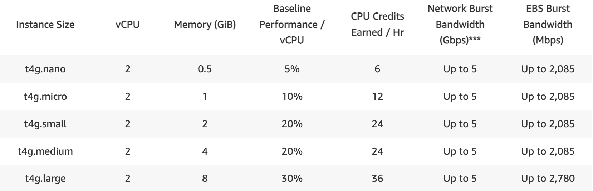

With your systems configured and reachable, you can now use iPerf3 to microbenchmark TCP and UDP performance between your Arm-based systems

## Microbenchmark the TCP connection

First, start by running `iperf` in server mode on the `SERVER` system with the following command: 

```bash
iperf3 -s
```

This starts the server on the default TCP port 5201. You should see:

```output
-----------------------------------------------------------
Server listening on 5201 (test #1)
-----------------------------------------------------------

```

The default server port is 5201. Use the `-p` flag to specify another port if it is in use.

{}
If you already have an `iperf3` server running, you can kill the process with the following command: 
 ```bash
 sudo kill $(pgrep iperf3)
 ```
{}

## Run a TCP test from the client

Next, on the client node, run the following command to run a simple 10-second microbenchmark using the TCP protocol: 

```bash
iperf3 -c SERVER -V
```
Replace `SERVER` with your server’s IP address or hostname. The -V flag enables verbose output. 

The output is similar to:

```output
...
[  5] local 10.248.213.97 port 42176 connected to 10.248.213.104 port 5201
Starting Test: protocol: TCP, 1 streams, 131072 byte blocks, omitting 0 seconds, 10 second test, tos 0
[ ID] Interval           Transfer     Bitrate         Retr  Cwnd
[  5]   0.00-1.00   sec   594 MBytes  4.98 Gbits/sec    0   1.48 MBytes       
[  5]   1.00-2.00   sec   593 MBytes  4.97 Gbits/sec    0   2.07 MBytes       
[  5]   2.00-3.00   sec   592 MBytes  4.97 Gbits/sec    0   2.07 MBytes       
[  5]   3.00-4.00   sec   590 MBytes  4.96 Gbits/sec    0   2.07 MBytes       
[  5]   4.00-5.00   sec   593 MBytes  4.97 Gbits/sec    0   2.18 MBytes       
[  5]   5.00-6.00   sec   591 MBytes  4.96 Gbits/sec    0   2.18 MBytes       
[  5]   6.00-7.00   sec   592 MBytes  4.97 Gbits/sec    0   2.18 MBytes       
[  5]   7.00-8.00   sec   593 MBytes  4.97 Gbits/sec    0   2.18 MBytes       
[  5]   8.00-9.00   sec   588 MBytes  4.93 Gbits/sec    0   2.18 MBytes       
[  5]   9.00-10.00  sec   592 MBytes  4.96 Gbits/sec    0   2.18 MBytes       
- - - - - - - - - - - - - - - - - - - - - - - - -
Test Complete. Summary Results:
[ ID] Interval           Transfer     Bitrate         Retr
[  5]   0.00-10.00  sec  5.78 GBytes  4.96 Gbits/sec    0             sender
[  5]   0.00-10.00  sec  5.78 GBytes  4.96 Gbits/sec                  receiver
CPU Utilization: local/sender 5.3% (0.1%u/5.2%s), remote/receiver 26.7% (1.2%u/25.5%s)
snd_tcp_congestion cubic
rcv_tcp_congestion cubic

iperf Done.
```
## TCP result highlights

- The`Cwnd` column prints the control window size and corresponds to the allowed number of TCP transactions in flight before receiving an acknowledgment `ACK` from the server. This value grows as the connection stabilizes and adapts to link quality.

- The `CPU Utilization` row shows both the usage on the sender and receiver. If you are migrating your workload to a different platform, such as from x86 to Arm, this is a useful metric. 

- The `snd_tcp_congestion cubic` and `rcv_tcp_congestion cubic` variables show the congestion control algorithm used.

- `Bitrate` shows the throughput achieved. In this example, the the `t4g.xlarge` AWS instance saturates its 5 Gbps bandwidth available. 



## UDP result highlights

You can also microbenchmark the `UDP` protocol with the `-u` flag. As a reminder, UDP does not guarantee packet delivery with some packets being lost. As such you need to observe the statistics on the server side to see the percent of packets lost and the variation in packet arrival time (jitter). The UDP protocol is widely used in applications that need timely packet delivery, such as online gaming and video calls. 

Run the following command from the client to send 2 parallel UDP streams with the `-P 2` option.

```bash
iperf3 -c SERVER -V -u -P 2
```

Looking at the server output you observe 0% of packets where lost for the short test. 

```output
[ ID] Interval           Transfer     Bitrate         Jitter    Lost/Total Datagrams
[  5]   0.00-10.00  sec  1.25 MBytes  1.05 Mbits/sec  0.016 ms  0/147 (0%)  receiver
[  6]   0.00-10.00  sec  1.25 MBytes  1.05 Mbits/sec  0.014 ms  0/147 (0%)  receiver
[SUM]   0.00-10.00  sec  2.51 MBytes  2.10 Mbits/sec  0.015 ms  0/294 (0%)  receiver
```

Additionally on the client side, the 2 streams saturated 2 of the 4 cores in the system. 

```output
CPU Utilization: local/sender 200.3% (200.3%u/0.0%s), remote/receiver 0.2% (0.0%u/0.2%s)
```