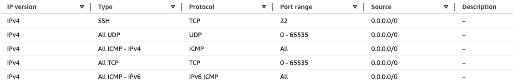

## Environment setup and Learning Path focus

To benchmark bandwidth and latency between Arm-based systems, you'll need to configure two Linux machines running on Arm. 

You can use AWS EC2 instances with Graviton processors, or Linux virtual machines from any other cloud service provider.

This tutorial walks you through a local-to-cloud test to compare performance between:

* Two cloud-based instances
* One local system and one cloud instance

The setup instructions below use AWS EC2 instances connected within a Virtual Private Cloud (VPC).

To get started, create two Arm-based Linux instances, with each instance serving a distinct role:

* One acting as a client
* One acting as a server

The instructions below use two `t4g.xlarge` instances running Ubuntu 24.04 LTS. 

## Install software dependencies

Use the commands below to install iPerf3, which is a powerful open-source CLI tool for measuring maximum achievable network bandwidth. 

Begin by installing iPerf3 on both the client and server systems:

```bash
sudo apt update
sudo apt install iperf3 -y
```

{}
If you're prompted to run `iperf3` as a daemon, answer "no".
{}

## Update security rules 

If you're working in a cloud environment like AWS, you must update the default security rules to enable specific inbound and outbound protocols. 

To do this, follow these instructions below using the AWS console:

* Navigate to the **Security** tab for each instance. 
* Configure the **Inbound rules** to allow the following protocols:
    * `ICMP` (for ping)
    * All UDP ports (for UDP tests)
    * TCP port 5201 (for traffic to enable communication between the client and server systems) 



{}
For secure internal communication, set the source to your instance’s security group. This avoids exposing traffic to the internet while allowing traffic between your systems.

You can restrict the range further by:

* Opening only TCP port 5201

* Allowing all UDP ports (or a specific range)
{}

## Update the local DNS

To avoid using IP addresses directly, add the other system's IP address to the `/etc/hosts` file.

You can find private IPs in the AWS dashboard, or by running:

```bash
hostname -I
ip address
ifconfig
```

### On the client

Add the server's IP address, and assign it the name `SERVER`:

```output
127.0.0.1       localhost
10.248.213.104  SERVER
```

### On the server

Add the client's IP address, and assign it the name `CLIENT`:

```output
127.0.0.1       localhost
10.248.213.105  CLIENT
```

| Instance Name | Role   | Description                        |
|---------------|--------|------------------------------------|
| SERVER        | Server | Runs `iperf3` in listen mode       |
| CLIENT        | Client | Initiates performance tests        |


## Confirm the server is reachable

Finally, confirm the client can reach the server by using the ping command below. If required, you can also ping the localhost: 

```bash
ping SERVER -c 3 && ping 127.0.0.1 -c 3
```

The output below shows that both SERVER and localhost (127.0.0.1) are reachable. 

Localhost response times are typically ~10× faster than remote systems, though actual values vary based on system location and network conditions.

```output
PING SERVER (10.248.213.104) 56(84) bytes of data.
64 bytes from SERVER (10.248.213.104): icmp_seq=1 ttl=64 time=0.217 ms
64 bytes from SERVER (10.248.213.104): icmp_seq=2 ttl=64 time=0.218 ms
64 bytes from SERVER (10.248.213.104): icmp_seq=3 ttl=64 time=0.219 ms

--- SERVER ping statistics ---
3 packets transmitted, 3 received, 0% packet loss, time 2056ms
rtt min/avg/max/mdev = 0.217/0.218/0.219/0.000 ms
PING 127.0.0.1 (127.0.0.1) 56(84) bytes of data.
64 bytes from 127.0.0.1: icmp_seq=1 ttl=64 time=0.022 ms
64 bytes from 127.0.0.1: icmp_seq=2 ttl=64 time=0.032 ms
64 bytes from 127.0.0.1: icmp_seq=3 ttl=64 time=0.029 ms

--- 127.0.0.1 ping statistics ---
3 packets transmitted, 3 received, 0% packet loss, time 2046ms
rtt min/avg/max/mdev = 0.022/0.027/0.032/0.004 ms
```

Now that your systems are configured, the next step is to measure the available network bandwidth between them.