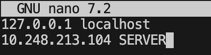

### Setup

For this demonstration I will be using instances available from AWS within a virtual private cloud (VPC)

Create 2 Arm-based linux instances, 1 to act as the server and the other to act as the client. In this tutorial I will be using two `t4g.xlarge` instance running Ubuntu 22.04 LTS. 


### Install dependencies

Run the following command to install the microbenchmark tool, `iperf3`. 

```bash
sudo apt update
sudo apt install iperf3 -y
```


### Update Security Rules 

Next, we need to update the default security rules to enable specific inbound and outbound protocols. From the AWS console, navigate to the security tab. Edit the inbound rules to enable `ICMP`, `UDP` and `TCP` traffic to enable communication between the client and server


{}
For security set the source and port ranges to those that are being used
{}


### Update local DNS

For readability, we will add the server IP address and an alias to the local DNS cache in `/etc/hosts`. The local IP address of the server and client can be found in the AWS dashboard. 

On the client, add the IP address of the server to the `/etc/hosts` file. Likewise on the server add the IP address of the client to the `/etc/hosts` file. 

. 

### Confirm server is reachable

Finally, confirm the client can reach the server with the ping command below. As a reference we also ping the localhost. 

```bash
ping SERVER -c 3 && ping 127.0.0.1 -c 3
```

The output below shows that both SERVER and localhost (127.0.0.1) are reachable. Naturally, on this system local host response tile is ~10x faster than the server. Your results will vary depending on geographic colocation and other networking factors. 

```output
PING SERVER (10.248.213.104) 56(84) bytes of data.
64 bytes from SERVER (10.248.213.104): icmp_seq=1 ttl=64 time=0.217 ms
64 bytes from SERVER (10.248.213.104): icmp_seq=2 ttl=64 time=0.218 ms
64 bytes from SERVER (10.248.213.104): icmp_seq=3 ttl=64 time=0.219 ms

--- SERVER ping statistics ---
3 packets transmitted, 3 received, 0% packet loss, time 2056ms
rtt min/avg/max/mdev = 0.217/0.218/0.219/0.000 ms
PING 127.0.0.1 (127.0.0.1) 56(84) bytes of data.
64 bytes from 127.0.0.1: icmp_seq=1 ttl=64 time=0.022 ms
64 bytes from 127.0.0.1: icmp_seq=2 ttl=64 time=0.032 ms
64 bytes from 127.0.0.1: icmp_seq=3 ttl=64 time=0.029 ms

--- 127.0.0.1 ping statistics ---
3 packets transmitted, 3 received, 0% packet loss, time 2046ms
rtt min/avg/max/mdev = 0.022/0.027/0.032/0.004 ms

```

