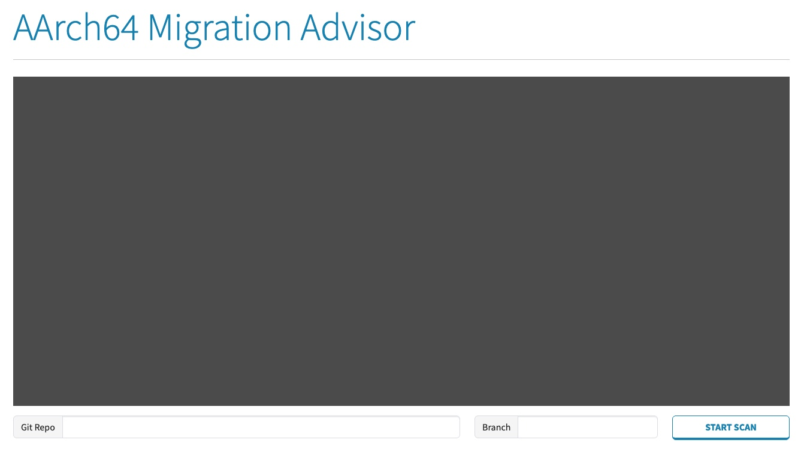
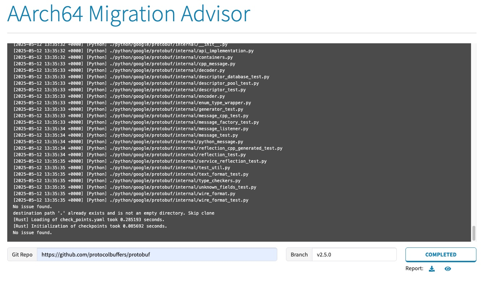

---
# User change
title: "Installing and Running Code Analysis Tools"

weight: 4

layout: "learningpathall"

---

# migrate-ease

[migrate-ease](https://github.com/migrate-ease/migrate-ease) is an open-source project designed to analyze codebases specifically for x86_64 architectures and offers tailored suggestions aimed at facilitating the migration process to AArch64. This tool streamlines the transition, ensuring a smooth and efficient evolution of your software to leverage the benefits of aarch64 architecture.

## Pre-requisites
Before you use migrate-ease, certain pre-requesites need to be installed.

  
sudo apt-get install -y python3 python3-pip python3-venv unzip libmagic1 git
  
  
sudo apt-get install -y python3 python3-pip python3-venv unzip libmagic1 git
  
  
sudo dnf install -y python3 python3-pip unzip git
  


## Install and setup
```bash

# Check out the project
git clone https://github.com/migrate-ease/migrate-ease

# Check the project folder
cd migrate-ease 

# Make sure you're at the root directory of migrate-ease
# Enable Python Environment
python3 -m venv .venv
source .venv/bin/activate

# install python packages dependencies
pip3 install -r requirements.txt
# Setup environment
export PYTHONPATH=`pwd`
```

## Usage
### As Python script

User can scan a project with a scanner type and the result is sent to console by default.
```bash
python3 -m {scanner_name} --arch {arch} {scan_path}
```
Scan result can be exported as one of txt, csv, json or html.

To generate a JSON report:
```bash
python3 -m {scanner_name} --output {result_file_name}.json --arch {arch} {scan_path}
```

**Parameters**

`{scanner_name}`: The name of the scanner, which can be one of cpp, docker, go, java, python, rust.

`{result_file_name}`: The name of the export result file (without the extension).

`{arch}`: The architecture type, `aarch64` is the default.

`{scan_path}`: The path to the code that needs to be scanned.

User can scan a git repository as well by given the URL.
```bash
python3 -m {scanner_name} --output {result_file_name}.json --arch {arch} --git-repo {repo} {clone_path}
```
In the case of git repository scan, `{clone_path}` is a directory to hold the cloned code. This directory should be empty or to be created.

There are more parameters for user to control the scan behaviors. To get these information user can get the built-in help
```bash
python3 -m {scanner_name} -h
```

### As Web UI
Migrate-ease also provides a Web UI that supports scanning a git repo with cpp, docker, go, java, python and rust scanners in one time.
To start the web server, simply run:
```
python3 web/server.py
```

Once that is successfully done, you can access a web server hosted at http://localhost:8080

The web UI looks as following:


A git repo URL is required, and you can specify certain branch name to scan. Once the necessary information is filled, user can click "START SCAN" button to proceed project scanning.

Scanning progress will be shown in the console pane. Once all jobs are done, user will see a web page as following:


You can download the result by clicking the "download" icon or view the result by clicking the "eye" icon.
