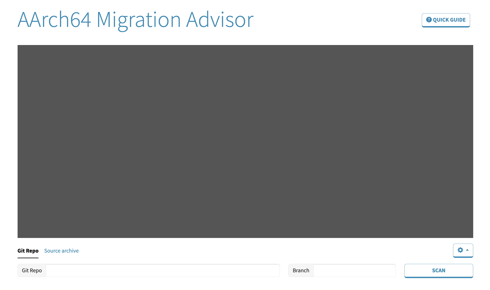
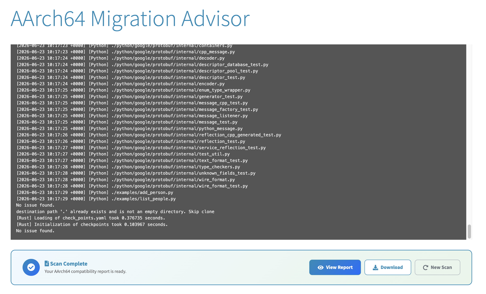

---
# User change
title: "Getting started with migrate-ease"

weight: 4

layout: "learningpathall"

---
## Set up your environment
Before using `migrate-ease`, install the following system dependencies:

  
sudo apt-get install -y python3 python3-pip python3-venv libmagic1 git
  
  
sudo apt-get install -y python3 python3-pip python3-venv libmagic1 git
  
  
sudo dnf install -y python3 python3-pip git
  
  
brew install python3 libmagic git
  
  
winget install --id Python.Python.3.11
winget install --id Git.Git
  


Clone the repository:
```bash
git clone https://github.com/migrate-ease/migrate-ease
cd migrate-ease 
```

Create and activate a Python virtual environment:


  
python3 -m venv .venv
source .venv/bin/activate
  
  
python -m venv .venv
Set-ExecutionPolicy RemoteSigned
.\.venv\Scripts\Activate.ps1
  


Install the required packages and set the environment variable:


  
pip3 install -r requirements.txt
export PYTHONPATH=`pwd`
  
  
pip install -r requirements.txt
$env:PYTHONPATH = (Get-Location).Path
  


## Usage

You can use migrate-ease from the command-line or through a Web UI. 
 
### Command-line usage
 
You can scan local codebases written in a supported programming languages. By default, scan results from the code analysis are sent to the console.

```bash
python3 -m {scanner_name} --march {arch} {scan_path}
```
The result from the scan can be exported as `txt`, `csv`, `json` or `html`. Specify this using the `--output` option:

To generate a JSON report:
```bash
python3 -m {scanner_name} --output {result_file_name}.json --march {arch} {scan_path}
```

Here's an explanation of each of the arguments passed to the scanner tool:

**Parameters**

`{scanner_name}`: The name of the scanner, which can be one of cpp, docker, go, java, python or rust.

`{result_file_name}`: The name of the exported results file (without the extension).

`{arch}`: Target processor architecture. It follows the same semantics as GCC's `-march`, specifying the target architecture and feature set. Supported: `armv8-a` (default) and `armv8.6-a+sve2`.

`{scan_path}`: The path to the code you want to scan.

To scan a remote Git repository:
```bash
python3 -m {scanner_name} --output {result_file_name}.json --march {arch} --git-repo {repo} {clone_path}
```
In the case of git repository scan, `{clone_path}` is a directory where the remote repo code is cloned into. This directory should be empty or must be created by the user.

There are more parameters for user to control the scan functionality. To see this information, use the built-in help as shown:
```bash
python3 -m {scanner_name} -h
```
Replace {scanner_name} with either cpp, docker, go, java, python or rust.

### Target a cloud vendor and instance type

Instead of setting `--march` manually, you can derive the target ISA from a cloud vendor and instance type. This is useful when you already know where the workload will run:

```bash
python3 -m {scanner_name} --vendor {VENDOR} --instance-type {INSTANCE} {scan_path}
```

Here's an explanation of each of the arguments passed to the scanner tool:

**Parameters**

`{VENDOR}`: The cloud vendor. Supported values are `AWS`, `GCP`, and `AliCloud`. The match is case-sensitive.

`{INSTANCE}`: The instance type under the selected vendor, for example, `c7g`, `c4a`, or `c8y`. The input is lowercased before matching, so it is case-insensitive. This option requires `--vendor`.

`{scan_path}`: The path to the code you want to scan.

To list the supported vendors and instance types per vendor, use the built-in help and check the **Supported Vendors** and **Supported Instance Types per Vendor** sections:

```bash
python3 -m {scanner_name} --help
```

For behavioral rules of `--vendor` and `--instance-type`, see the [vendor and instance-type usage guide](https://github.com/migrate-ease/migrate-ease/blob/main/docs/vendor-instance-type-usage.md).

### Web UI

Migrate-ease also provides a Web UI that supports scanning a git repo or a local source archive (`.zip`/`.tar`) with cpp, docker, go, java, python and rust scanners in one time. To start the web server, simply run:
```bash
python3 web/server.py
```

The server listens on port `8080` by default. To use a different port, pass `--port`:
```bash
python3 web/server.py --port <PORT>
```

Once the server is running, you can access a web server hosted at `http://<localhost>:8080`

The Web UI looks like this:



The Web UI walks you through three steps: choose what to scan, set options, and run.

**1. Choose what to scan** on either tab:

| Tab | Input |
|---|---|
| **Git Repo** | An HTTPS Git URL with an optional branch name. Leave the branch empty to use the repository's default branch. |
| **Source archive** | A local `.zip` or `.tar` archive uploaded from your machine. |

**2. Configure scan options** (optional) from the **Options** menu (gear icon):

| Option | Description | Default |
|---|---|---|
| **CSP & Instance** | Cloud provider and instance type used to derive the target architecture. | `armv8-a` |
| **Report format** | Format of the downloadable report (`JSON`, `HTML`, `Text`, or `CSV`). | `JSON` |
| **Scanner** | Language scanners to run. Uncheck **All** to pick a subset from `C/C++`, `Go`, `Rust`, `Java`, `Python`, and `Docker`. | All |

**3. Run and monitor** by clicking **SCAN**. The **Console Output** panel streams live logs from each scanner.

{}
On your first visit, a step-by-step Quick Guide overlay highlights the key controls. A **Quick Guide** button stays in the top-right so you can rerun the walkthrough at any time.
{}

When a scan finishes, a results banner appears with three actions:



| Action | What it does |
|---|---|
| **View Report** | Opens the full compatibility report in a new browser tab. |
| **Download** | Saves a `report.zip` package to your machine. |
| **New Scan** | Returns to the scan form so you can run another scan. |

For a detailed walkthrough of every Web UI control, including screenshots for each step, see the [Web UI quick start guide](https://github.com/migrate-ease/migrate-ease/blob/main/docs/webui-quick-start.md).
