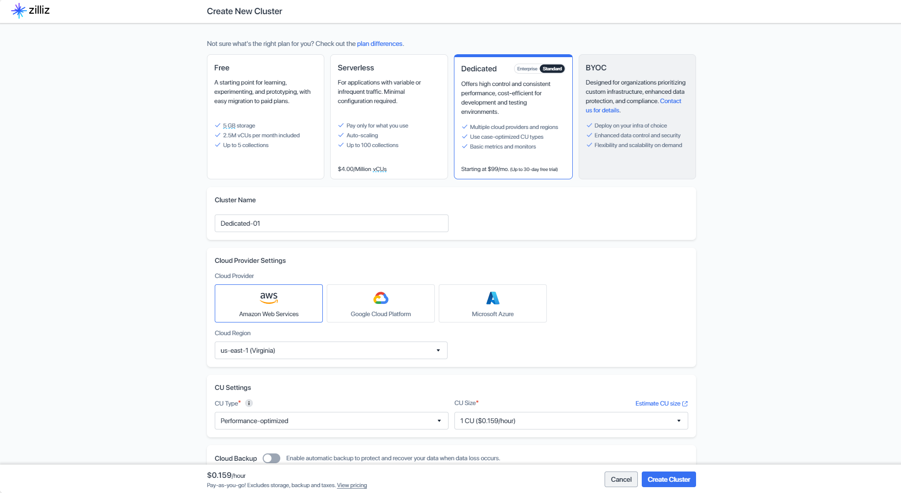
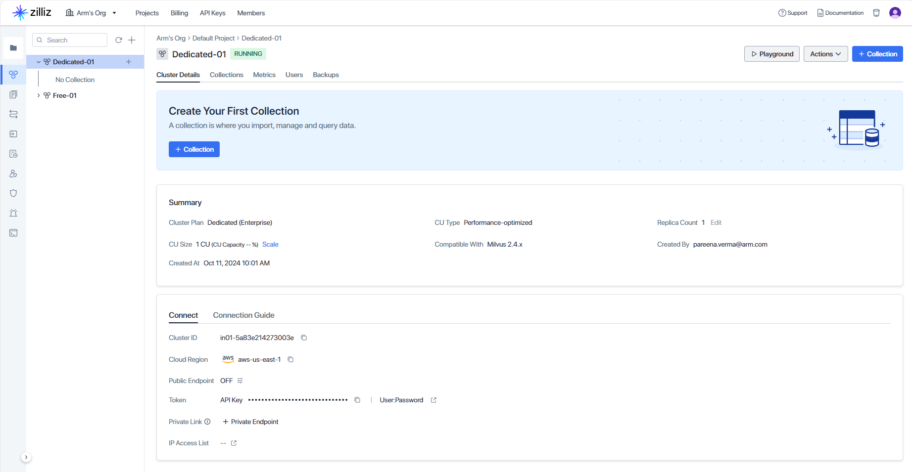

## Create a dedicated cluster

In this section, you will learn how to set up a cluster on Zilliz Cloud.

Begin by [registering](https://docs.zilliz.com/docs/register-with-zilliz-cloud) for a free account on Zilliz Cloud. 

After you register, [create a cluster](https://docs.zilliz.com/docs/create-cluster) on Zilliz Cloud. In this Learning Path, you will create a dedicated cluster deployed in AWS using Arm-based machines to store and retrieve the vector data as shown:



When you select the **Create Cluster** Button, you should see the cluster running in your Default Project.



{}
You can use self-hosted Milvus as an alternative to Zilliz Cloud. This option is more complicated to set up. You can also deploy [Milvus Standalone](https://milvus.io/docs/install_standalone-docker-compose.md) and [Kubernetes](https://milvus.io/docs/install_cluster-milvusoperator.md) on Arm-based machines. For more information about Milvus installation, please refer to the [installation documentation](https://milvus.io/docs/install-overview.md).
{}

## Create the Collection

With the dedicated cluster running in Zilliz Cloud, you are now ready to create a collection in your cluster.

Within your activated python virtual environment `venv`, start by creating a file named `zilliz-llm-rag.py`, and copy the contents below into it:

```python
from pymilvus import MilvusClient

milvus_client = MilvusClient(
    uri="<your_zilliz_public_endpoint>", token="<your_zilliz_api_key>"
)

```
Replace <your_zilliz_public_endpoint> and <your zilliz_api_key> with the `URI` and `Token` for your running cluster. Refer to [Public Endpoint and Api key](https://docs.zilliz.com/docs/on-zilliz-cloud-console#free-cluster-details) in Zilliz Cloud for more details.

Now, append the following code to `zilliz-llm-rag.py` and save the contents:

```python
collection_name = "my_rag_collection"
embedding_dim = "384"

if milvus_client.has_collection(collection_name):
    milvus_client.drop_collection(collection_name)

milvus_client.create_collection(
    collection_name=collection_name,
    dimension=embedding_dim,
    metric_type="IP",  # Inner product distance
    consistency_level="Strong",  # Strong consistency level
)
```
This code checks if a collection already exists and drops it if it does. You then, create a new collection with the specified parameters.

If you don't specify any field information, Milvus will automatically create a default `id` field for primary key, and a `vector` field to store the vector data. A reserved JSON field is used to store non-schema-defined fields and their values.
You will use inner product distance as the default metric type. For more information about distance types, you can refer to [Similarity Metrics page](https://milvus.io/docs/metric.md?tab=floating)

You can now prepare the data to use in this collection.

## Prepare the data

In this example, you will use the FAQ pages from the [Milvus Documentation 2.4.x](https://github.com/milvus-io/milvus-docs/releases/download/v2.4.6-preview/milvus_docs_2.4.x_en.zip) as the private knowledge that is loaded in your RAG dataset/collection.

Download the zip file and extract documents to the folder `milvus_docs`.

```shell
wget https://github.com/milvus-io/milvus-docs/releases/download/v2.4.6-preview/milvus_docs_2.4.x_en.zip
unzip -q milvus_docs_2.4.x_en.zip -d milvus_docs
```

You will load all the markdown files from the folder `milvus_docs/en/faq` into your data collection. For each document, use "# " to separate the content in the file, which can roughly separate the content of each main part of the markdown file.

Open `zilliz-llm-rag.py` and append the following code to it:

```python
from glob import glob

text_lines = []

for file_path in glob("milvus_docs/en/faq/*.md", recursive=True):
    with open(file_path, "r") as file:
        file_text = file.read()

    text_lines += file_text.split("# ")
```

### Insert data
You will now prepare a simple but efficient embedding model [all-MiniLM-L6-v2](https://huggingface.co/sentence-transformers/all-MiniLM-L6-v2) that can convert the loaded text into embedding vectors.

You will iterate through the text lines, create embeddings, and then insert the data into Milvus.

Append and save the code shown below into `zilliz-llm-rag.py`:

```python
from langchain_huggingface import HuggingFaceEmbeddings

embedding_model = HuggingFaceEmbeddings(model_name="all-MiniLM-L6-v2")

from tqdm import tqdm

data = []

text_embeddings = embedding_model.embed_documents(text_lines)

for i, (line, embedding) in enumerate(
    tqdm(zip(text_lines, text_embeddings), desc="Creating embeddings")
):
    data.append({"id": i, "vector": embedding, "text": line})

milvus_client.insert(collection_name=collection_name, data=data)
```
Run the python script, to check that you have successfully created the embeddings on the data you loaded into the RAG collection:

```bash
python3 python3 zilliz-llm-rag.py
```

The output should look like:
```
Creating embeddings: 72it [00:00, 700672.59it/s]
```

