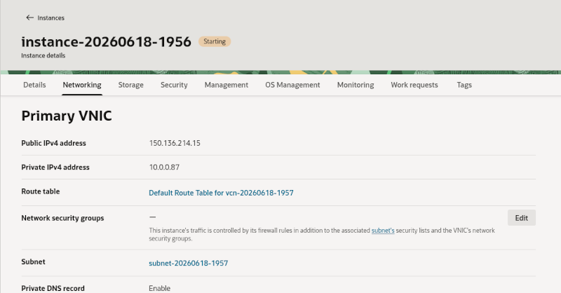

## Connecting the Minecraft client to the server

### Opening the port for the Minecraft server

Before we connect to the Minecraft server, we will change the network policy to allow clients to
connect to the Minecraft server over TCP port number 25565. To do this, we need to modify the
networking settings for our instance in the OCI dashboard.

1. On the OCI Instances page, choose your Minecraft server instance.
2. In the Networking tab, click on the subnet name:
   
3. On the Security tab of the subnet page, choose the security list which is active for the instance
   (by default, this is called "Default Security List for vcn-xxxxxxxx")
   
4. Under "Security rules", add a new Ingress rule (this means the rule applies to incoming traffic
   from outside the instance). Set "Source CIDR" to "0.0.0.0/0" (this means all IP addresses can
   connect), and set the "Destination Port Range" field to 25565.
   

You will also need to update your local firewall to allow connections to port 25565 on your instance.
Reconnect to your instance with SSH, and run the following commands on Oracle Linux:
```
sudo firewall-cmd --permanent --add-port=25565/tcp
sudo firewall-cmd --reload
```
or the following commands on Ubuntu:
```
sudo ufw allow 25565/tcp
sudo ufw reload
```

You should now be able to run your Minecraft server on the OCI instance, then start your client, log in as
usual, and connect to your brand new server!

### Connecting to the server from the Minecraft client

1. Start your Minecraft client and log in as usual.
2. Choose "Multiplayer" mode - read and click through the warning that third party servers are not operated
by Mojang.
3. To add your server to the menu of available servers, choose "Add server", name your server
something meaningful ("My OCI server" for example) and put the IP address of your instance into the
"Server Address" field:
   

You can now join the server and start building! 
   

You can also share the address with your friends to start building a shared world. Have fun!


