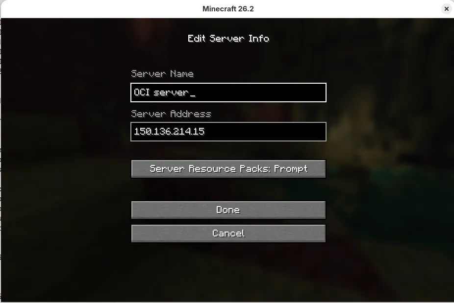

## Update Linux firewall to open port 25565

Update the instance's local firewall to allow connections to port `25565`. 

Run the following commands:

```console
sudo firewall-cmd --permanent --add-port=25565/tcp
sudo firewall-cmd --reload
``` 

## Start a Minecraft client and connect to the server 

Run your Minecraft server on the instance, then start your client on your laptop or desktop.

To start a client and connect to the server, follow these steps:

1. Start your Minecraft client and log in with your Microsoft account credentials.
2. Start the **Minecraft Java Edition** client from the launcher.
   
3. Choose **Multiplayer** mode - read and click through the warning that third party servers aren't operated by Mojang.
4. To add your server to the menu of available servers, choose **Add server**. Name your server something meaningful (for example, **My OCI server**) and put the IP address of your instance into the **Server Address** field:
   

You can now join the server and start building!


## What you've accomplished

You've now updated the instance's local firewall to open port `25565`, then started a client and connected it to the Minecraft server. 

Now that your server is running, you can share the IP address with friends for multiplayer play. You can also explore automated startup scripts to ensure the server automatically recovers from reboots.