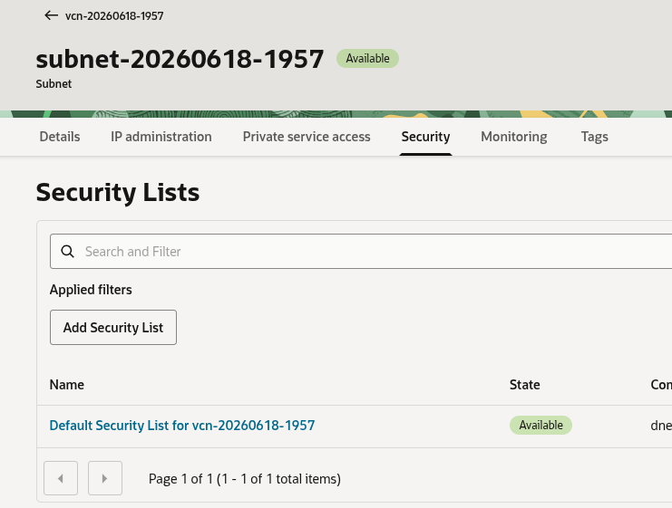
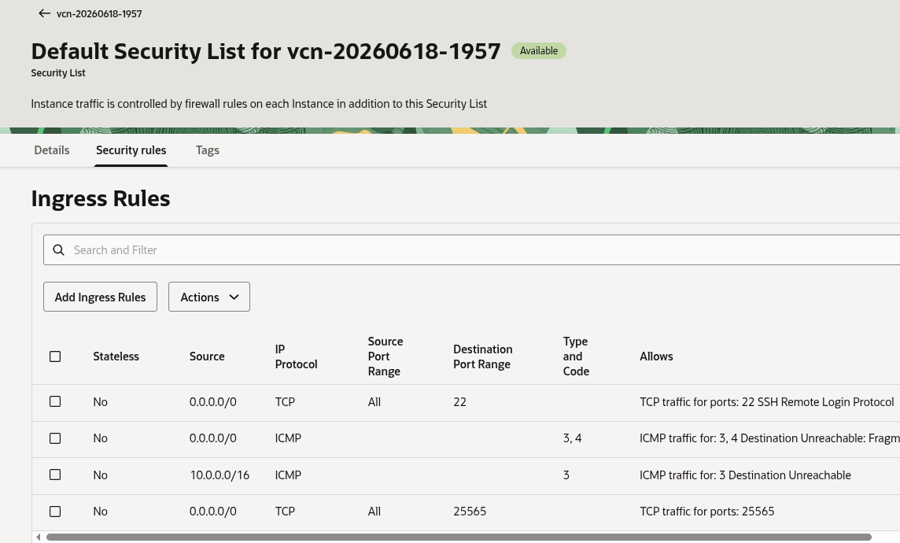
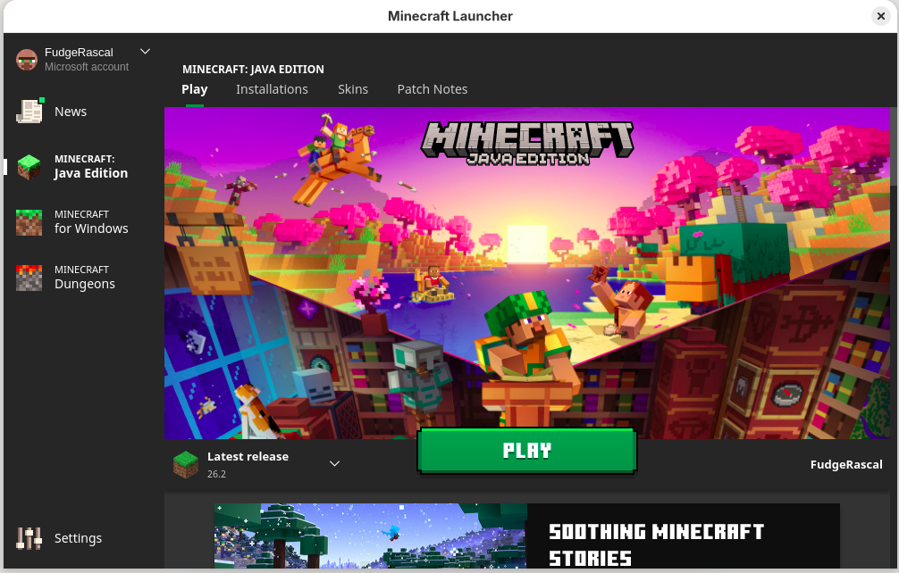
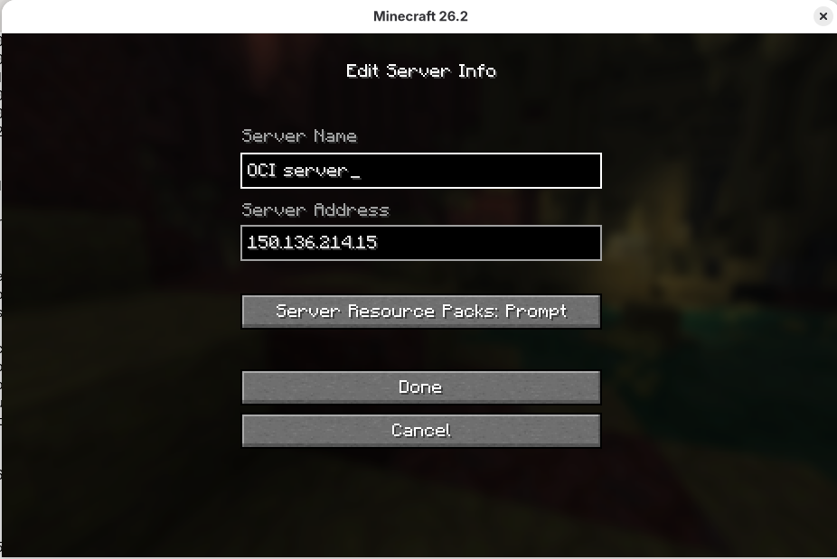
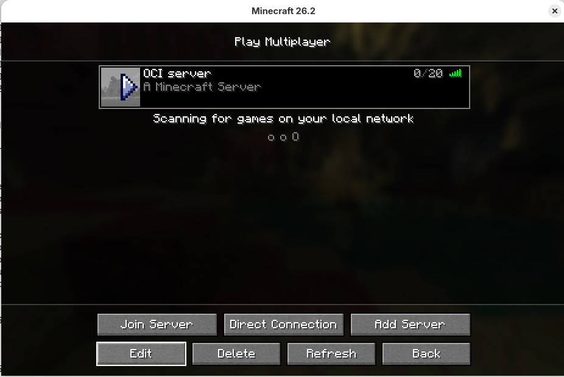

## Connecting the Minecraft client to the server

### Opening the port for the Minecraft server

Before you connect to the Minecraft server, you will change the network policy to allow clients
to connect to the Minecraft server over TCP port number 25565. To do this, you need to modify
the networking settings for your instance in the OCI dashboard.

1. On the OCI Instances page, choose your Minecraft server instance.
2. In the **Networking** tab, click on the subnet name:
   
3. On the **Security** tab of the subnet page, choose the security list which is active for the instance
   (by default, this is called "Default Security List for vcn-xxxxxxxx")
   
4. Under **Security rules**, add a new Ingress rule (this means the rule applies to incoming traffic
   from outside the instance). Set **Source CIDR** to "0.0.0.0/0" (this means all IP addresses can
   connect), and set the **Destination Port Range** field to 25565.
   

You will also need to update the instance's local firewall to allow connections to port 25565 on 
your instance. Reconnect to your instance with SSH, and run the following commands:
```
sudo firewall-cmd --permanent --add-port=25565/tcp
sudo firewall-cmd --reload
```

You should now be able to run your Minecraft server on the OCI instance, then start your client
on your laptop or desktop., You will first be asked to log in with your Microsoft or Mojang account.
Use the credentials you created for your Microsoft account.

### Connecting to the server from the Minecraft client

1. Start your Minecraft client and log in with your Microsoft account credentials.
2. Start the "Minecraft Java edition" client from the launcher.
   
3. Choose **Multiplayer** mode - read and click through the warning that third party servers are not operated by Mojang.
3. To add your server to the menu of available servers, choose **Add server**, name your server
something meaningful ("My OCI server" for example) and put the IP address of your instance into the
**Server Address** field:
   

You can now join the server and start building!



### What you've accomplished

In this guide, you successfully:
- Provisioned an Arm-based VM instance on Oracle Cloud Infrastructure.
- Installed Java and deployed the Minecraft server software.
- Configured OCI security ingress rules and server-side firewalls to expose the port.
- Added and connected to the server using the Minecraft client application.

### Next steps

Now that your server is running, you can share the IP address with friends for multiplayer play. You can also explore automated startup scripts to ensure the server automatically recovers from reboots.


