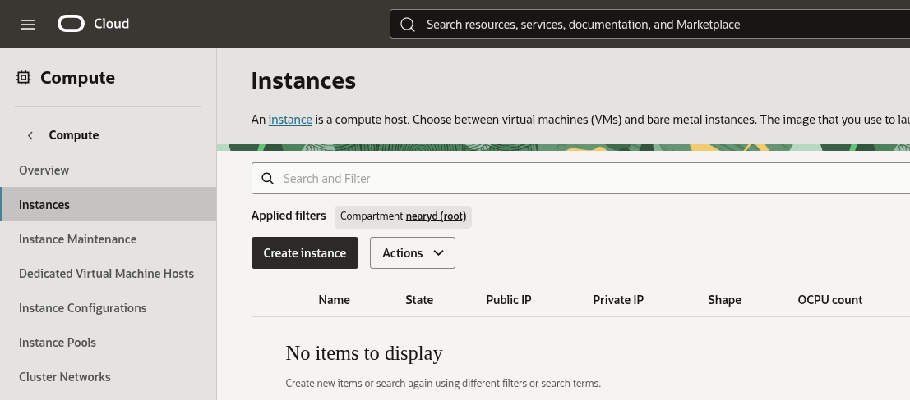
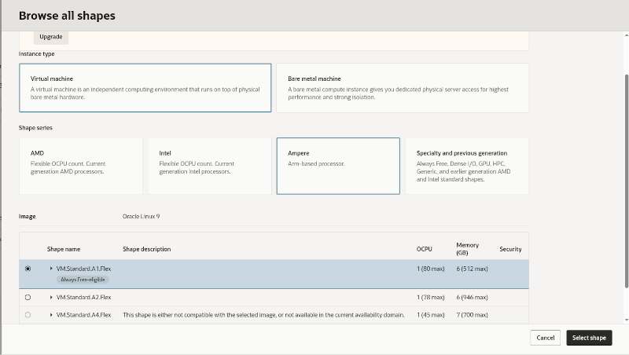
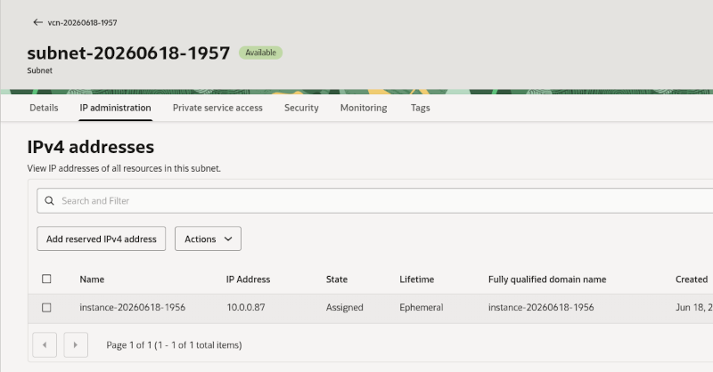

## Starting an OCI A4 or A1 instance

Once you have [created an OCI account](../csp/oci) and verified that you can start an
instance, we will create an AmpereOne powered A4 instance and connect to it with SSH to
install the Minecraft Java server.

1. Log on to [Oracle Cloud](https://cloud.oracle.com)
2. On the$ OCI dashboard, navigate to Compute -> Instances to start a new instance: 
   
3. Click "Create instance", then: 
    * Choose one of the availability domains offered to you with A4 instances available
    * Select "Change shape", and set the instance type to Ampere VM.Standard.A4.Flex - if the
      A4.Flex instance type is not available in your preferred 
      AD, try another, or choose VM.Standard.A1.Flex:
      
    * Beside the instance type, click the small black arrow to open options. Allocate 2 OCPUs
      and 12 GB of memory to your instance
    * Choose "Oracle Linux 9" or one of the other available images of your choice under "Change
      image", then click Next
4. Use the default security options, click "Next" to get to networking options
5. Configure networking as follows:
    * When prompted, create a new Virtual Cloud Network (VCN) and public subnet if you do not
      have one already, or choose an existing VCN configuration
    * Select "Automatically assign public IPv4 address" to to allow you to access the instance
      remotely from your Minecraft server
    * Create an SSH key pair if you do not have one (and download both private and public keys),
      or upload the public key for an existing key pair so that you can connect to your instance
      over SSH once it is created
5. Use default Storage options
6. After verifying that the instance is correctly configured, choose "Create" to provision a new 
   instance
7. It can take up to 2 minutes for your instance to be created. Once created, we need to ensure
   that there is a public IP address to connect to by going to the "Networking" tab for the instance:
   ![Instance networking]{OCI_instance_networking.png)
8. Scroll down and click on the VNIC name - `instance-yyyymmdd-HHmm` by default - then on the IP
   administration tab, and click on the three dots on the primary IP row to edit the IP address type
   associated with the instance to set its type to "Ephemeral public IP":
   

Take note of the IP address under "Public IP address". You should now be able to SSH into your
instance with the command
```
ssh -i <path to private key> opc@<public IP address>
```

Congratulations - you are connected to your OCI instance. Next we will install some prerequisites and
download and start the Minecraft server.


