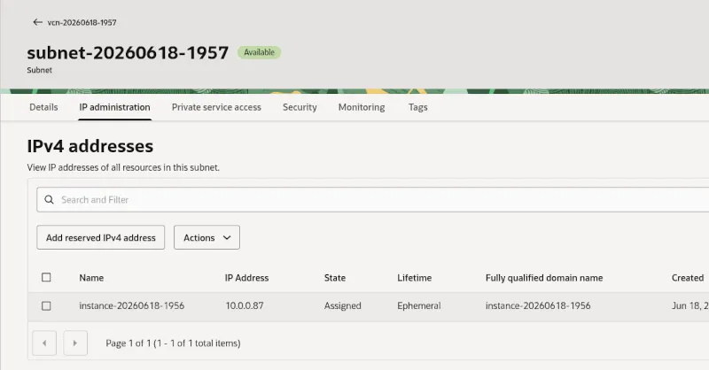

## Starting an OCI A1 instance

Make sure you have an OCI account. If you need to create an account refer to
[Getting Started with Oracle OCI](/learning-paths/servers-and-cloud-computing/csp/oci/).

Next, create an Ampere powered A1 instance and connect with SSH.

1. Log on to [Oracle Cloud](https://cloud.oracle.com)
2. On the OCI dashboard, navigate to Compute -> Instances to start a new instance: 
   
3. Click "Create instance", then: 
    * Choose one of the availability domains offered to you with A1 instances available
    * Select "Change shape", and set the instance type to Ampere VM.Standard.A1.Flex:
      
    * Beside the instance type, click the small black arrow to open options. Allocate 2 OCPUs
      and 12 GB of memory to your instance
    * Choose "Oracle Linux 9" under "Change
      image", then click Next
4. Use the default security options, click "Next" to get to networking options
5. Configure networking as follows:
    * When prompted, create a new Virtual Cloud Network (VCN) and public subnet if you do not
      have one already, or choose an existing VCN configuration
    * Select "Automatically assign public IPv4 address" to allow you to access the instance
      remotely from your Minecraft server
    * Create an SSH key pair if you do not have one (and download both private and public keys),
      or upload the public key for an existing key pair so that you can connect to your instance
      over SSH once it is created
6. Use default Storage options
7. After verifying that the instance is correctly configured, choose "Create" to provision a new 
   instance
8. It can take up to 2 minutes for your instance to be created. Once created, you need to ensure
   that there is a public IP address to connect to by going to the "Networking" tab for the instance:
   
9. If you did not select "Automatically assign public IPv4 address" during instance creation, you
   will need to assign one manually. Scroll down and click on the VNIC name - `instance-yyyymmdd-HHmm`
   by default - then on the IP administration tab, and click on the three dots on the primary IP row
   to edit the IP address type associated with the instance to set its type to "Ephemeral public IP":
   

Take note of the IP address under "Public IP address". You should now be able to SSH into your instance with the command:

```console
ssh -i <path to private key> opc@<public IP address>
```

### What you've accomplished

You successfully provisioned an Ampere A1 virtual machine instance on Oracle Cloud Infrastructure, configured its virtual network to assign a public IP address, and connected to the server securely over SSH.

### Next step

Now that your VM is running and accessible, proceed to install Java and download the Minecraft server software.