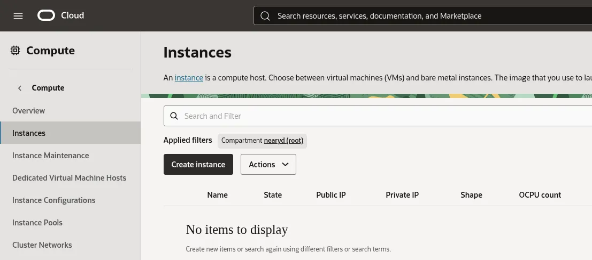
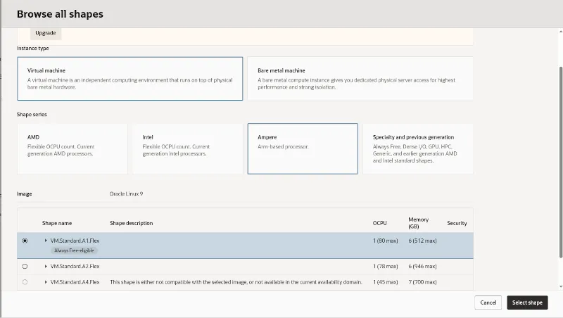
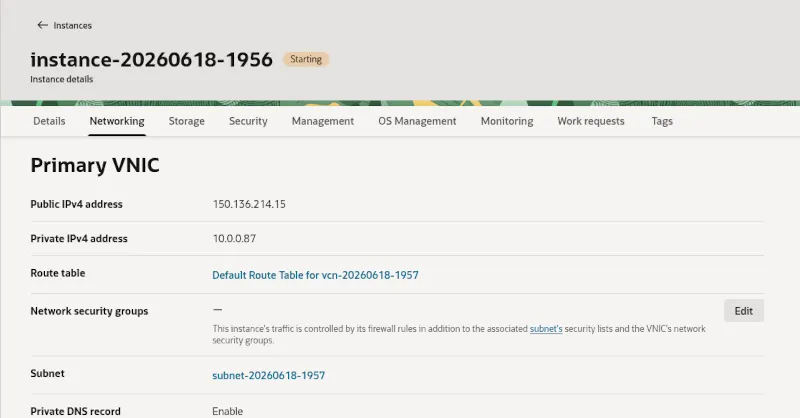
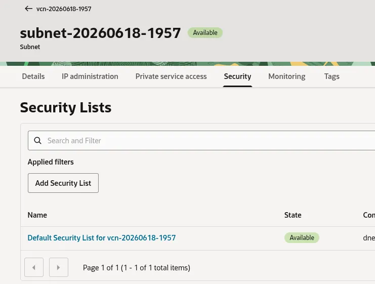
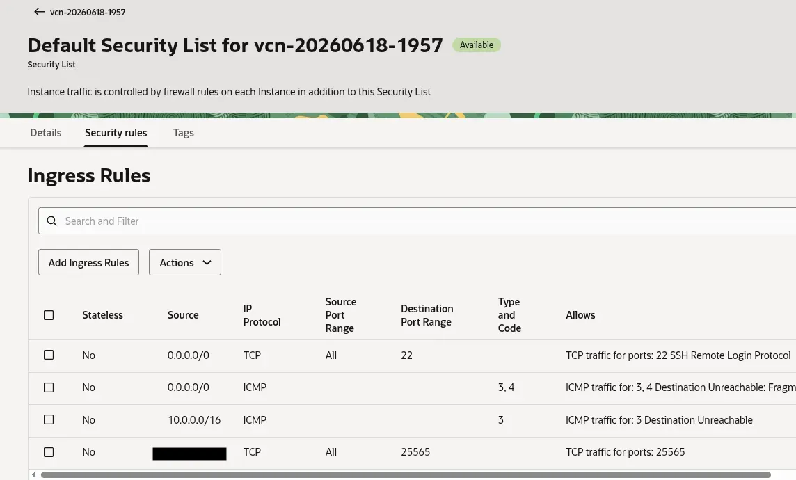

## Set up and launch a virtual machine instance

To create an Ampere powered A1 virtual machine (VM) instance that you'll use for the Minecraft server, follow these steps:

1. Log on to [Oracle Cloud](https://cloud.oracle.com).
2. On the Oracle Cloud Infrastructure (OCI) dashboard, navigate to **Compute -> Instances** to start a new instance: 
   
3. Select **Create instance**.
4. Select an availability domain for your instance.
5. Under **Image and shape**. select **Edit**.
6. To update the instance's image, select **Change image**.
7. In the **Select an image** panel, search for and select **Oracle Linux 9**, then select **Select image**.
8. To update the shape of the instance, select **Change shape** and update the following in the **Browse all shapes** panel:
  - For **Instance type**, select **Virtual machine**.
  - For **Shape series**, select **Ampere**.
  - For **Image**, select **VM.Standard.A1.Flex**.
  - Allocate 2 OCPUs and 12 GB of memory to your instance.
    
9. After updating the instance shape, select **Select shape**.
10. Leave the security and storage options as defaults. Then, under **Networking**, update the following:
    - Create a new Virtual Cloud Network (VCN) and public subnet if you don't
      have one already, or choose an existing VCN configuration.
    - Select **Automatically assign public IPv4 address** to allow remote access to the instance from your Minecraft server.
    - Create and download an SSH key pair if you don't already have one,
      or upload the public key for an existing key pair so that you can connect to your instance over SSH after it's created.
11. After verifying that the instance is correctly configured, choose **Create** to provision a new instance. It can take up to 2 minutes for your instance to be created.

## Allow clients to connect to the Minecraft server instance

After creating the instance, change the network policy to allow clients to connect to the Minecraft server over TCP port number `25565`. 

To do this, modify the networking settings for the instance as follows:

1. On the **OCI Instances** page, choose the Minecraft server instance.
2. Under the **Networking** tab, select the subnet name.
   
3. Under the **Security** tab of the subnet page, choose the security list which is active for the instance. By default, this is called **Default Security List for vcn-xxxxxxxx**.
   
4. Under **Security rules**, select **Add Ingress Rules** to add a new ingress rule, then update the following: 
  - Set **Source CIDR** to the public IP address (or range) of the players who'll connect to your server. For example, if your home IP address is `203.0.113.45`, set the Source CIDR to **203.0.113.45/32** to allow only that address.  You can find your current public IP address by searching "what is my IP address?" in a web browser
   from the network you'll use to connect. You can add multiple ingress rules if players connect from different networks.

   {}
   Avoid using `0.0.0.0/0` as the **Source CIDR**. This opens the port to the entire internet and
   exposes your server to unauthorized access attempts. Always restrict access to only the IP
   addresses that need to connect.
   {}

  - Set the **Destination Port Range** field to **25565**.
   

## Connect to the instance over SSH

After creating the instance and opening a port for the Minecraft server, navigate to the **Networking** tab for the instance:


Note the IP address under **Public IP address**. 

SSH into your instance, replacing `<path to private key>` with the path to your SSH private key and `<public IP address>` with the instance's public IP:

```bash
ssh -i <path to private key> opc@<public IP address>
```

## What you've accomplished and what's next

You've now successfully provisioned an Ampere A1 virtual machine instance on Oracle Cloud Infrastructure, configured its virtual network to assign a public IP address, opened port `25565`, and connected to the server securely over SSH.

Next, you'll install Java and download the Minecraft server software.