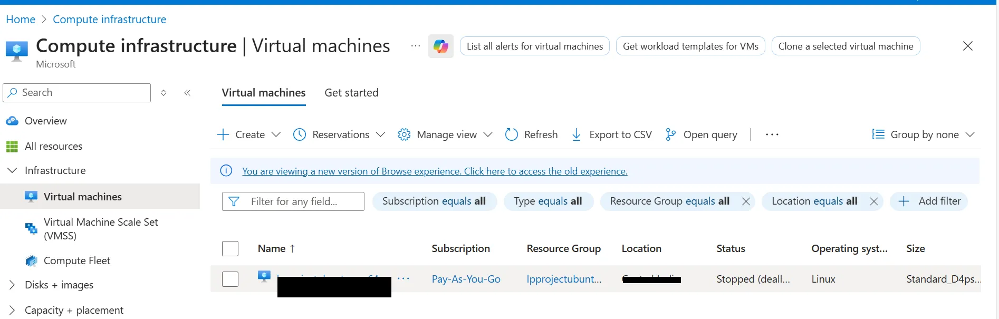
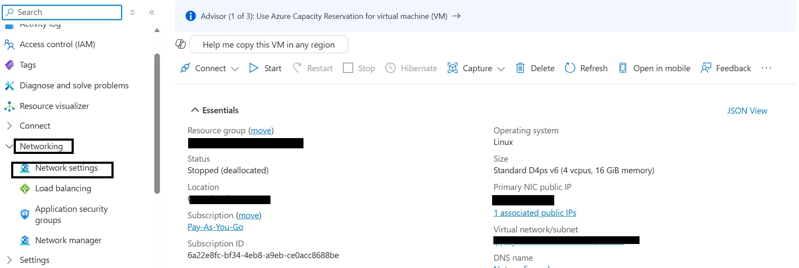
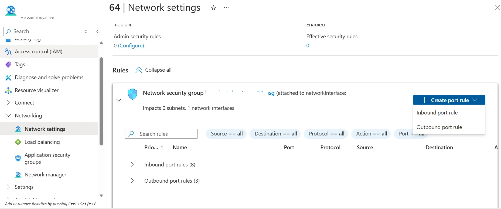
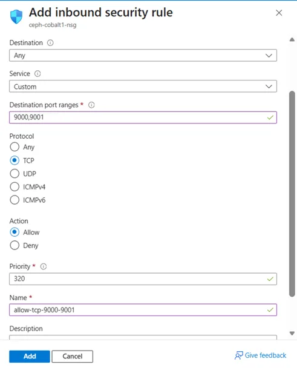

## Configure Azure firewall for MinIO

To allow external traffic on ports `9000` and `9001` for MinIO running on an Azure virtual machine, open the ports in the Network Security Group (NSG) attached to the virtual machine's network interface or subnet.

{}For more information about Azure setup, see [Getting started with Microsoft Azure Platform](/learning-paths/servers-and-cloud-computing/csp/azure/).{}

## Create a firewall rule in Azure

To expose TCP ports `9000` and `9001`, create a firewall rule.

Navigate to the [Azure Portal](https://portal.azure.com), go to **Virtual Machines**, and select your virtual machine.

In the left menu, select **Networking** and in the **Networking** section, select **Network settings** associated with the virtual machine's network interface.

Navigate to **Create port rule**, and select **Inbound port rule**.

Configure it using the following details:

- **Source:** Any  
- **Source port ranges:** *  
- **Destination:** Any  
- **Destination port ranges:** 9000,9001  
- **Protocol:** TCP  
- **Action:** Allow  
- **Name:** allow-tcp-9000-9001

{}
This rule allows traffic from any source IP address. For production use, restrict the **Source** to your own IP address or a specific CIDR range.
{}

After filling in the details, select **Add** to save the rule.

The network firewall rule is now created, allowing MinIO to communicate over ports `9000` and `9001`. Now that the ports are open, you're ready to install and start the MinIO server.
