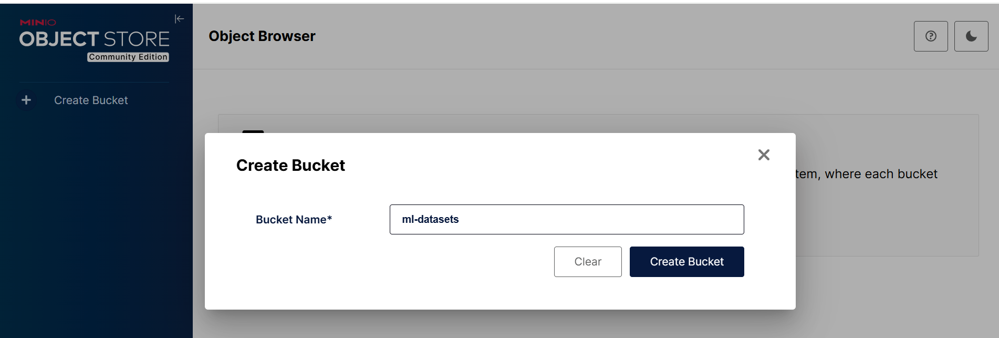
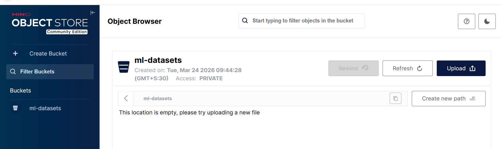
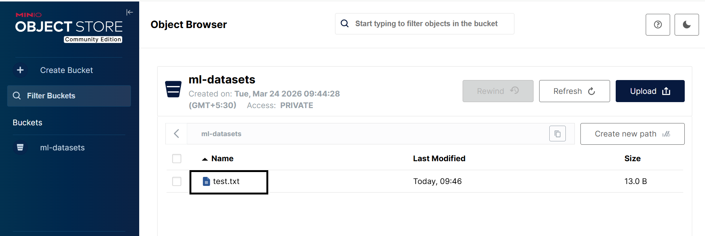

## Install and Configure MinIO

In this section, you install and configure **MinIO**, an S3-compatible object storage service, on an Azure Cobalt ARM virtual machine.

MinIO provides high-performance object storage that is widely used in AI/ML pipelines, data lakes, and cloud-native applications.

This setup ensures MinIO runs natively on Arm-based processors, enabling efficient storage and retrieval of large datasets.

## Architecture overview

This architecture represents a single-node object storage deployment.

```text
Azure Cobalt ARM VM (Ubuntu 24.04)
        │
        ▼
MinIO Server (S3-compatible storage)
        │
        ▼
Object Storage (/data/minio)
```

## Update the system

Update the system packages to ensure you have the latest security patches and dependencies.

```bash
sudo apt update
sudo apt install -y wget curl unzip python3-pip python3-venv
```

**Why this matters:**

- Ensures compatibility with the latest packages
- Installs tools required for downloading and running MinIO
- Prepares Python environment for later validation

## Install MinIO (ARM64)

Download and install the MinIO binary compiled for Arm64 architecture.

```bash
wget https://dl.min.io/server/minio/release/linux-arm64/minio
chmod +x minio
sudo mv minio /usr/local/bin/
```

**Verify installation:**

```bash
minio --version
```

The output is similar to:

```output
minio version RELEASE.2025-09-07T16-13-09Z (commit-id=07c3a429bfed433e49018cb0f78a52145d4bedeb)
Runtime: go1.24.6 linux/arm64
License: GNU AGPLv3 - https://www.gnu.org/licenses/agpl-3.0.html
Copyright: 2015-2025 MinIO, Inc.
```

The output confirms MinIO is installed correctly.

**Why this matters:**

- Arm64 binary ensures optimal performance on Cobalt processors
- MinIO runs natively without emulation

## Create storage directory

Create a directory where MinIO will store object data.

```bash
sudo mkdir -p /data/minio
sudo chown -R $USER:$USER /data/minio
```

**Why this matters:**

- Provides persistent storage for objects
- Ensures proper permissions for MinIO to read/write data

## Set environment variables

Set credentials for accessing MinIO. These credentials control access to your object storage

```bash
export MINIO_ROOT_USER=admin
export MINIO_ROOT_PASSWORD=StrongPassword123
```

## Start MinIO server

Start the MinIO server using the storage directory.

```bash
minio server /data/minio --console-address ":9001"
```

**Keep this terminal running.**

**Why this matters:**

- Starts S3-compatible storage service
- Exposes API and web console for interaction
 
## Access MinIO console

Open the following URLs in your browser:

- **API:** http://<VM-IP>:9000
- **Console:** http://<VM-IP>:9001


## Login credentials:

- **Username:** admin
- **Password:** StrongPassword123

## Create a bucket

Buckets are logical containers for storing objects.

- Navigate to **Buckets**
- Click **Create Bucket**
- Name: **ml-datasets**

**Why this matters:**

- Buckets organize data similarly to folders
- Required before uploading objects  





## Install MinIO client (mc)

Install the MinIO CLI tool for interacting with storage.

```bash
wget https://dl.min.io/client/mc/release/linux-arm64/mc
chmod +x mc
sudo mv mc /usr/local/bin/
```

## Configure client

Configure the client to connect to your MinIO server.

```bash
mc alias set local http://localhost:9000 admin StrongPassword123
```
- Enables CLI-based interaction with MinIO
- Used for automation, scripting, and benchmarking

## Test object upload

Upload a sample object to verify functionality.

```bash
echo "hello cobalt" > test.txt
mc cp test.txt local/ml-datasets/
```

**Verify:**

```bash
mc ls local/ml-datasets
```

The output is similar to:

```output
[2026-03-24 04:28:25 UTC]    43B STANDARD data.csv
[2026-03-24 04:29:59 UTC]    19B STANDARD model.bin
[2026-03-24 04:16:22 UTC]    13B STANDARD test.txt
[2026-03-24 04:54:02 UTC]     0B dataset/
```


**Why this matters:**

- Confirms MinIO is working correctly
- Validates upload and storage functionality

## What you've learned and what's next

In this section, you learned how to:

- Set up MinIO on an Azure Cobalt ARM VM
- Configure object storage using a local data directory
- Access the MinIO web console and API
- Create buckets and upload objects
- Use the MinIO CLI for storage operations

In the next section, you will:

- Benchmark MinIO to evaluate storage performance
- Validate S3 compatibility using Python SDK
- Ensure readiness for real-world application integration

