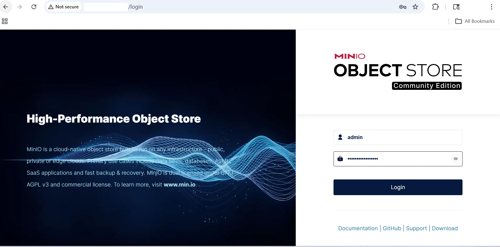
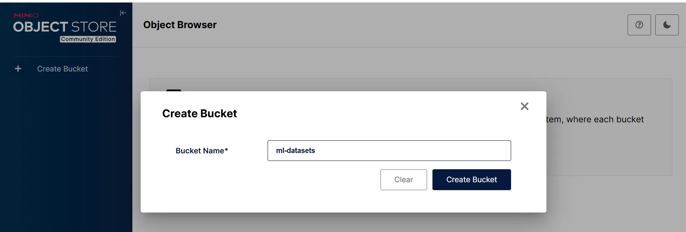
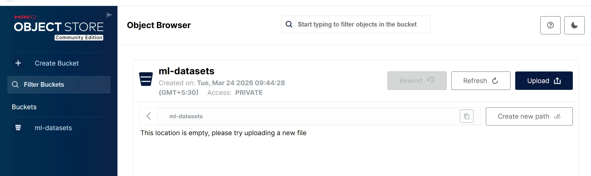
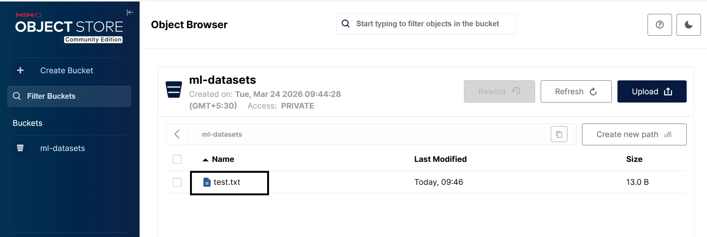

## Architecture overview

This architecture represents a single-node object storage deployment.

```text
Azure Cobalt 100 VM (Ubuntu 24.04)
        │
        ▼
MinIO Server (S3-compatible storage)
        │
        ▼
Object Storage (/data/minio)
```

## Connect to your virtual machine

SSH into your virtual machine using the private key you downloaded earlier and the public IP address shown in the Azure Portal.

```bash
ssh -i <your-key>.pem azureuser@<VM-IP>
```

Replace `<your-key>.pem` with the path to your downloaded private key file and `<VM-IP>` with your virtual machine's public IP address.

## Update the system

Update the system packages to ensure you have the latest security patches and dependencies.

```bash
sudo apt update
sudo apt install -y wget curl unzip python3-pip python3-venv python-is-python3
```

## Install MinIO 

Download and install the MinIO binary compiled for Arm architecture.

```bash
wget https://dl.min.io/server/minio/release/linux-arm64/minio
chmod +x minio
sudo mv minio /usr/local/bin/
```

Confirm MinIO is installed and print the version:

```bash
minio --version
```

The output is similar to:

```output
minio version RELEASE.2025-09-07T16-13-09Z (commit-id=07c3a429bfed433e49018cb0f78a52145d4bedeb)
Runtime: go1.24.6 linux/arm64
License: GNU AGPLv3 - https://www.gnu.org/licenses/agpl-3.0.html
Copyright: 2015-2025 MinIO, Inc.
```

The output confirms MinIO is installed and running on your virtual machine.

## Create storage directory

Create a directory where MinIO will store object data.

```bash
sudo mkdir -p /data/minio
sudo chown -R $USER:$USER /data/minio
```

## Set environment variables

Set the credentials MinIO uses to control access to your object storage.

{}
Replace `yourpassword` with a strong, unique password before running these commands. Do not use a default or example value in any environment accessible from the internet.
{}

```bash
export MINIO_ROOT_USER=admin
export MINIO_ROOT_PASSWORD=yourpassword
```

## Start MinIO server

Start the MinIO server using the storage directory.

```bash
minio server /data/minio --console-address ":9001"
```

The MinIO server runs in the foreground. Leave this terminal open and open a second SSH session for the remaining steps.

## Access MinIO console

Open a browser and navigate to `http://<VM-IP>:9001`, replacing `<VM-IP>` with your virtual machine's public IP address. This opens the MinIO web console. The S3-compatible API is also available on port `9000` for use with SDKs and CLI tools.

Log in with username `admin` and the password you set in `MINIO_ROOT_PASSWORD`.



## Create a bucket

Buckets are the containers you use to store objects in MinIO. To create one:

- Select **Buckets** in the left menu.
- Select **Create Bucket**.
- Enter `ml-datasets` as the bucket name and select **Create Bucket**.





## Install MinIO client (mc)

The MinIO server is still running in your first terminal. Open a second SSH session to your virtual machine for the remaining steps.

```bash
ssh -i <your-key>.pem azureuser@<VM-IP>
```

Install the MinIO CLI tool for interacting with your storage.

```bash
wget https://dl.min.io/client/mc/release/linux-arm64/mc
chmod +x mc
sudo mv mc /usr/local/bin/
```

## Configure the MinIO client

The MinIO client `mc` needs to know the address and credentials of your MinIO server before you can use it. The `mc alias set` command registers this information under a short name so you can refer to it in later commands without repeating the URL and credentials each time. In this case the alias is named `local`.

Because this is a new SSH session, the `MINIO_ROOT_PASSWORD` environment variable is not set. Export it again before configuring the client:

```bash
export MINIO_ROOT_PASSWORD=yourpassword
```

Then register the alias:

```bash
mc alias set local http://localhost:9000 admin $MINIO_ROOT_PASSWORD
```

The four arguments are the alias name (`local`), the MinIO API endpoint (`http://localhost:9000`), and the username and password read from the environment variables you set earlier.

## Test object upload

Upload a sample object to verify functionality.

```bash
echo "hello cobalt" > test.txt
mc cp test.txt local/ml-datasets/
```

Confirm the file was uploaded by listing the bucket contents:

```bash
mc ls local/ml-datasets
```

The output is similar to:

```output
[2026-03-24 04:16:22 UTC]    13B STANDARD test.txt
```



## What you've learned and what's next

In this section, you learned how to:

- Set up MinIO on an Azure Cobalt 100 VM
- Configure object storage using a local data directory
- Access the MinIO web console and API
- Create buckets and upload objects
- Use the MinIO CLI for storage operations

In the next section, you will:

- Benchmark MinIO to evaluate storage performance
- Validate S3 compatibility using Python SDK
- Ensure readiness for real-world application integration
