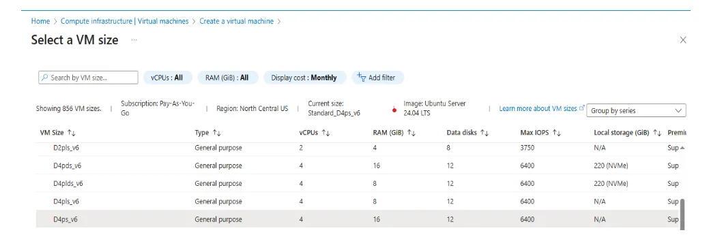
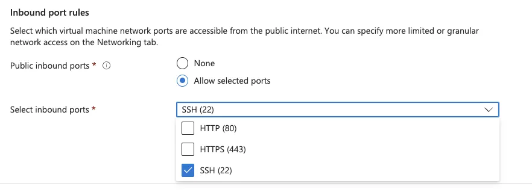
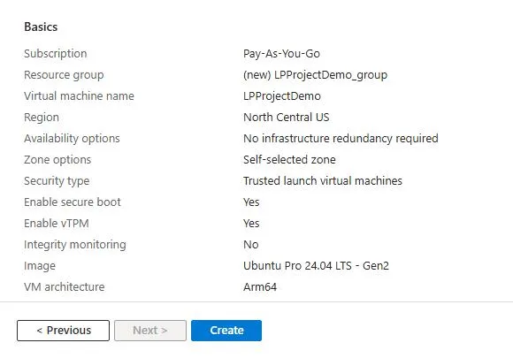
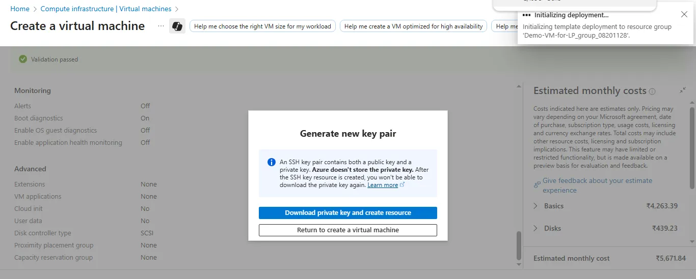
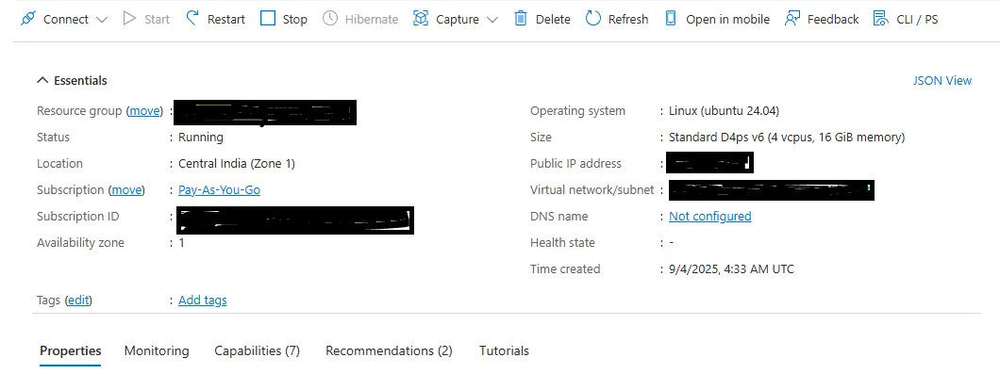

## Prerequisites and setup

There are several common ways to create an Arm-based Cobalt 100 virtual machine, and you can choose the method that best fits your workflow or requirements:

- The Azure Portal
- The Azure CLI
- An infrastructure as code (IaC) tool

In this section, you will use the Azure Portal to create a virtual machine with the Arm-based Azure Cobalt 100 processor.

The steps below use a general-purpose virtual machine from the Dpsv6 series. For more information, see the [Microsoft Azure guide for the Dpsv6 size series](https://learn.microsoft.com/en-us/azure/virtual-machines/sizes/general-purpose/dpsv6-series).

While the steps to create this instance are included here for convenience, you can also refer to [Deploy a Cobalt 100 Virtual Machine on Azure](/learning-paths/servers-and-cloud-computing/cobalt/) for more information.

## Create an Arm-based Azure virtual machine

Creating a virtual machine based on Azure Cobalt 100 is no different to creating any other virtual machine in Azure. To create an Azure virtual machine:

- Launch the Azure Portal and navigate to **Virtual Machines**.
- Select **Create**, and select **Virtual Machine** from the drop-down list.
- Inside the **Basic** tab, fill in the instance details such as **Virtual machine name** and **Region**.
- Select the image for your virtual machine (for example, Ubuntu Pro 24.04 LTS) and select **Arm64** as the VM architecture.
- In the **Size** field, select **See all sizes** and select the **D-Series v6** family of virtual machines.
- Select **D4ps_v6** from the list as shown in the diagram below:

- For **Authentication type**, select **SSH public key**.

{}
Azure generates an SSH key pair for you and lets you save it for future use. This method is fast, secure, and easy for connecting to your virtual machine.
{}

- Fill in the **Administrator username** for your VM.
- Select **Generate new key pair**, and select **RSA SSH Format** as the SSH Key Type.
- Give your SSH key a key pair name.
- In the **Inbound port rules**, select **SSH (22)** as the inbound port.

{}
Azure sets the source to **Any** by default, which allows SSH connections from the entire internet. After creating the VM, update the SSH inbound rule in the Network Security Group to restrict the source to your own IP address.
{}

- Select the **Review + Create** tab and review the configuration for your virtual machine. It should look like the following:

- Review the configuration and select the **Create** button, then select **Download Private key and Create Resource**.

Your virtual machine should be ready and running in a few minutes. You can SSH into the virtual machine using the private key, along with the public IP details.

{}To learn more about Arm-based virtual machine in Azure, see “Getting Started with Microsoft Azure” in [Get started with Arm-based cloud instances](/learning-paths/servers-and-cloud-computing/csp/azure).{}

## What you've learned and what's next

You've successfully:

- Created an Azure Cobalt 100 Arm-based virtual machine using the D-Series v6 (Dpsv6) family
- Selected Ubuntu Pro 24.04 LTS as the operating system
- Configured SSH authentication for secure access

Your Azure Cobalt 100 virtual machine is now ready. Next, you will install MinIO to set up S3-compatible object storage and begin storing and managing data on the virtual machine.
