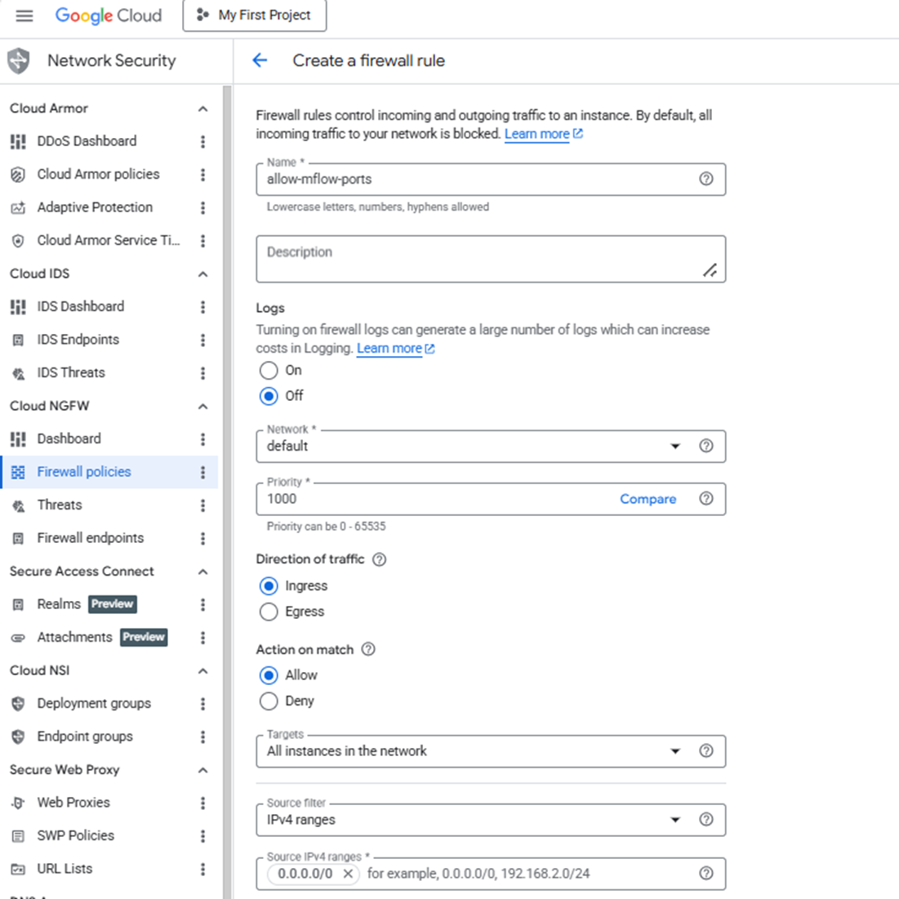
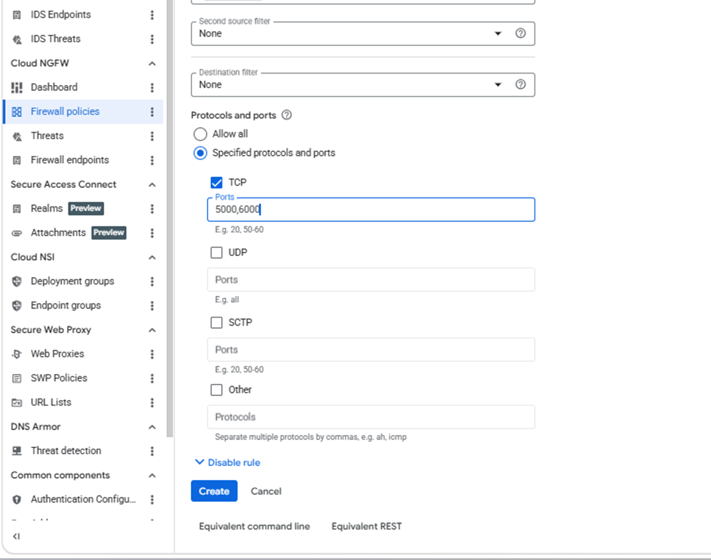

## Allow inbound access to MLflow

Create a firewall rule in Google Cloud Console to expose required ports for the MLflow UI and Model Serving API.

{}For help with GCP setup, see the Learning Path [Getting started with Google Cloud Platform](/learning-paths/servers-and-cloud-computing/csp/google/).{}

## Configure the firewall rule in Google Cloud Console

To configure a firewall rule for the MLflow UI and the Model Serving API: 

1. Navigate to the [Google Cloud Console](https://console.cloud.google.com/), go to **VPC Network > Firewall**, and select **Create firewall rule**.


2. Create a firewall rule that exposes the ports required for MLflow.

3. Set **Name** to `allow-mlflow-ports`, then select the network you want to bind to your virtual machine.

4. Set **Direction of traffic** to **Ingress**, set **Action on match** to **Allow**, set **Targets** to **All instances in the network**, and set **Source IPv4 ranges** to **0.0.0.0/0**.



5. Under **Protocols and ports**, select **Specified protocols and ports**.
6. Select the **TCP** checkbox and enter:

```text
5000,6000
```

Use port mapping **5000** for the MLflow Tracking UI and **6000** for the MLflow Model Serving API.



7. Select **Create**.

## What you've accomplished and what's next

You've created a firewall rule to expose the MLflow UI and the model serving API. You also enabled external access to monitor experiments and access deployed models.

Next, you'll create a C4A Arm virtual machine and attach it to this firewall rule.
