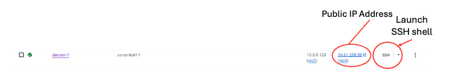

## Set up the virtual machine

In this section, you'll create a Google Axion C4A Arm-based virtual machine (VM) on Google Cloud Platform (GCP). You'll use the `c4a-standard-4` machine type, which provides 4 vCPUs and 16 GB of memory. This VM will host your MLflow tracking server and model serving API.

{}For help with GCP setup, see the Learning Path [Getting started with Google Cloud Platform](/learning-paths/servers-and-cloud-computing/csp/google/).{}

## Configure the C4A virtual machine in Google Cloud Console

To create a virtual machine based on the C4A instance type in the console:

1. Navigate to the [Google Cloud Console](https://console.cloud.google.com/).
2. Go to **Compute Engine** > **VM Instances** and select **Create Instance**.
3. Under **Machine configuration**, populate fields such as **Instance name**, **Region**, and **Zone**.
4. Set **Series** to `C4A`, then select `c4a-standard-4` for **Machine type**.

5. Under **OS and storage**, select **Change** and then choose an Arm64-based operating system image. For this Learning Path, select **SUSE Linux Enterprise Server**. 
6. For the license type, choose **Pay as you go**. 
7. Increase **Size (GB)** from **10** to **100** to allocate sufficient disk space, and then select **Choose**.
8. Expand **Advanced options** and select **Networking**.
9. Under **Network tags**, enter `allow-mlflow-ports` to link the VM to the firewall rule from the previous step and allow inbound access to ports 5000 (MLflow UI) and 6000 (model serving API).
10. Select **Create** to launch the virtual machine.

After the instance starts, select **SSH** next to the VM in the instance list to open a browser-based terminal session.

A new browser window opens with a terminal connected to your VM.

## What you've accomplished and what's next

You've now provisioned a Google Axion C4A Arm VM and connected to it using SSH.

Next, you'll install MLflow and the required dependencies on your VM.