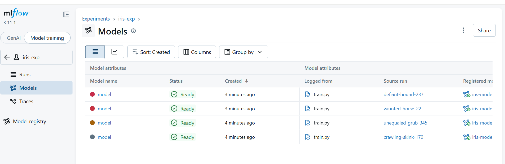

## Model Registry and Deployment

This section covers model versioning, alias assignment, and serving the model as an API.


## Terminal usage (Important)

We continue using the same terminals:

- **Terminal A** → Run scripts and test API  
- **Terminal B** → MLflow server (already running)  
- **Optional Terminal C** → Model serving (if you want a separate terminal)

If you want simplicity, you can use only **Terminal A + B**

## Set tracking URI

In **Terminal A**, run:

```bash
export MLFLOW_TRACKING_URI=http://127.0.0.1:5000
```

- This tells MLflow to use your running server.
- Without this, MLflow will not find your models.

## Create alias script

```bash
cd ~/mlflow-learning-path/demo
```

Create a script to select the best model automatically:

```bash
cat > set_prod.py <<'EOF'
import os
from mlflow import MlflowClient

tracking_uri = os.environ.get("MLFLOW_TRACKING_URI", "http://127.0.0.1:5000")
client = MlflowClient(tracking_uri=tracking_uri)

versions = client.search_model_versions("name='iris-model'")

best_v = None
best_acc = -1

for v in versions:
    run = client.get_run(v.run_id)
    acc = run.data.metrics.get("accuracy", -1)
    if acc > best_acc:
        best_acc = acc
        best_v = v.version

client.set_registered_model_alias("iris-model", "production", best_v)
print("Production version:", best_v)
EOF
```

## Assign production model

**Run the script:**

```bash
python set_prod.py
```

**What this does:**

- checks all model versions.
- finds the best accuracy.
- marks it as production.

## Serve model

Now we deploy the model as an API.

You can run this in **Terminal A** or open **Terminal C**.

```bash
cd ~/mlflow-learning-path
source mlflow-env/bin/activate
```

```bash
export MLFLOW_TRACKING_URI=http://127.0.0.1:5000
```

```bash
mlflow models serve \
  -m "models:/iris-model@production" \
  -p 6000 \
  --no-conda
```

## View registered models

Go to:

- Model training → Models



You should see:

- multiple versions (v1, v2, v3…)
- one marked as production

## Test inference from the Free Terminal ( A or C)

```bash
curl -X POST http://127.0.0.1:6000/invocations \
  -H "Content-Type: application/json" \
  -d '{
    "dataframe_records": [
      {
        "sepal length (cm)": 5.1,
        "sepal width (cm)": 3.5,
        "petal length (cm)": 1.4,
        "petal width (cm)": 0.2
      }
    ]
```

You will get a prediction output like:

```output
[0]
```

## What you've learned

You have successfully:

- Selected the best model from experiments
- Assigned a production alias
- Deployed the model as an API
- Performed inference using curl
