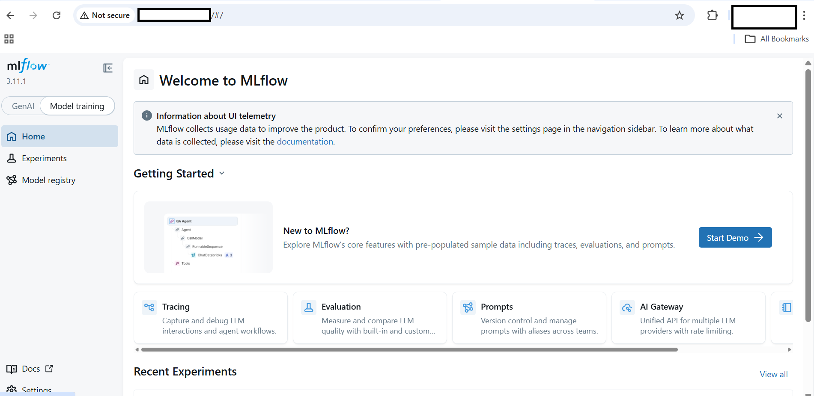
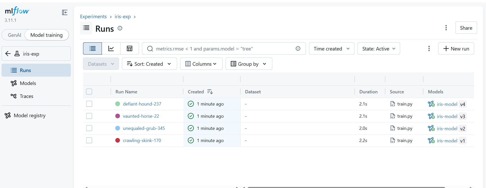

## Deploy MLflow on GCP SUSE Arm64

In this section, you will learn how to set up MLflow on a GCP Arm64 (Axion) virtual machine using SUSE Linux and Python 3.11.

By the end of this section, you will be able to:

- Install MLflow and required dependencies  
- Start the MLflow tracking server  
- Run machine learning experiments  
- View results in the MLflow UI

## Terminal usage (Important)

To keep things simple, we will use only **two terminals**:

- **Terminal A** → For setup, training, and running commands  
- **Terminal B** → For running the MLflow server (keep this running)

Think of it like:

- Terminal A = “work terminal”
- Terminal B = “server terminal”

## Connect to the VM

Open **Terminal A** and connect:

```bash
ssh <your-user>@<your-vm-ip>
```

## Verify system:

Check your system architecture:

```bash
uname -m
cat /etc/os-release
```

The output is similar to:

```output
aarch64
NAME="SLES"
VERSION="15-SP5"
VERSION_ID="15.5"
PRETTY_NAME="SUSE Linux Enterprise Server 15 SP5"
ID="sles"
ID_LIKE="suse"
ANSI_COLOR="0;32"
CPE_NAME="cpe:/o:suse:sles:15:sp5"
DOCUMENTATION_URL="https://documentation.suse.com/"
```

This confirms you are on an Arm-based VM

## Update your system

Update all system packages:

```bash
sudo zypper refresh
sudo zypper update -y
```
This ensures your system is up to date before installing anything.

## Install required dependencies

Now install Python 3.11 and other tools:

```bash
sudo zypper install -y \
  python311 \
  python311-pip \
  python311-setuptools \
  python311-wheel \
  sqlite3 \
  gcc \
  gcc-c++ \
  make \
  git
```

**What these do:**

- python311 → Python 3.11 runtime
- pip → install Python packages
- gcc/g++/make → build tools
- sqlite3 → MLflow database

**Verify:**

```bash
python3.11 --version
pip3.11 --version
```

The output is similar to:

```output
Python 3.11.10
pip 26.0.1 from /home/gcpuser/mlflow-learning-path/mlflow-env/lib64/python3.11/site-packages/pip (python 3.11)
```

## Create Python environment

```bash
mkdir -p ~/mlflow-learning-path
cd ~/mlflow-learning-path

python3.11 -m venv mlflow-env
source mlflow-env/bin/activate
```
This is where all your MLflow files will live.

**Upgrade tools:**

```bash
pip install --upgrade pip setuptools wheel
```

## Install MLflow

```bash
pip install mlflow scikit-learn pandas numpy matplotlib
```
This installs MLflow + ML libraries.

## Create directories

```bash
mkdir -p backend artifacts demo
touch backend/mlflow.db
```

**These folders store:**

- experiments
- models
- logs

## Start MLflow server

**Now open Terminal B and run:**

```bash
ssh <your-user>@<your-vm-ip>
cd ~/mlflow-learning-path
source mlflow-env/bin/activate
```

**Start MLflow server:**

```bahs
mlflow server \
  --host 0.0.0.0 \
  --port 5000 \
  --backend-store-uri sqlite:///$(pwd)/backend/mlflow.db \
  --artifacts-destination file://$(pwd)/artifacts \
  --allowed-hosts "*" \
  --cors-allowed-origins "*"
```

- Keep this terminal running.
- This is your MLflow backend.

## Access MLflow UI

**Open in browser:**

```text
http://<VM-IP>:5000
```



- Select **Model training**
- See experiments
- Compare runs
- View accuracy

## Create training script

**Go back to Terminal A:**

```bash
cd ~/mlflow-learning-path/demo
```

**Create the file:**

```bash
cat > train.py <<'EOF'
import os
import mlflow
import mlflow.sklearn
from sklearn.datasets import load_iris
from sklearn.model_selection import train_test_split
from sklearn.linear_model import LogisticRegression
from sklearn.metrics import accuracy_score

mlflow.set_tracking_uri("http://127.0.0.1:5000")
mlflow.set_experiment("iris-exp")

X, y = load_iris(return_X_y=True)
X_train, X_test, y_train, y_test = train_test_split(X, y)

C = float(os.getenv("C", 1.0))

with mlflow.start_run():
    model = LogisticRegression(C=C, max_iter=200)
    model.fit(X_train, y_train)

    preds = model.predict(X_test)
    acc = accuracy_score(y_test, preds)

    mlflow.log_param("C", C)
    mlflow.log_metric("accuracy", acc)

    mlflow.sklearn.log_model(
        model,
        name="model",
        registered_model_name="iris-model"
    )

    print("Accuracy:", acc)
EOF
```

**This script:**

- trains a model
- logs accuracy
- registers the model

## Run experiments

**Set MLflow server:**

```bash
export MLFLOW_TRACKING_URI=http://127.0.0.1:5000
```

**Run experiments:**

```bash
python train.py
export C=0.5
python train.py
export C=2.0
python train.py
```

**Each run creates:**

- new experiment entry
- new model version

The output is similar to:

```output
Registered model 'iris-model' already exists. Creating a new version of this model...
2026/04/22 04:44:42 INFO mlflow.store.model_registry.abstract_store: Waiting up to 300 seconds for model version to finish creation. Model name: iris-model, version 2
Created version '2' of model 'iris-model'.
Accuracy: 1.0
🏃 View run unequaled-grub-345 at: http://127.0.0.1:5000/#/experiments/1/runs/8a9e3cf1ab3b4f669a37fb0cbe1e469c
🧪 View experiment at: http://127.0.0.1:5000/#/experiments/1

(mlflow-env) gcpuser@mlfow-new:~/mlflow-learning-path/demo> export C=0.5
(mlflow-env) gcpuser@mlfow-new:~/mlflow-learning-path/demo> python train.py

Registered model 'iris-model' already exists. Creating a new version of this model...
2026/04/22 04:44:52 INFO mlflow.store.model_registry.abstract_store: Waiting up to 300 seconds for model version to finish creation. Model name: iris-model, version 3
Created version '3' of model 'iris-model'.
Accuracy: 1.0
🏃 View run vaunted-horse-22 at: http://127.0.0.1:5000/#/experiments/1/runs/4e10db3266c5495bae43df36a46ebd13
🧪 View experiment at: http://127.0.0.1:5000/#/experiments/1

(mlflow-env) gcpuser@mlfow-new:~/mlflow-learning-path/demo> export C=2.0
(mlflow-env) gcpuser@mlfow-new:~/mlflow-learning-path/demo> python train.py

2026/04/22 04:45:00 INFO mlflow.store.model_registry.abstract_store: Waiting up to 300 seconds for model version to finish creation. Model name: iris-model, version 4
Created version '4' of model 'iris-model'.
Accuracy: 1.0
🏃 View run defiant-hound-237 at: http://127.0.0.1:5000/#/experiments/1/runs/8b2517b64bb34df199a78f2a8b29137c
🧪 View experiment at: http://127.0.0.1:5000/#/experiments/1
```

## Verify results

In UI:

- Open Model training
- Select iris-exp
- Go to Runs

**You should see:**

- Multiple runs
- Accuracy metrics
- Model versions (v1, v2, v3)

## View experiment runs

Go to:

- Model training → iris-exp → Runs



## What you've learned

You have successfully:

- Installed MLflow on SUSE ARM64
- Configured Python 3.11 environment
- Started MLflow tracking server
- Logged experiments and metrics
- Registered models

Next, you will deploy and serve the model.
