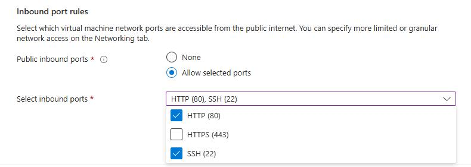
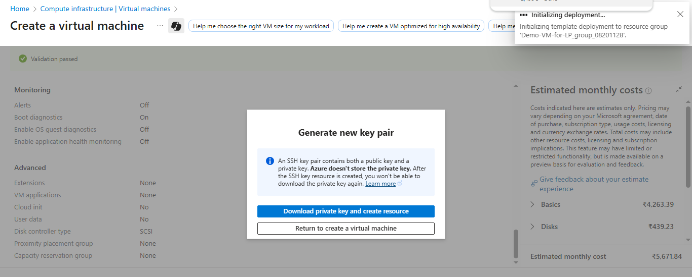

## Introduction

There are several ways to create an Arm-based Cobalt 100 virtual machine: 

- The Azure console
- The Azure CLI
- An infrastructure as code (IaC) tool

In this section, you will use the Azure console to create a virtual machine with the Arm-based Azure Cobalt 100 processor.

This Learning Path focuses on the general-purpose virtual machines in the **Dpsv6** series. For further information, see the [Microsoft Azure Dpsv6 sizes series guide](https://learn.microsoft.com/en-us/azure/virtual-machines/sizes/general-purpose/dpsv6-series).  

While the steps to create this instance are included here for convenience, you can also refer to the [Deploy a Cobalt 100 virtual machine on Azure Learning Path](/learning-paths/servers-and-cloud-computing/cobalt/).

## Create an Arm-based Azure virtual machine 

Creating a virtual machine on Azure Cobalt 100 is similar to creating any other virtual machine in Azure. To create an Azure virtual machine, open the Azure portal and navigate to **Virtual machines**.

Now follow these steps:

- Select **Create**, then select **Virtual machine** from the drop-down list.
- In the **Basics** tab, enter the instance details such as **Virtual machine name** and **Region**.
- Choose the image for your virtual machine (for example, **Ubuntu Pro 24.04 LTS**) and select **Arm64** as the **VM architecture**.
- In the **Size** field, select **See all sizes** and select the **D-series v6** family of virtual machines. Select **D4ps_v6** from the list.

- Next, select **SSH public key** as the **Authentication type**. Azure can generate an **SSH key pair** for you and store it for future use. This is a fast, simple, and secure way to connect to your virtual machine.
- Enter the **Administrator username** for your VM.
- Select **Generate new key pair**, and select **RSA SSH format** as the **SSH key type**. RSA could offer better security with keys longer than 3072 bits. Give a Key pair name to your SSH key.
- In **Inbound port rules**, select **HTTP (80)** and **SSH (22)** as the inbound ports:

Select the **Review and create** tab and confirm your configuration. It should look similar to the following:

When you are satisfied with your selections, select **Create**, then select **Download private key and create resource**.

After deployment, your virtual machine will be running. Use the private key and the **Public IP** to connect over **SSH**.

With the virtual machine ready, proceed to the next section to deploy MongoDB on your running instance.
