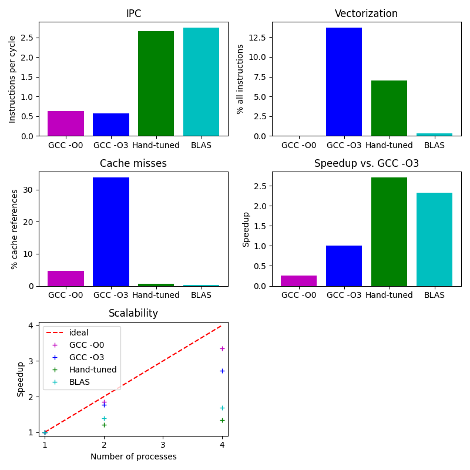

---
# User change
title: "Optimize your code"
weight: 4 # (intro is 1), 2 is first, 3 is second, etc.

# Do not modify these elements
layout: "learningpathall"
---

You can profile the application using a variety of tools and compare performance between different alternatives. 

You can try different compiler options, alternative ways of coding, and different libraries implementing equivalent functions. 

## Build options for profiling

To compare performance you can disable compiler optimizations using `-O0`, profile the application, and then enable compiler optimizations to see the difference. 

1. Navigate to the `src` directory:

```bash
cd src
```

2. Modify the compiler settings

Use a text editor to modify `make.def` 

Add the `CFLAGS` as shown below to disable compiler optimizations and add debugging symbols:

```makefile
CFLAGS = -O0 -g
```

## Build

The build step is the same as the previous section. 

Select the implementation you would like to use: C, Fortran, or Python. 

1. Navigate to the sub-directory and build

For example, for C:

```bash
cd C
make clean && make
```

You can do the same for the Fortran example by changing to the `F90` directory instead. 

## Run and profile your application

Profile the application with `perf`:

This can be done for C and Fortran. 

```bash
perf stat mpirun ./mmult 1024
```

This will provide information on a few hardware counter events as well as the elapsed time. 

You can investigate the number of cycles per instruction (CPI). If it is low (less than 1), this indicates inefficiency.

```output
 Performance counter stats for 'mpirun ./mmult 1024':

          29181.09 msec task-clock                #    3.789 CPUs utilized
              7878      context-switches          #  269.969 /sec
                48      cpu-migrations            #    1.645 /sec
             23276      page-faults               #  797.640 /sec
       72386310159      cycles                    #    2.481 GHz
       42741639406      instructions              #    0.59  insn per cycle
   <not supported>      branches
          14030444      branch-misses

       7.701723690 seconds time elapsed

      28.926470000 seconds user
       0.495809000 seconds sys
```

### Use a parallel profiler

Using the same implementation, run the application in parallel with Linaro MAP.

- for C and Fortran:

```bash
map mpirun ./mmult 1024
```

- for Python

```bash
map mpirun python ./mmult.py -s 1024
```

The `map` command will launch a GUI, and profiling results will be displayed as a timeline with annotated code.

## Enable compiler optimizations

Return `src` directory and enable compiler optimizations. 

1. Modify the compiler settings

Use a text editor to modify `make.def` to turn compiler optimizations on and report on vectorized loops: 

```bash
CFLAGS = -Ofast -g -fopt-info-vec
```

2. Rebuild the application

For C:

```bash
cd C
make clean && make
```

You can do the same for the Fortran example by changing to the `F90` directory instead. 

For C you will see message output about vectorization:

```output
mpicc -Ofast -g -fopt-info-vec -std=c99 mmult.c -c -o mmult.o
mmult.c:32:5: optimized: loop vectorized using 16 byte vectors
mmult.c:65:7: optimized: loop vectorized using 16 byte vectors
mmult.c:32:5: optimized: loop vectorized using 16 byte vectors
mmult.c:32:5: optimized: loop vectorized using 16 byte vectors
mmult.c:32:5: optimized: loop vectorized using 16 byte vectors
mpicc -Ofast -g -fopt-info-vec -std=c99 mmult.o -o mmult
```

Run again with compiler optimizations:

```bash
perf stat mpirun ./mmult 1024
```

The `perf` output will show the program is much faster:

```output
 Performance counter stats for 'mpirun ./mmult 1024':

           6245.58 msec task-clock                #    3.197 CPUs utilized
              7537      context-switches          #    1.207 K/sec
                70      cpu-migrations            #   11.208 /sec
             23269      page-faults               #    3.726 K/sec
       15158107248      cycles                    #    2.427 GHz
        8565162057      instructions              #    0.57  insn per cycle
   <not supported>      branches
           7632276      branch-misses

       1.953869851 seconds time elapsed

       5.975460000 seconds user
       0.504854000 seconds sys
```

## Investigate cache misses

You can also specify different hardware counter events to collect. 

For example, you can investigate memory access issues by collecting cache statistics with:

```bash
perf stat -e cache-misses,cache-references mpirun ./mmult 1024
```

The output will be similar to:

```output
       1223056962      cache-misses              #   32.486 % of all cache refs
       3764910428      cache-references

       2.025318426 seconds time elapsed

       6.115777000 seconds user
       0.382980000 seconds sys
```

If this ratio is high, memory access may be suboptimal. 

You can annotate the code where cache misses happen with the following perf commands:

Record the `perf` results and store them in a file named `perf.data`:

```bash
perf record -e cache-misses mpirun ./mmult 1024
```

Run the `report` command to see the functions with the most cache misses:

```bash
perf report
```

You will see that nearly all of the cache misses come from the `mmult()` function.

## Optimize memory accesses

Change the order of the loops to raise the cache hit rate.


1. Create a patch file

Navigate back to the `arm_hpc_tools_trial` directory and use a text editor to create a new file named `p2` and copy the contents below into the file.

```patch
--- ./src/Py/C/mmult.c
+++ ./src/Py/C/mmult.c
@@ -23,16 +23,12 @@
 {
   for(int i=0; i<sz/nslices; i++)
   {
-    for(int j=0; j<sz; j++)
+    for(int k=0; k<sz; k++)
     {
-      double res = 0.0;
-
-      for(int k=0; k<sz; k++)
+      for(int j=0; j<sz; j++)
       {
-        res += A[i*sz+k]*B[k*sz+j];
+        C[i*sz+j] += A[i*sz+k]*B[k*sz+j];
       }
-
-      C[i*sz+j] += res;
     }
   }
 }


--- ./src/Py/F90/mmult.F90
+++ ./src/Py/F90/mmult.F90
@@ -27,12 +27,10 @@
 !f2py intent(hide) :: i,j,k,res

     do i=1,sz/nslices
-      do j=1,sz
-        res=0.0
-        do k=1,sz
-         res=A(k,i)*B(j,k)+res
+      do k=1,sz
+        do j=1,sz
+          C(j,i)=A(k,i)*B(j,k)+C(j,i)
         end do
-        C(j,i)=res+C(j,i)
       end do
     end do
   end subroutine mmult


--- ./src/C/mmult.c
+++ ./src/C/mmult.c
@@ -41,16 +42,12 @@
 {
   for(int i=0; i<sz/nslices; i++)
   {
-    for(int j=0; j<sz; j++)
+    for(int k=0; k<sz; k++)
     {
-      double res = 0.0;
-
-      for(int k=0; k<sz; k++)
+      for(int j=0; j<sz; j++)
       {
-        res += A[i*sz+k]*B[k*sz+j];
+        C[i*sz+j] += A[i*sz+k]*B[k*sz+j];
       }
-
-      C[i*sz+j] += res;
     }
   }
 }


--- ./src/F90/mmult.F90
+++ ./src/F90/mmult.F90
@@ -171,12 +171,10 @@
     real(8)                 :: res

     do i=1,sz/nslices
-      do j=1,sz
-        res=0.0
-        do k=1,sz
-         res=A(k,i)*B(j,k)+res
+      do k=1,sz
+        do j=1,sz
+          C(j,i)=A(k,i)*B(j,k)+C(j,i)
         end do
-        C(j,i)=res+C(j,i)
       end do
     end do
   end subroutine mmult
```

4. Run the patch command:

```bash
patch -p0 < p2
```

5. Build and run again

Repeat the build and run steps again to see the impact on performance:

```bash
cd src/C
make clean
make 
perf stat -e cache-misses,cache-references mpirun ./mmult 1024
```

The cache misses are dramatically reduced from more than 30% to less than 1%.

The output will be similar to:

```output
 Performance counter stats for 'mpirun ./mmult 1024':

          18555942      cache-misses              #    0.614 % of all cache refs
        3022511071      cache-references

       0.737815764 seconds time elapsed

       1.110964000 seconds user
       0.370245000 seconds sys
```

## Use optimized routines

Performance varies with different versions of libraries. You can investigate two different libraries to try and review the results. 

### Use BLAS libraries

Using BLAS libraries may also improve performance. You can replace the `mmult()` function with a library function.

1. Edit the source code files

For C, use a text editor to modify the file `src/C/mmult.c`

Add the BLAS include file at the end of the list of other include files (about line 23):

```C
#include <cblas.h>
```

Replace the `mmult()` function by the `cblas_dgemm` function (about line 162):

```C
    /*  mmult(sz, nproc, mat_a, mat_b, mat_c); */
    cblas_dgemm(CblasRowMajor, CblasNoTrans, CblasNoTrans, sz/nproc, sz, sz, 1.0, mat_a, sz, mat_b, sz, 1.0, mat_c, sz);
```

For Fortran, use a text editor to modify the file `src/F90/mmult.F90`

Replace the `mmult()` function by the `DGEMM` function (about line 108):

```fortran
! call mmult(sz, nproc, mat_a, mat_b, mat_c)
 call DGEMM('N','N', sz, sz/nproc, sz, 1.0D0, &
            mat_b, sz, &
            mat_a, sz, 1.0D0, &
            mat_c, sz)
```


2. Edit the make values

Use a text editor to modify `src/make.def` and change the `CFLAGS` and `LFLAGS`

```makefile
CFLAGS = -Ofast -g -I/usr/include/aarch64-linux-gnu
LFLAGS = -L/usr/lib/aarch64-linux-gnu/blas -lblas -Wl,-rpath=/usr/lib/aarch64-linux-gnu/blas
```

3. Build and run 

Build the application with the BLAS implementation:

```bash
make clean && make
```

Run the application again to check performance. 

```bash
perf stat mpirun ./mmult 1024
```

The results show faster performance and high instructions per cycle.

```output
 Performance counter stats for 'mpirun ./mmult 1024':

           1835.84 msec task-clock                #    2.151 CPUs utilized
              7457      context-switches          #    4.062 K/sec
                79      cpu-migrations            #   43.032 /sec
             23308      page-faults               #   12.696 K/sec
        4117987250      cycles                    #    2.243 GHz
       11757097468      instructions              #    2.86  insn per cycle
   <not supported>      branches
           7339396      branch-misses

       0.853352223 seconds time elapsed

       1.541793000 seconds user
       0.521078000 seconds sys
```

### Use Arm Performance Library

You may also be able to increase performance by using a different library, such as the Arm Performance Library. 

Follow the steps below to try a different implementation of the matrix multiply function. 

1. Download the [Arm Performance Library](https://developer.arm.com/downloads/-/arm-performance-libraries). 

There are are number of options on the downloads page depending on the operating system and the compiler version you are using. 

If you are using Ubuntu 20.04 with the default `gcc` download the matching version with `wget`:

```bash
cd $HOME
wget https://developer.arm.com/-/media/Files/downloads/hpc/arm-performance-libraries/23-04/ubuntu-20/arm-performance-libraries_23.04_Ubuntu-20.04_gcc-9.3.tar
```

2. Extract the download and install the library

Extract the download using:

```bash
tar xvf arm-performance-libraries_23.04_Ubuntu-20.04_gcc-9.3.tar
cd ./arm-performance-libraries_23.04_Ubuntu-20.04/
```

Run the installer with `-a` to accept the EULA:

```bash
sudo ./arm-performance-libraries_23.04_Ubuntu-20.04.sh -a
```

3. Modify the make variables to use the Arm Performance Library

Navigate back to the example application:

```bash
cd ~/arm_hpc_tools_trial/
```

Use a text editor to modify `src/make.def` and change the `CFLAGS` and `LFLAGS` to point to the new library:

```makefile
ARMPL=/opt/arm/armpl_23.04_gcc-9.3
CFLAGS = -Ofast -g -I $(ARMPL)/include
LFLAGS = -L $(ARMPL)/lib -larmpl -Wl,-rpath=$(ARMPL)/lib
```

4. Rebuild and run 

Repeat the build and run steps above and confirm the application run correctly. 

```bash
cd src/C
make clean
make 
LD_LIBRARY_PATH=/opt/arm/armpl_23.04_gcc-9.3/lib perf stat mpirun ./mmult 1024
```

The output with Arm Performance Libraries will be similar to:

```output
 Performance counter stats for 'mpirun ./mmult 1024':

           1052.33 msec task-clock                #    1.608 CPUs utilized
              7530      context-switches          #    7.156 K/sec
                55      cpu-migrations            #   52.265 /sec
             24984      page-faults               #   23.742 K/sec
        2138316898      cycles                    #    2.032 GHz
        5017697830      instructions              #    2.35  insn per cycle
   <not supported>      branches
           6313065      branch-misses

       0.654396684 seconds time elapsed

       0.775589000 seconds user
       0.494900000 seconds sys
```

## Summary

The graphs below summarize the optimizations on the C version of the application, when using 1, 2 or 4 processes on AWS Graviton 2.



You have learned some tools and techniques for optimizing the compute kernel of a small example. 


