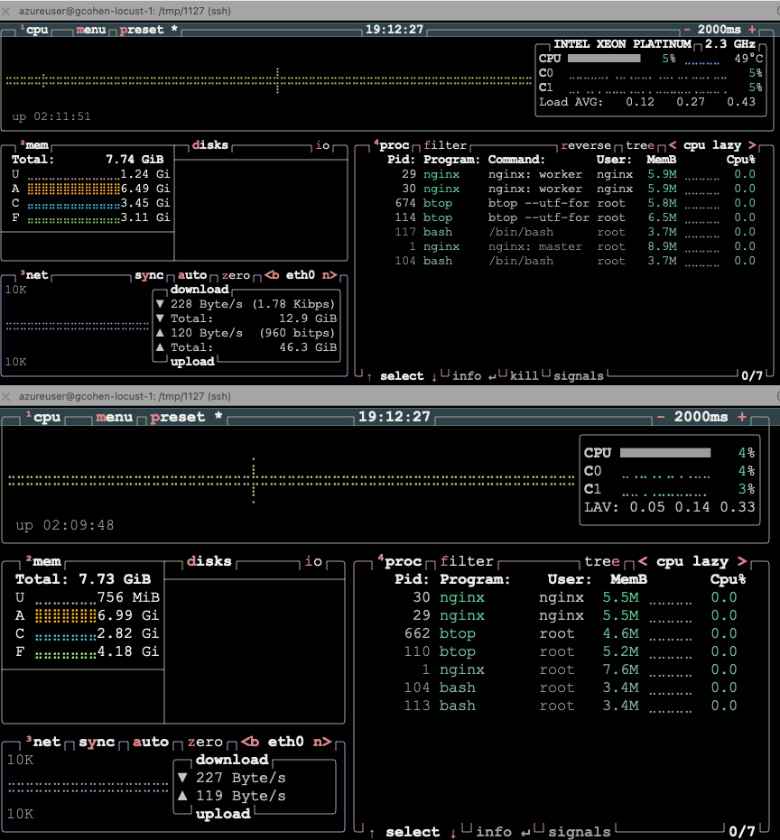
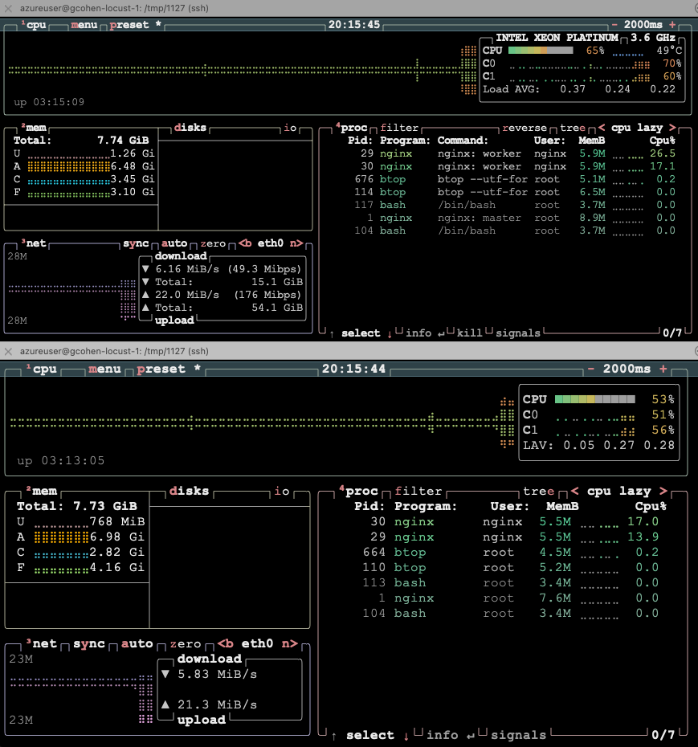
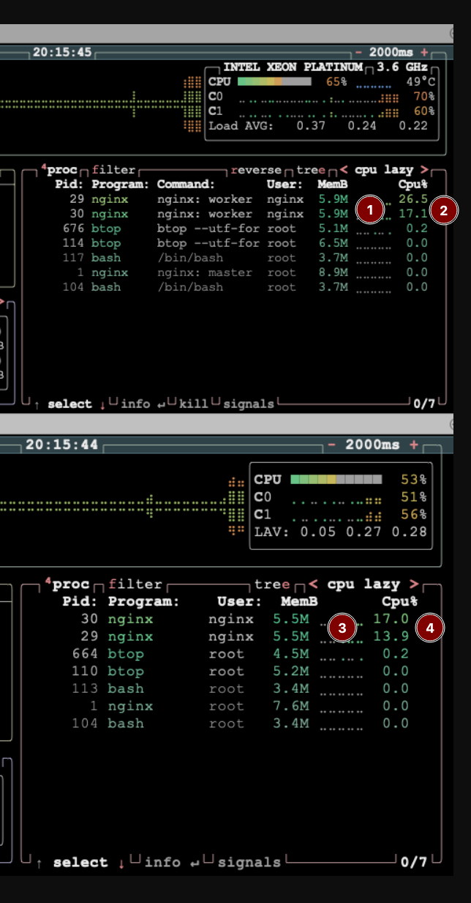

## Apply configuration updates

Now that you have all your nginx deployments running across Intel and ARM architectures, you can monitor performance across each architecture using wrk to generate load and btop to monitor system performance.

{}
This tutorial uses wrk to generate load, which is readily available on apt and brew package managers.  [wrk2](https://github.com/giltene/wrk2) is a modern fork of wrk with additional features.  wrk was chosen for this tutorial due to its ease of install, but if you prefer to install and use wrk2 (or other http load generators) for your testing, feel free to do so.
{}

### Apply performance configuration

The `nginx_util.sh` script includes a `put config` command that will:

- Apply a performance-optimized nginx configuration to all pods
- Install btop monitoring tool on all pods for system monitoring
- Restart pods with the new configuration

1. Run the following command to apply the configuration updates:

```bash
./nginx_util.sh put btop
```

You will see output similar to the following:

```output
Installing btop on all nginx pods...
Installing btop on nginx-amd-deployment-56b547bb47-vgbjj...
✓ btop installed on nginx-amd-deployment-56b547bb47-vgbjj
Installing btop on nginx-arm-deployment-66cb47ddc9-fgmsd...
✓ btop installed on nginx-arm-deployment-66cb547ddc9-fgmsd
Installing btop on nginx-intel-deployment-6f5bff9667-zdrqc...
✓ btop installed on nginx-intel-deployment-6f5bff9667-zdrqc
✅ btop installed on all pods!
```

### Verify configuration updates

2. Check that all pods have restarted with the new configuration:

```bash
kubectl get pods -n nginx
```

You should see all pods with recent restart times.

{}
Because pods are ephemeral, btop will need to be reinstalled if the pods are deleted or restarted.  If you get an error saying btop is not found, simply rerun the `./nginx_util.sh put btop` command to reinstall it.
{}


### Monitor pod performance

You can now login to any pod and use btop to monitor system performance.  There are many variables which may affect an individual workload's performance, btop (like top), is a great first step in understanding those variables.

{}
When performing load generation tests from your laptop, local system and network settings may interfere with proper load generation between your machine and the remote cluster services.  To mitigate these issues, its suggested to install the nginx_util.sh (or whichever tool you wish to use) on a [remote Azure instance](https://learn.arm.com/learning-paths/servers-and-cloud-computing/csp/azure/) in the same region and zone as your K8s cluster (us-west-2 if you follow these tutorial instructions exactly) for best results.  If you aren't seeing at least 70K+ requests/s to either K8s service endpoint, switching to a better located/tuned system is advised.
{}

Bringing up two btop terminals, one for each pod, is a convenient way to view performance in realtime. To bring up btop on both Arm and Intel pods:

1. Open a new terminal window or tab.
2. Within the terminal, run the `login arm` command from the nginx utility script to enter the pod: 

```bash
# Login to AMD pod (replace with intel or arm as needed)
./nginx_util.sh login arm
```

3. Once inside the pod, run btop to see real-time system monitoring:

```bash
btop --utf-force
```
4. Repeat, from Step 1, but this time, using the `login intel` command.

You should now see something similar to below, that is, one terminal for each Arm and Intel, running btop:



To visualize performance with btop against the Arm and Intel pods via the load balancer service endpoints, you can use the nginx_util.sh wrapper to generate the load two both simultaneoulsy:

```bash
./nginx_util.sh wrk both
```

This runs wrk with predefined setting (1 thread, 50 simultaneous connections) to generate load to the K8s architecture-specific endpoints. While it runs (for a default of 30s), you can observe some performance characteristics from the btop outputs:



Of particular interest is memory and CPU resource usage per pod.  For Intel, figure 1 shows memory usage for the process, with figure 2 showing total cpu usage.  Figures 3 and 4 show us the same metrics, but for Arm.



In addition to the visual metrics, the script also returns runtime results including requests per second, and latencies:

```output
azureuser@gcohen-locust-1:/tmp/1127$ ./nginx_util.sh wrk both
Running wrk against both architectures in parallel...

Intel: wrk -t1 -c50 -d30 http://172.193.227.195/
ARM: wrk -t1 -c50 -d30 http://20.252.73.72/

========================================

INTEL RESULTS:
Running 30s test @ http://172.193.227.195/
  1 threads and 50 connections
  Thread Stats   Avg      Stdev     Max   +/- Stdev
    Latency   752.40us    1.03ms  28.95ms   94.01%
    Req/Sec    84.49k    12.14k  103.08k    73.75%
  2528743 requests in 30.10s, 766.88MB read
Requests/sec:  84010.86
Transfer/sec:     25.48MB

ARM RESULTS:
Running 30s test @ http://20.252.73.72/
  1 threads and 50 connections
  Thread Stats   Avg      Stdev     Max   +/- Stdev
    Latency   621.56us  565.90us  19.75ms   95.43%
    Req/Sec    87.54k    10.22k  107.96k    82.39%
  2620567 requests in 30.10s, 789.72MB read
Requests/sec:  87062.21
Transfer/sec:     26.24MB

========================================
Both tests completed
```

### Experimenting with wrk

The nginx_util.sh script shows the results of the load generation, as well as the command lines used to generate them.  

```output
...
Intel: wrk -t1 -c50 -d30 http://172.193.227.195/
ARM: wrk -t1 -c50 -d30 http://20.252.73.72/
...
```


Feel free to experiment increasing/decreasing client threads, connections, and durations to better understand the performance characteristics under different scenarios.  

For example, to generate load using 500 connections across 4 threads to the Arm service for five minutes (300s), you could use the following commandline:

```bash
wrk -t4 -c500 -d300 http://20.252.73.72/
``` 

As mentioned earlier, unless your local system is tuned to handle load generation, you may find better traffic generation results by running on a VM. If aren't seeing at least 70K+ requests/s to either K8s service endpoint when running `wrk`, switching to a better located/tuned system is advised.

## Next Steps

You learned in this learning path how to run a sample nginx workload on a dual-architecture (Arm and Intel) Azure Kubernetes Service.  Once setup, you learned how to generate load with the wrk utility, and monitor runtime metrics with btop.  If you wish to continue experimenting with this learning path, some ideas you may wish to explore include:

* What do the performance curves look like between the two architectures as a function of load?
* How do larger instance types scale versus smaller ones?

Most importantly, you now possess the knowledge needed to begin experimenting with your own workloads on Arm-based AKS nodes to identify performance and efficiency opportunities unique to your own environments.
