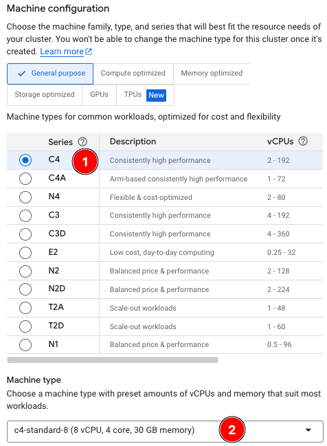

## Project Overview

Arm CPUs are widely used in  AI/ML workloads on Kubernetes. In this Learning Path, you'll learn how to deploy [Ollama](https://ollama.com/) on Arm-based CPUs within a hybrid architecture (amd64 and arm64) K8s cluster.

First, you'll bring up an initial Kubernetes cluster with an amd64 node running an Ollama Deployment and Service ("*1. Initial Cluster (amd64)*" in the image below).

Next, you'll expand the cluster by adding an arm64 deployment and service to it, forming a hybrid cluster ("*2. Hybrid Cluster amd64/arm64*"). This allows you to test both architectures together, and separately, to investigate performance. 

Once satisfied with arm64 performance, you can remove the amd64-specific node, deployment, and service, which then completes your migration to an arm64-only cluster ("*3. Migrated Cluster (arm64)*").


Once you've seen how easy it is to add arm64 nodes to an existing cluster, you will be ready to  explore arm64 nodes for other workloads in your environment.
 
### Create the cluster

* In the GCP Console, navigate to [Google Kubernetes Engine](https://console.cloud.google.com/kubernetes/list/overview), then select **Create**.

* Select **Standard: You manage your cluster**->**Configure**.


On the **Cluster basics** tab:

* For **Name**, enter `ollama-on-arm`.
* For **Region**, enter `us-central1`.


{}
Whilst this procedure works in all regions and zones supporting C4 and C4a instance types, this example uses `us-central1` and `us-central1-1a` regions and zones. For simplicity and cost savings, only one node per architecture is used. 
{}

* Under **NODE POOLS**, select **default-pool**.
* For **Name**, enter `amd64-pool`.
* For **Size**, enter **1**.
* Select **Specify node locations**, and select **us-central1-a**.


* Click on **NODE POOLS**->**Nodes**
* For **Series**, select **C4**.
* For **Machine Type**, select **c4-standard-8**.



* Click the **Create** button at the bottom of the screen.

Wait until the cluster shows a green checkmark next to the `ollama-on-multiarch` cluster, then you're ready to continue to test your connection to the cluster.

### Connect to the cluster

Ensure you have `kubectl` and `gcloud` installed. 

You can verify by running each command, for example, enter `gcloud`, and run:

```bash
gcloud
```
This should return:
```output
ERROR: (gcloud) Command name argument expected.
... 
```
Then enter `kubectl` and run it, which should return:

```output
kubectl controls the Kubernetes cluster manager.

 Find more information at: https://kubernetes.io/docs/reference/kubectl/
...
```
If you get something similar to:

```output
command not found
```

Then follow the prerequisite instructions on the first page to install the missing utilities.

Now you can set up your newly-created K8s cluster credentials using the gcloud utility.  

Enter the following in your command prompt (or cloud shell), and make sure to replace `YOUR_PROJECT_ID` with the ID of your GCP project:

```bash
export ZONE=us-central1
export CLUSTER_NAME=ollama-on-multiarch
export PROJECT_ID=YOUR_PROJECT_ID
gcloud container clusters get-credentials $CLUSTER_NAME --zone $ZONE --project $PROJECT_ID
```

If you get the message:

```output
CRITICAL: ACTION REQUIRED: gke-gcloud-auth-plugin, which is needed for continued use of kubectl, was not found or is not executable. Install gke-gcloud-auth-plugin for use with kubectl by following https://cloud.google.com/kubernetes-engine/docs/how-to/cluster-access-for-kubectl#install_plugin
```
This command will resolve it:

```bash
gcloud components install gke-gcloud-auth-plugin
```

Finally, test the connection to the cluster with this command:

```commandline
kubectl cluster-info
```

If you receive a non-error response, you're successfully connected to the K8s cluster.