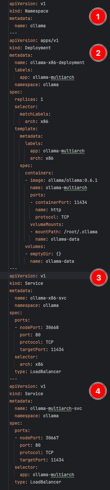

## Overview

Any easy way to experiment with Arm64 nodes in your K8s cluster is to deploy Arm64 nodes and pods alongside your existing amd64 node and pods. In this section of the tutorial, you'll bootstrap the cluster with ollama on amd64, which prepares you for the next section of the tutorial, where you'll add Arm64 nodes and pods to the mix.

### Connect to the cluster

{}
The following assumes you have gcloud and kubectl already installed.  If not, please follow the instructions on the first page under "Prerequisites". 
{}

You'll first setup your newly created K8s cluster credentials using the gcloud utility.  Enter the following in your command prompt (or cloud shell), and make sure to replace "YOUR_PROJECT_ID" with the ID of your GCP project:

```bash
export ZONE=us-central1
export CLUSTER_NAME=ollama-on-Arm64
export PROJECT_ID=YOUR_PROJECT_ID
gcloud container clusters get-credentials $CLUSTER_NAME --zone $ZONE --project $PROJECT_ID
```
If you get the error:

```commandline
CRITICAL: ACTION REQUIRED: gke-gcloud-auth-plugin, which is needed for continued use of kubectl, was not found or is not executable. Install gke-gcloud-auth-plugin for use with kubectl by following https://cloud.google.com/kubernetes-engine/docs/how-to/cluster-access-for-kubectl#install_plugin
```
This command should help resolve it:

```bash
gcloud components install gke-gcloud-auth-plugin
```
Finally, test the connection to the cluster with this command:

```commandline
kubectl cluster-info
```
If you receive a non-error response, you're successfully connected to the k8s cluster!

### Deployment and Service

1. Copy the following YAML, and save it to a file called amd64_ollama.yaml:

```yaml
foo
```
Before we run it, lets dive a bit deeper into what its doing.

1. First, you create a new Namespace called *ollama*.  This is where all your objects will live.
2. Next, you will create the amd64 Deployment.  The Pods of this deployment will run a multiarch (either amd64 or Arm64) container, based on the architecture of the node its running on.
3. You will then create a Service, *ollama-amd64-svc*, whose endpoints are of only amd64 type.
4. Finally, we create another Service, *ollama-multiarch*, whose endpoints will be of any (amd64 or Arm64) architecture type.



