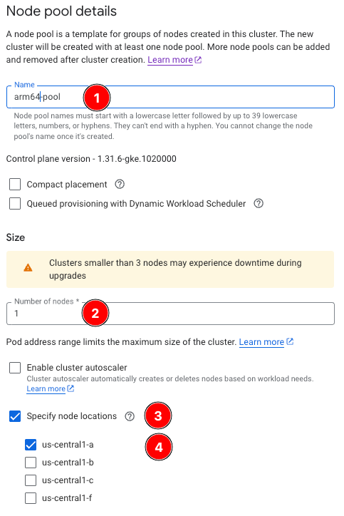

## Overview
At this point we have a what many people in their K8s Arm journey start with -- a workload running on an x86 cluster!  As mentioned earlier, the easiest way to experiment with Arm in your K8s cluster is to run both architectures simultaneously, so you'll be shown how to do that next.

### Adding arm-pool
To add Arm nodes to the cluster:

1. From the Clusters menu, select *ollama-on-arm*
2. Select *Add node pool*
3. For *Name*, enter *arm-pool*
4. For *Size*, enter *1*
5. Check *Specify node locations* and select *us-central1-a*



6. Select the *Nodes* tab to navigate to the *Configure node settings* screen
7. Select *C4A* : *c4a-standard-4* for Machine *Configuration/Type*.


8. Select *Create*
9. After provisioning completes, select the newly created *arm-pool* from the *Clusters* screen to take you to the *Node pool details* page.

Note the taint applied by default to the Arm Node of *NoSchedule* (if arch=arm64):


The nodeSelector in both Deplopyments not only defines which node to run on, [but in the arm64 use case](https://cloud.google.com/kubernetes-engine/docs/how-to/prepare-arm-workloads-for-deployment#schedule-with-node-selector-arm), it also adds the required toleration automatically.


```yaml
nodeSelector:
    kubernetes.io/arch: arm64 # or amd64
```


10. 

```bash
export ZONE=us-central1
export CLUSTER_NAME=ollama-on-arm
export PROJECT_ID=YOUR_PROJECT_ID
gcloud container clusters get-credentials $CLUSTER_NAME --zone $ZONE --project $PROJECT_ID
```
If you get the error:

```commandline
CRITICAL: ACTION REQUIRED: gke-gcloud-auth-plugin, which is needed for continued use of kubectl, was not found or is not executable. Install gke-gcloud-auth-plugin for use with kubectl by following https://cloud.google.com/kubernetes-engine/docs/how-to/cluster-access-for-kubectl#install_plugin
```
This command should help resolve it:

```bash
gcloud components install gke-gcloud-auth-plugin
```
Finally, test the connection to the cluster with this command:

```commandline
kubectl cluster-info
```
If you receive a non-error response, you're successfully connected to the k8s cluster!

### Deployment and Service

1. Copy the following YAML, and save it to a file called x86_ollama.yaml:

```yaml
foo
```
Before we run it, lets dive a bit deeper into what its doing.

1. First, you create a new Namespace called *ollama*.  This is where all your objects will live.
2. Next, you will create the x86 Deployment.  The Pods of this deployment will run a multiarch (either x86 or Arm) container, based on the architecture of the node its running on.
3. You will then create a Service, *ollama-x86-svc*, whose endpoints are of only x86 type.
4. Finally, we create another Service, *ollama-multiarch*, whose endpoints will be of any (x86 or Arm) architecture type.


