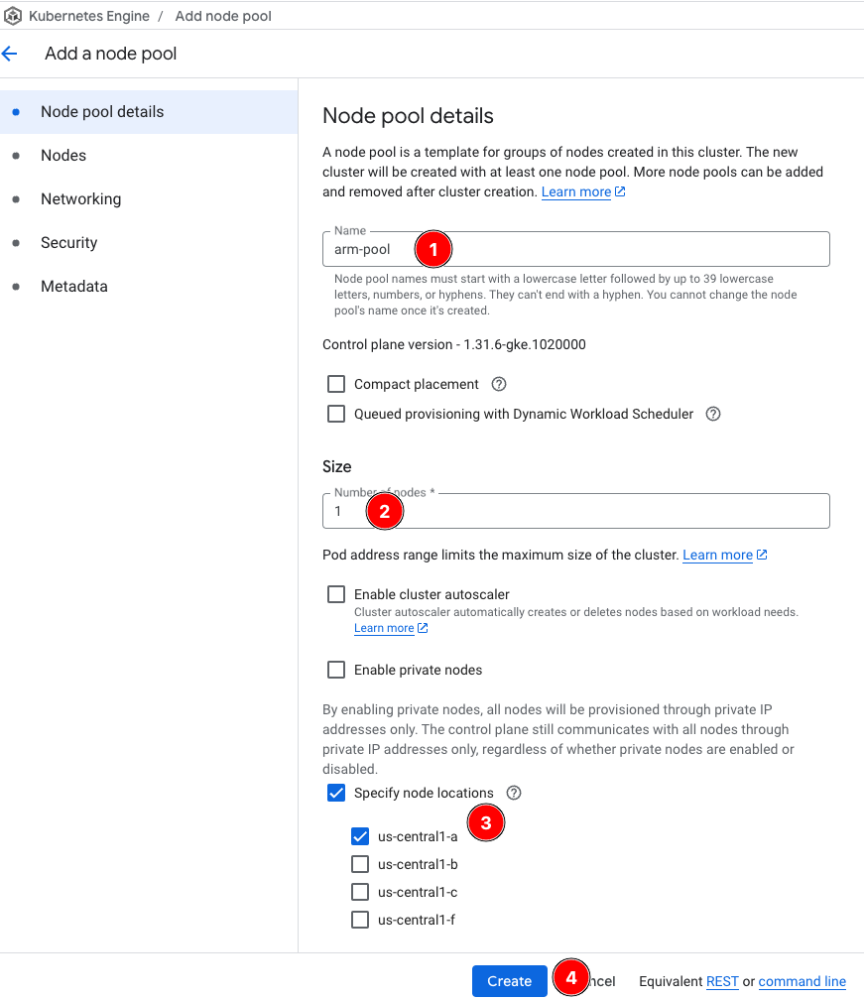
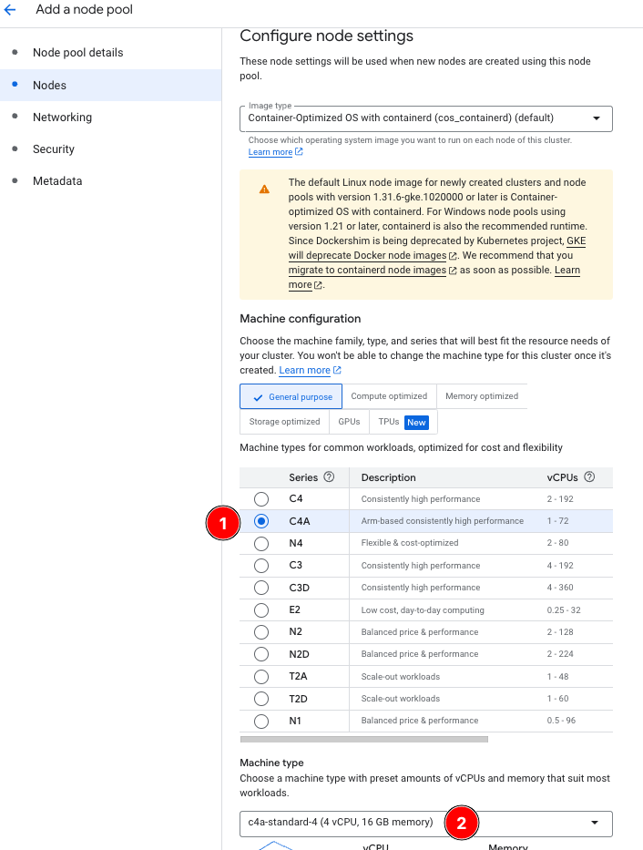
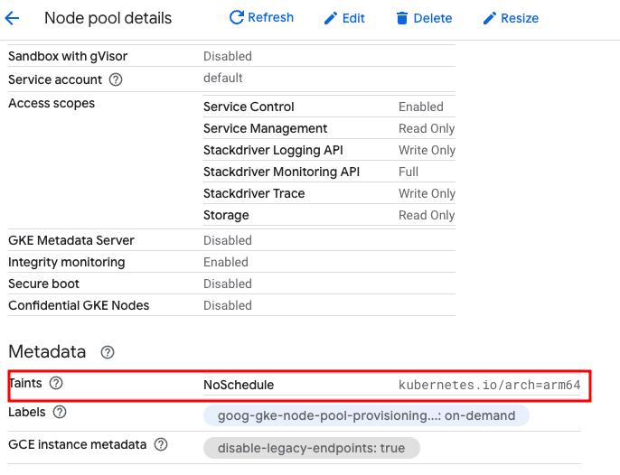

## Adding the arm64-pool node pool

You have reached the point from which most projects start investigating migration to Arm. You have a workload running on an amd64 cluster and you want to evaluate the benefits of Arm.

In this section, you will add an Arm-based node pool to the cluster, and apply an Ollama Arm deployment and service to mimic what you did in the previous section.

To add Arm nodes to the cluster:

1. From the Clusters menu, select *ollama-on-multiarch*.
2. Select *Add node pool*.
3. For **Name**, enter `arm64-pool`.
4. For **Size**, enter `1`.
5. Check **Specify node locations** and select **us-central1-a**.



6. Select the *Nodes* tab to navigate to the *Configure node settings* screen
7. Select *C4A* : *c4a-standard-4* for Machine *Configuration/Type*.

{}
To compare amd64 and arm64 performance, the c4a-standard-4 is used as the arm64 equivalent of the previously deployed c4-standard-8 in the amd64 node pool.
{}



8. Select *Create*
9. After provisioning completes, select the newly created *arm64-pool* from the *Clusters* screen to take you to the *Node pool details* page.

Notice the taint below that GKE applies by default to the Arm node of `NoSchedule` if `arch=arm64`:



Without a toleration for this taint, you won't be able to schedule any workloads on it. The nodeSelector in the amd64 (and as you will shortly see, the arm64) deployment YAMLs not only defines which architecture to target, [but in the arm64 use case](https://cloud.google.com/kubernetes-engine/docs/how-to/prepare-arm-workloads-for-deployment#schedule-with-node-selector-arm), it also adds the required toleration automatically.

```yaml
nodeSelector:
    kubernetes.io/arch: arm64 
```

### Deployment and service

You can now apply the arm64-based deployment.

1. Use a text editor to copy the following YAML, and save it to a file called `arm64_ollama.yaml`:

```yaml
apiVersion: apps/v1
kind: Deployment
metadata:
  name: ollama-arm64-deployment
  labels:
    app: ollama-multiarch
  namespace: ollama
spec:
  replicas: 1
  selector:
    matchLabels:
      arch: arm64
  template:
    metadata:
      labels:
        app: ollama-multiarch
        arch: arm64
    spec:
      nodeSelector:
        kubernetes.io/arch: arm64
      containers:
      - image: ollama/ollama:0.6.1
        name: ollama-multiarch
        ports:
        - containerPort: 11434
          name: http
          protocol: TCP
        volumeMounts:
        - mountPath: /root/.ollama
          name: ollama-data
      volumes:
      - emptyDir: {}
        name: ollama-data
---
apiVersion: v1
kind: Service
metadata:
  name: ollama-arm64-svc
  namespace: ollama
spec:
  sessionAffinity: None
  ports:
  - nodePort: 30666
    port: 80
    protocol: TCP
    targetPort: 11434
  selector:
    arch: arm64
  type: LoadBalancer
---
apiVersion: v1
kind: Service
metadata:
  name: ollama-multiarch-svc
  namespace: ollama
spec:
  sessionAffinity: None
  ports:
  - nodePort: 30667
    port: 80
    protocol: TCP
    targetPort: 11434
  selector:
    app: ollama-multiarch
  type: LoadBalancer
```

When the above is applied:

* A new Deployment called `ollama-arm64-deployment` is created.  Like the amd64 deployment, it pulls the same multi-architecture image from DockerHub.

Of particular interest is the `nodeSelector` `kubernetes.io/arch`, with the value of `arm64`.  This ensures that the deployment runs on arm64-based nodes, utilizing the arm64 layer of the Ollama multi-architecture container image. The `nodeSelector` triggers the automatic creation of the toleration for the arm64 nodes.

* Two new load balancer services are created.  The first, `ollama-arm64-svc` is created, analogous to the existing service, and targets all pods with the `arch: arm64` label (the arm64 deployment creates these pods).  The second service, `ollama-multiarch-svc`, targets all pods, regardless of the architecture. This service shows how you can mix and match pods in production to serve the same application regardless of node/pod architecture.

A `sessionAffinity` tag is added to this service to remove sticky connections to the target pods. This removes persistent connections to the same pod on each request.


### Apply the arm64 Deployment and Service

1. Run the following command to apply the arm64 deployment and service definitions:

```bash
kubectl apply -f arm64_ollama.yaml
```

You see the following responses:

```output
deployment.apps/ollama-arm64-deployment created
service/ollama-arm64-svc created
service/ollama-multiarch-svc created
```

2. Get the status of the nodes, pods, and services by running the following:

```bash
kubectl get nodes,pods,svc -nollama 
```

Your output is similar to the following, showing two nodes, two pods, and three services:

```output
NAME                                              STATUS   ROLES    AGE     VERSION
node/gke-ollama-on-arm-amd64-pool-62c0835c-93ht   Ready    <none>   91m     v1.31.6-gke.1020000
node/gke-ollama-on-arm-arm64-pool-2ae0d1f0-pqrf   Ready    <none>   4m11s   v1.31.6-gke.1020000

NAME                                           READY   STATUS    RESTARTS   AGE
pod/ollama-amd64-deployment-cbfc4b865-msftf    1/1     Running   0          29m
pod/ollama-arm64-deployment-678dc8556f-956d6   1/1     Running   0          2m52s

NAME                           TYPE           CLUSTER-IP       EXTERNAL-IP      PORT(S)        AGE
service/ollama-amd64-svc       LoadBalancer   1.2.3.4          1.2.3.4          80:30668/TCP   29m
service/ollama-arm64-svc       LoadBalancer   1.2.3.4          1.2.3.4          80:30666/TCP   2m52s
service/ollama-multiarch-svc   LoadBalancer   1.2.3.4          1.2.3.4          80:30667/TCP   2m52s
```

When the pods show `Running` and the service shows a valid `External IP`, you are ready to test the Ollama arm64 service.

### Test the Ollama web service on arm64

To test the service, use the previously created `model_util.sh` from the previous section.

Instead of the `amd64` parameter, replace it with `arm64`:

3. Run the following to make an HTTP request to the amd64 ollama service on port 80:

```bash
./model_util.sh arm64 hello
```

You get back the HTTP response, as well as the log line from the pod that served it:

```output
Server response:
Using service endpoint 34.44.135.90 for hello on arm64
Ollama is running

Pod log output:

[pod/ollama-arm64-deployment-678dc8556f-956d6/ollama-multiarch] 2025-03-25T21:25:21.547384356Z
```

Once again, if you see "Ollama is running" then you have successfully setup your GKE cluster with both amd64 and arm64 nodes and pods running a deployment with the Ollama multi-architecture container.

Continue to the next section to analyze the performance. 