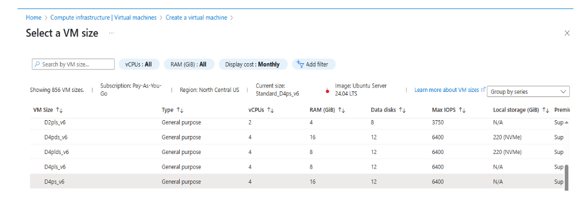
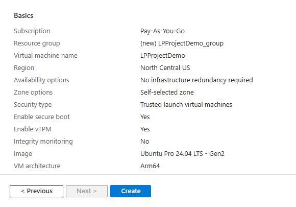
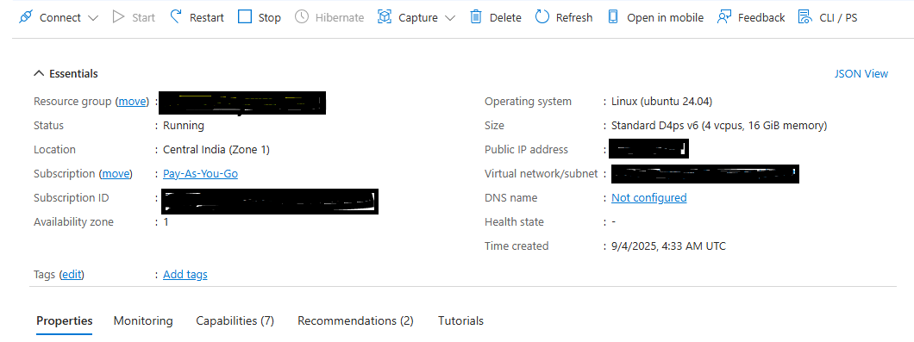

## Prerequisites and setup

There are several common ways to create an Arm-based Cobalt 100 virtual machine, and you can choose the method that best fits your workflow or requirements:

- The Azure Portal
- The Azure CLI
- An infrastructure as code (IaC) tool

In this section, you will launch the Azure Portal to create a virtual machine with the Arm-based Azure Cobalt 100 processor.

This Learning Path focuses on general-purpose virtual machines in the Dpsv6 series. For more information, see the [Microsoft Azure guide for the Dpsv6 size series](https://learn.microsoft.com/en-us/azure/virtual-machines/sizes/general-purpose/dpsv6-series).

While the steps to create this instance are included here for convenience, you can also refer to the [Deploy a Cobalt 100 virtual machine on Azure Learning Path](/learning-paths/servers-and-cloud-computing/cobalt/).

## Create an Arm-based Azure virtual machine 

Creating a virtual machine based on Azure Cobalt 100 is no different from creating any other virtual machine in Azure. Follow these steps below to create an Azure virtual machine:

- Launch the Azure portal and navigate to **Virtual Machines**.
- Select **Create**, and select **Virtual Machine** from the drop-down list.
- Inside the **Basic** tab, fill in the instance details such as **Virtual machine name** and **Region**.
- Select the image for your virtual machine (for example, Ubuntu Pro 24.04 LTS) and select **Arm64** as the VM architecture.
- In the **Size** field, select **See all sizes** and select the D-Series v6 family of virtual machines. Select **D4ps_v6** from the list as shown in the diagram below:

- For **Authentication type**, select **SSH public key**. Azure generates an SSH key pair for you and lets you save it for future use. This method is fast, secure, and easy for connecting to your virtual machine.
- Fill in the **Administrator username** for your VM.
- Select **Generate new key pair**, and select **RSA SSH Format** as the SSH Key Type. RSA offers better security with keys longer than 3072 bits. Give your SSH key a key pair name.
- In the **Inbound port rules**, select **HTTP (80)** and **SSH (22)** as the inbound ports.

Now select the **Review + Create** tab and review the configuration for your virtual machine. It should look like the following:

When you are happy with your selection, select the **Create** button and then **Download Private key and Create Resources** button.

Your virtual machine should be ready and running in a few minutes. You can SSH into the virtual machine using the private key, along with the public IP details.

{}

To learn more about Arm-based virtual machine in Azure, see “Getting Started with Microsoft Azure” in [Get started with Arm-based cloud instances](/learning-paths/servers-and-cloud-computing/csp/azure).

{}

Your Azure Cobalt 100 Arm64 virtual machine is now ready. Continue to the next step to install and configure MySQL.
