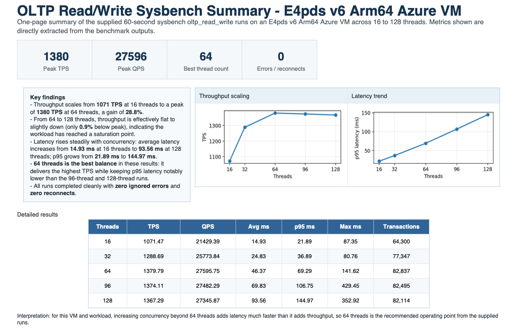

## Prepare to run the benchmark

From your local machine, open an SSH shell to the on-premises simulator by replacing `YOUR_RSA_FILENAME` and `YOUR_ONPREM_IP_ADDRESS`:

```bash
ssh -i $HOME/.ssh/YOUR_RSA_FILENAME azureadmin@YOUR_ONPREM_IP_ADDRESS
```

From that on-premises shell, identify the SSH key in `$HOME/.ssh` used for the Azure VM. Then connect to the Arm-based Azure VM:

```bash
ssh -i $HOME/.ssh/AZURE_CLOUD_RSA_FILENAME azureadmin@YOUR_ARM_BASED_VM_PUBLIC_IP_ADDRESS
```

You should now have an SSH shell into your Arm-based Azure VM.

Create a file named `run.sh` with the following content. The script runs sysbench `oltp_read_write` at five thread counts (16, 32, 64, 96, and 128), each for 60 seconds, and writes the results to separate `.perf` files:

```bash
#!/bin/bash


run_bench() {
    THR=$1
    LENGTH=$2
    FILENAME=${PREFIX}_${THR}.perf
    if [ -f ${FILENAME} ]; then
        rm ${FILENAME}
    fi
    set -x
    sysbench /usr/share/sysbench/oltp_read_write.lua --table-size=1000000 --db-driver=mysql --mysql-db=testdb --mysql-user=${ADMIN} --mysql-password=${PW} --time=${LENGTH} --max-requests=0 --threads=${THR} run 2>&1 1>${FILENAME}
    set +x
}

main() {
  run_bench 16 60
  run_bench 32 60
  run_bench 64 60
  run_bench 96 60
  run_bench 128 60
}

export ADMIN=$1
export PW=$2
export PREFIX=$3
shift 3

main $*
```

Make the script executable:

```bash
sudo chmod 755 ./run.sh
```

In the same shell, retrieve the MySQL root password file used by the migration script:

```bash
sudo su - 
cat /root/mysql_root_password.txt
exit
```

## Run the benchmark

The script creates five `.perf` files with sysbench `oltp_read_write` results at different thread counts. Run `run.sh`, replacing `AZURE_CLOUD_MYSQL_ADMIN_PW` with the password value you just retrieved:

```bash
./run.sh admin AZURE_CLOUD_MYSQL_ADMIN_PW cobalt_100_arm64
```

## Interpret the results

First, download the five `.perf` files from the Azure VM to your on-premises simulator shell. Replace `AZURE_CLOUD_RSA_FILENAME` and `YOUR_ARM_BASED_VM_PUBLIC_IP_ADDRESS`:

```bash
cd $HOME
scp -i $HOME/.ssh/AZURE_CLOUD_RSA_FILENAME azureadmin@YOUR_ARM_BASED_VM_PUBLIC_IP_ADDRESS:*.perf .
```

Next, from your local machine, copy those files from the on-premises simulator to your local host. Replace `ON_PREM_RSA_FILENAME`(private key/pem file downloaded earlier) and `YOUR_ON_PREM_SIM_IP_ADDRESS`:

```bash
cd $HOME
scp -i $HOME/.ssh/ON_PREM_RSA_FILENAME azureuser@YOUR_ON_PREM_SIM_IP_ADDRESS:\*.perf .
```

You should now have five `.perf` files on your local host.

To summarize key metrics quickly, run:

```bash
for f in *.perf; do
  echo "== $f =="
  grep -E "threads:|transactions:|queries:|95th percentile:" "$f"
  echo
done
```

To compare throughput and latency across thread counts, look at:

- Higher `transactions:` values indicate better throughput.
- Lower `95th percentile:` values indicate better tail latency.
- Look for where adding threads no longer increases throughput meaningfully.

The following example image shows benchmark output from this workflow:



## What you've learned

You learned how to provision an Arm-based Azure VM for MySQL migration, move a database from an on-premises x64 simulator, and evaluate performance by reading sysbench throughput and latency metrics.