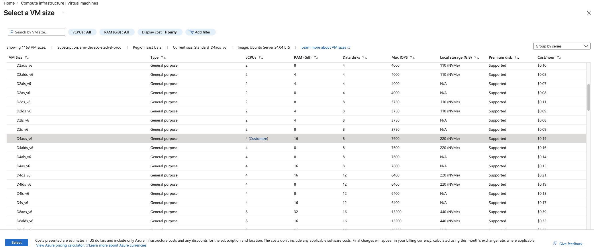
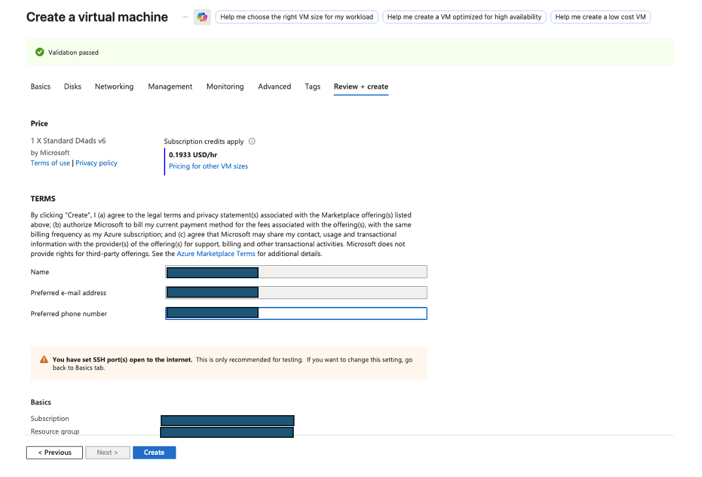
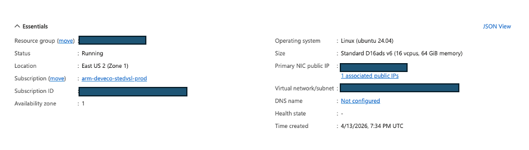

## Configure the virtual machine

Use the Azure portal to create a virtual machine (VM) with an x64 processor architecture. This VM acts as your simulated on-premises x64 MySQL server.

To create an Azure virtual machine:

1. Launch the Azure portal and navigate to **Virtual Machines**.
2. Select **Create**, and select **Virtual Machine** from the drop-down list.
3. Inside the **Basic** tab, fill in the instance details such as **Virtual machine name** and **Region**.
4. Select the image for your virtual machine (for example, Ubuntu Pro 24.04 LTS) and select **x64** as the VM architecture.
5. In the **Size** field, select **See all sizes** and select the D-Series v6 family of virtual machines.
6. Select **D4ads_v6** from the list as shown in the following screenshot:

7. For **Authentication type**, select **SSH public key**.

{}
Azure can generate an SSH key pair for you and lets you save it for future use.
{}

8. Fill in the **Administrator username** for your VM.
9. Select **Generate new key pair**, and select **RSA SSH Format** as the SSH Key Type.

{}
RSA offers better security with keys longer than 3072 bits.
{}

10. Give your SSH key a key pair name.
11. In the **Inbound port rules**, select **HTTP (80)** and **SSH (22)** as the inbound ports, as shown in the following screenshot:

12. Select the **Review + Create** tab and review the configuration for your virtual machine. It should look like the following:

13. After reviewing your configuration, select the **Create** button and then **Download Private key and Create Resource**.

Your virtual machine should be ready and running in a few minutes. You can SSH into the virtual machine using the private key, along with the public IP details.

{}
To learn more about virtual machines in Azure, see "Getting Started with Microsoft Azure" in [Get started with cloud instances](/learning-paths/servers-and-cloud-computing/csp/azure/).
{}

## What you've accomplished and what's next

You've now created an Azure x64 virtual machine running Ubuntu 24.04 LTS with SSH authentication configured. The virtual machine is now ready to act as your simulated on-premises environment for this Learning Path.

Next, you will prepare this environment by installing MySQL and loading a sample database for migration.
