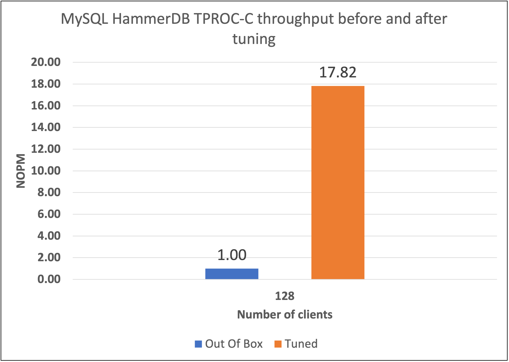

## About performance tuning

Performance tuning is most useful when you treat it as a measurement process, not a fixed checklist. You can tune by changing one parameter at a time, running a designed experiment, comparing profiles, or using automation and AI-assisted tools to explore a larger configuration space.

There isn't a universal set of tuning parameters that works best for every application. The right settings depend on the workload, data size, memory capacity, storage performance, network behavior, software version, system architecture, operating system, and other application-specific factors.

Whatever method you use, keep the measurements repeatable. Record the system configuration, workload, software versions, and tuning parameters so you can identify which changes improved performance and which changes had little effect.

## Why tune MySQL

MySQL performance can be limited by memory usage, disk I/O, connection handling, concurrency, or synchronization overhead. Tuning helps you use the available compute, memory, and storage resources more efficiently.

Improved performance can give you higher throughput, lower latency, or better cost efficiency. A tuned configuration can increase capacity on the same system, or help you meet the same performance target with fewer compute resources.

## Example benchmark result

The following example shows MySQL throughput with HammerDB TPROC-C before and after tuning on an Arm Neoverse V3 system.

This benchmark result is an example, not a guaranteed improvement for every workload. Your results depend on the MySQL version, database size, storage device, memory capacity, client thread count, and the queries used in the test.

{}
Links to MySQL documentation in this Learning Path point to the latest version of the documentation. If you use an older version of MySQL, select the matching documentation version after opening the links.
{}
