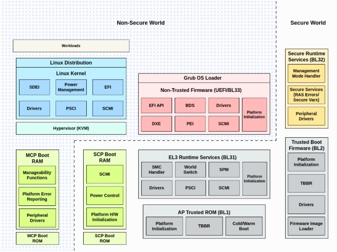

## Introduction to the Arm RD-V3 Platform

In this section, you will learn about the Arm [Neoverse CSS-V3](https://www.arm.com/products/neoverse-compute-subsystems/css-v3) subsystem and the RD-V3 [Reference Design Platform Software](https://neoverse-reference-design.docs.arm.com/en/latest/index.html) that implements it. You’ll learn how these components enable scalable, server-class system design, and how to simulate and validate the full firmware stack using Fixed Virtual Platforms (FVPs) before hardware is available.

Arm Neoverse is designed for the demanding requirements of data-center and edge computing, delivering high performance and efficiency. Widely adopted in servers, networking, and edge devices, the Neoverse architecture provides a solid foundation for modern infrastructure.

Using Arm Fixed Virtual Platforms (FVPs), you can explore system bring-up, boot flow, and firmware customization well before physical silicon becomes available.

This Learning Path also introduces the key components involved, from Neoverse V3 cores to secure subsystem controllers, and shows how these elements work together in a fully virtualized system simulation.

## Neoverse CSS-V3 platform overview

[Neoverse CSS-V3](https://www.arm.com/products/neoverse-compute-subsystems/css-v3) (Compute Subsystem Version 3) is the core subsystem architecture underpinning the Arm RD-V3 platform. It is optimized for high-performance server and data-center applications, providing an integrated solution that combines processing cores, memory management, and interconnect technology.

CSS-V3 forms the key building block for specialized computing systems. It reduces design and validation costs for the general-purpose compute subsystem, allowing partners to focus on specialization and acceleration while reducing risk and time to deployment.

CSS-V3 is available in configurable subsystems, supporting up to 64 Neoverse V3 cores per die. It also enables integration of high-bandwidth DDR5/LPDDR5 memory (up to 12 channels), PCIe Gen5 or CXL I/O (up to 64 lanes), and high-speed die-to-die links with support for UCIe 1.1 or custom PHYs. Designs can scale down to smaller core-count configurations, such as 32-core SoCs, or expand through multi-die integration.

Key features of CSS-V3 include:

- High-performance CPU clusters optimized for server workloads and data throughput  
- Advanced memory management for efficient handling across multiple processing cores  
- High-speed, low-latency interconnect within the subsystem

The CSS-V3 subsystem is fully supported by Arm’s Fixed Virtual Platforms (FVPs), enabling pre-silicon testing of these capabilities.

## RD-V3 platform introduction

The RD-V3 platform is a comprehensive reference design built around Arm’s [Neoverse V3](https://www.arm.com/products/silicon-ip-cpu/neoverse/neoverse-v3) CPUs, along with [Cortex-M55](https://www.arm.com/products/silicon-ip-cpu/cortex-m/cortex-m55) and [Cortex-M7](https://www.arm.com/products/silicon-ip-cpu/cortex-m/cortex-m7) microcontrollers. This platform enables efficient high-performance computing and robust platform management:

| Component          | Description                                                                                      |
|-------------------|--------------------------------------------------------------------------------------------------|
| Neoverse V3       | Primary application processor responsible for executing the OS and payloads                      |
| Cortex-M7         | Implements the System Control Processor (SCP) for power, clocks, and initialization               |
| Cortex-M55        | Hosts the Runtime Security Engine (RSE), providing secure boot and runtime integrity              |
| Cortex-M55 (LCP)  | Acts as the Local Control Processor, enabling per-core power and reset management for AP cores    |

These subsystems work together in a coordinated architecture, communicating through shared memory regions, control buses, and platform protocols. This enables multi-stage boot processes and robust secure-boot implementations.

Here is the Neoverse Reference Design Platform [software stack](https://neoverse-reference-design.docs.arm.com/en/latest/about/software_stack.html#sw-stack) for reference.

## Develop and validate without hardware

In traditional workflows, system validation often cannot begin until silicon is available, introducing risk and delay.

To address this, Arm provides Fixed Virtual Platforms ([FVPs](https://developer.arm.com/Tools%20and%20Software/Fixed%20Virtual%20Platforms)), a set of simulation models that emulate Arm SoC behavior on a host machine. The CSS-V3 platform is available in multiple FVP configurations, allowing you to select the model that best fits specific development and validation needs.

Key capabilities of FVPs:

- Multi-core CPU simulation with SMP boot  
- Multiple UART interfaces for serial debug and monitoring  
- Compatibility with TF-A, UEFI, GRUB, and Linux kernel images  
- Boot logs, trace outputs, and interrupt event visibility for debugging

FVPs enable developers to verify boot sequences, debug firmware handoffs, and even simulate RSE (Runtime Security Engine) behaviors, all pre-silicon.

## Comparing RD-V3 FVP variants

To support different use cases and levels of platform complexity, Arm offers several virtual models based on the CSS-V3 architecture: RD-V3, RD-V3-R1, RD-V3-Cfg1 (CFG1), and RD-V3-Cfg2 (CFG2). While they share a common foundation, they differ in chip count, system topology, and simulation flexibility.

| Model          | Description                                                                 | Recommended use cases                                                           |
|----------------|-----------------------------------------------------------------------------|----------------------------------------------------------------------------------|
| RD-V3          | Standard single-die platform with full processor and security blocks        | Ideal for newcomers, firmware bring-up, and basic validation                     |
| RD-V3-R1       | Dual-die platform simulating chiplet-based architecture                     | Suitable for multi-node, interconnect, and advanced boot tests                   |
| RD-V3-Cfg1 (CFG1) | Lightweight model with reduced control complexity for fast startup          | Best for CI pipelines, unit testing, and quick validations                       |
| RD-V3-Cfg2 (CFG2) | Quad-chip platform with 4×32-core Poseidon-V CPUs connected via CCG links   | Designed for advanced multi-chip validation, CMN-based coherence, and scaling    |

In this Learning Path you will use RD-V3 as the primary platform for foundational exercises, guiding you through building the software stack and simulating it on an FVP to verify the boot sequence. In later modules, you’ll transition to RD-V3-R1 for more advanced system simulation, multi-node bring-up, and firmware coordination across components like LCP and SCP.
