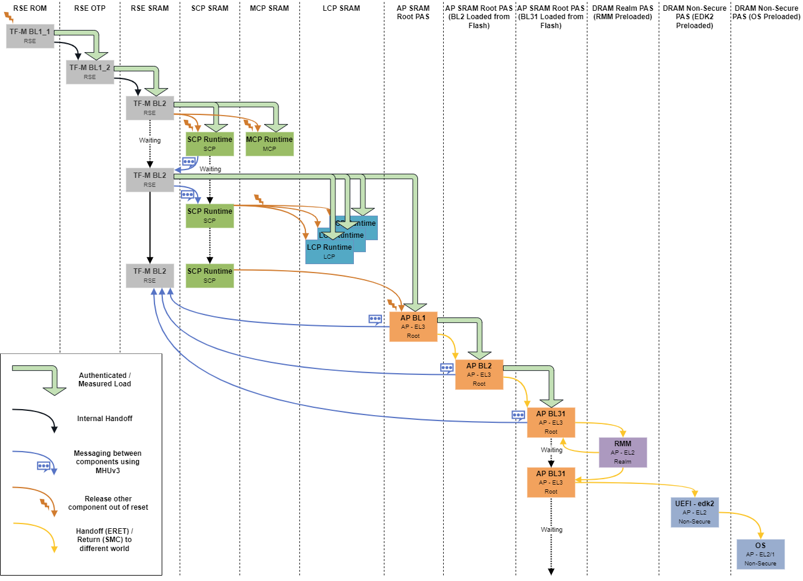

## Firmware stack overview and boot sequence coordination

To ensure the platform transitions securely and reliably from power-on to operating system launch, this section introduces the roles and interactions of each firmware component within the RD-V3 boot process. You’ll learn how each component contributes to system initialization and how control is systematically handed off across the boot chain.

## How the system boots up

In the RD-V3 platform, each firmware component  such as TF-A, RSE, SCP, MCP, LCP, and UEFI - operates independently but participates in a well-defined sequence. Each is delivered as a separate firmware image, yet they coordinate tightly through a structured boot flow and inter-processor signaling.

The following diagram from the [Neoverse Reference Design documentation](https://neoverse-reference-design.docs.arm.com/en/latest/shared/boot_flow/rdv3_single_chip.html?highlight=boot) illustrates the progression of component activation from initial reset to OS handoff:

## Stage 1: Security validation starts (RSE)

After BL2, the Runtime Security Engine (RSE, Cortex-M55) authenticates critical firmware components—including SCP, UEFI, and kernel images—using secure-boot mechanisms. It performs cryptographic measurements and establishes a Root of Trust (RoT) before allowing other processors to start.

***RSE acts as the platform’s security gatekeeper.***

## Stage 2: Early hardware initialization (SCP / MCP)

Once RSE completes verification, the System Control Processor (SCP, Cortex-M7) and the Management Control Processor (MCP, where present) are released from reset.

They perform essential bring-up:
* Initialize clocks, reset lines, and power domains
* Prepare DRAM and interconnect
* Enable the application processor (AP) cores and signal readiness to TF-A

***SCP/MCP are the ground crew bringing hardware systems online.***

## Stage 3: Secure execution setup (TF-A)

When the AP is released, it begins executing Trusted Firmware-A (TF-A) at EL3 from the reset vector address programmed during boot-image layout. TF-A configures the secure world, sets up exception levels, and prepares for handoff to UEFI.

***TF-A is the ignition controller, launching the next stages securely.***

## Stage 4: Firmware and Bootloader (EDK2 / GRUB)

TF-A hands off control to UEFI firmware (EDK 2), which performs device discovery and launches GRUB.

Responsibilities:
* Detect and initialize memory, PCIe, and boot devices
* Generate ACPI and platform configuration tables
* Locate and launch GRUB from storage or flash

***EDK2 and GRUB are like the first- and second-stage rockets launching the payload.***

## Stage 5: Linux kernel boot

GRUB loads the Linux kernel and passes full control to the OS.

Responsibilities:
* Initialize device drivers and kernel subsystems
* Mount the root filesystem
* Start user-space processes (for example, BusyBox)

***The Linux kernel is the spacecraft - it takes over and begins its mission.***

## Firmware module responsibilities in detail
Now that you’ve examined the high-level boot stages, you can now break down each firmware module’s role in more detail.

Each stage of the boot chain is backed by a dedicated component - secure bootloader, platform controller, or OS manager - working together to ensure reliable system bring-up.

## RSE: Runtime Security Engine (Cortex-M55) — (Stage 1: Security Validation)

RSE firmware runs on the Cortex‑M55 and plays a critical role in platform attestation and integrity enforcement.
* Authenticates BL2, SCP, and UEFI firmware images (Secure Boot)
* Records boot-time measurements (for example, PCRs, ROT)
* Releases boot authorization only after successful validation

RSE acts as the second layer of the chain of trust, maintaining a monitored and secure environment throughout early boot.

### SCP: System Control Processor (Cortex‑M7) (Stage 2: Early Hardware Bring-up)

* Initializes clocks, reset controllers, and system interconnect
* Manages DRAM setup and enables power for the AP
* Coordinates boot readiness with RSE via the Message Handling Unit (MHU)

### TF-A: Trusted Firmware-A (BL1 / BL2) — Stage 3

* **BL1** executes from ROM, initializes minimal hardware (clocks, UART), and loads BL2  
* **BL2** validates and loads SCP, RSE, and UEFI images, setting up secure handover to later stages

TF-A establishes the system’s chain of trust and ensures downstream components are authenticated and loaded from trusted sources.

### UEFI / GRUB / Linux kernel — Stages 4–5

* **UEFI (EDK II):** firmware abstraction, hardware discovery, ACPI table generation  
* **GRUB:** selects and loads the Linux kernel image  
* **Linux kernel:** initializes the OS, drivers, and launches userland (for example, BusyBox)

On the FVP you can observe this process via UART logs to validate each stage.

### LCP: Low-Power Controller (optional)

If present, the LCP provides fine-grained platform power management:
* Implements sleep/wake transitions
* Controls per-core power gating
* Manages transitions to ACPI power states (for example, S3, S5)

LCP support depends on the FVP model and may be omitted in simplified setups.

## Coordination and handoff logic

The RD-V3 boot sequence follows a multi-stage, dependency-driven handshake model, where each firmware module validates, powers, or authorizes the next.

| Stage | Dependency chain     | Description                                                                   |
|------:|----------------------|-------------------------------------------------------------------------------|
| 1     | RSE ← BL2            | RSE is loaded and triggered by BL2 to begin security validation              |
| 2     | SCP ← BL2 + RSE      | SCP initialization requires BL2 and authorization from RSE                   |
| 3     | AP ← SCP + RSE       | The AP starts only after SCP sets power and RSE permits                      |
| 4     | UEFI → GRUB → Linux  | UEFI launches GRUB, which loads the kernel and enters the OS                 |

This handshake ensures no stage proceeds unless its dependencies have securely initialized and authorized the next step.

{}
In the table, arrows (←) indicate **dependency**—the component on the left depends on the component(s) on the right to be triggered or authorized.  
For example, `RSE ← BL2` means BL2 loads/triggers RSE; `AP ← SCP + RSE` means the AP can start only after SCP has initialized hardware and RSE has granted authorization.  
The right-facing arrows in `UEFI → GRUB → Linux` indicate a **direct execution path**—each stage passes control directly to the next.
{}

This layered approach supports modular testing, independent debugging, and early simulation—essential for secure and robust platform bring-up.

**In this section, you have:**
* Explored the full boot sequence of the RD-V3 platform, from power-on to Linux login
* Understood the responsibilities of TF-A, RSE, SCP, MCP, LCP, and UEFI
* Learned how secure boot is enforced and how each module hands off control
* Interpreted boot dependencies using FVP simulation and UART logs

With an understanding of the full boot sequence and firmware responsibilities, you’re ready to apply these insights. In the next section, you’ll fetch the RD-V3 codebase and start building the firmware stack for simulation.
