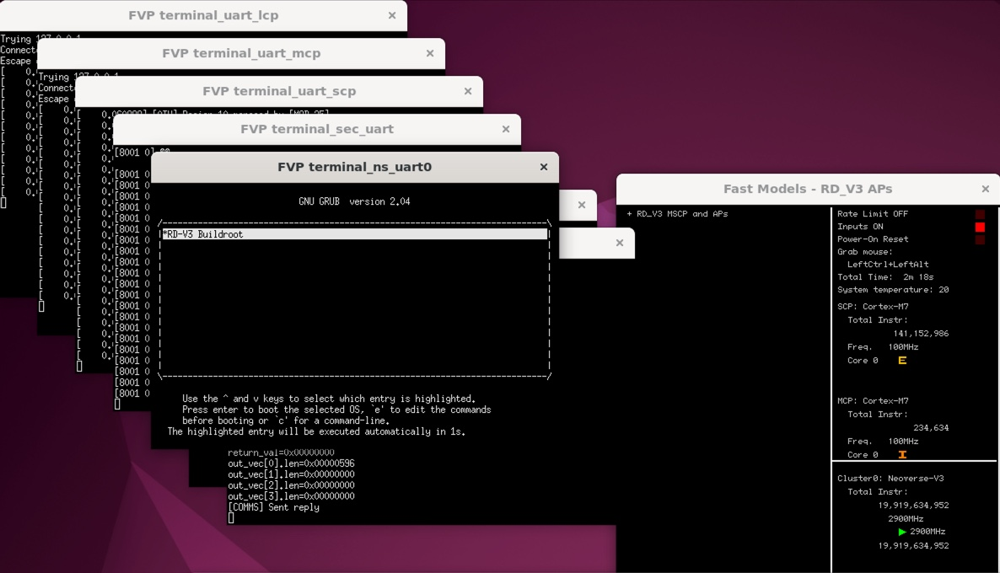
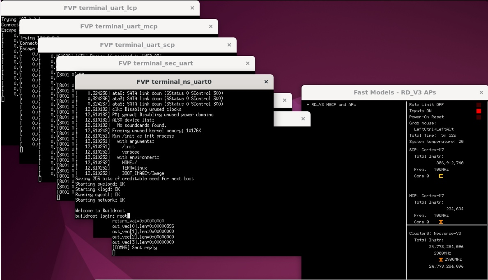

## Simulating RD-V3 with an Arm FVP

In the previous section, you built the complete CSS-V3 firmware stack.  
Now you’ll use an Arm Fixed Virtual Platform (FVP) to simulate the system, allowing you to verify the boot sequence without any physical silicon.  
This simulation brings up the full stack from BL1 to a Linux shell using Buildroot.

## Step 1: Download and Install the FVP Model

Each reference design release tag corresponds to a specific FVP model version.  
For example, the **RD-INFRA-2025.07.03** tag is designed to work with **FVP version 11.29.35**.

See the [RD-V3 Release Tags](https://neoverse-reference-design.docs.arm.com/en/latest/platforms/rdv3.html#release-tags) for a full list of release tags, corresponding FVP versions, and their associated release notes, which summarize changes and validated test cases.

Download and install the matching FVP:

```bash
mkdir -p ~/fvp
cd ~/fvp
wget https://developer.arm.com/-/cdn-downloads/permalink/FVPs-Neoverse-Infrastructure/RD-V3/FVP_RD_V3_11.29_35_Linux64_armv8l.tgz
tar -xvf FVP_RD_V3_11.29_35_Linux64_armv8l.tgz
./FVP_RD_V3.sh
```

The FVP installation might prompt you with a few questions,choosing the defaults is sufficient for this Learning Path. By default, the FVP installs under `/home/ubuntu/FVP_RD_V3`.

## Step 2: remote desktop setup

The RD‑V3 FVP model launches multiple UART consoles. Each console is mapped to a separate terminal window for different subsystems (for example, Neoverse V3, Cortex‑M55, Cortex‑M7, panel).

If you’re accessing the platform over SSH, these UART consoles can still be displayed, but network latency and graphical forwarding can severely degrade performance.

To interact with different UARTs more efficiently, it is recommend to install a remote desktop environment using `XRDP`. This provides a smoother user experience when dealing with multiple terminal windows and system interactions.

Install required packages and enable XRDP:


```bash
sudo apt update
sudo apt install -y ubuntu-desktop xrdp xfce4 xfce4-goodies pv xterm sshpass socat retry
sudo systemctl enable --now xrdp
```

To allow remote desktop connections, you need to open port 3389 (RDP) in your AWS EC2 security group:
- Go to the EC2 Dashboard → Security Groups
- Select your instance’s group → **Inbound rules** → **Edit inbound rules**
- Add a rule: Type: RDP, Port: 3389, Source: your public IP (recommended)
- Add the following rule:
   - **Type**: RDP
   - **Port**: 3389
   - **Source**: your local machine IP

For better security, limit the source to your current public IP instead of 0.0.0.0/0.


## Switch to Xorg (required on Ubuntu 22.04)

Wayland is the default display server on Ubuntu 22.04, but it is not compatible with XRDP.  
To enable XRDP remote sessions, you must switch to Xorg by modifying the GDM configuration.

Open the `/etc/gdm3/custom.conf` in a text editor. Find the line: 

```output
#WaylandEnable=false
```

Uncomment it:

```output
WaylandEnable=false
```

Restart the GDM display manager:
```bash
sudo systemctl restart gdm3
```

After restart, XRDP sessions will use Xorg and you can connect to it in the Arm server using Remote Desktop.

## Step 3: launch the simulation

Once connected using Remote Desktop, open a terminal and launch the RD‑V3 FVP simulation:

```bash
cd ~/rdv3/model-scripts/rdinfra
export MODEL=/home/ubuntu/FVP_RD_V3/models/Linux64_armv8l_GCC-9.3/FVP_RD_V3
./boot-buildroot.sh -p rdv3 &
```

The command launches the simulation and opens multiple xterm windows, each corresponding to a different CPU.

Start by locating the ***terminal_ns_uart0*** window. In it, you should see the GRUB menu.

Select **RD-V3 Buildroot** in the GRUB menu and press **Enter** to proceed.


Booting Buildroot takes a short while as Linux messages scroll by.

Eventually, the system will stop at the `Welcome to Buildroot` message on the ***terminal_ns_uart0*** window.

Log in at the `buildroot login:` prompt with user `root`.



Congratulations - you’ve now successfully simulated the boot of the RD-V3 software you built earlier, all on FVP!

## Step 4: Understand the UART Outputs

The RD-V3 FVP opens multiple terminals, each connected to a different UART that carries logs from specific firmware components.
UART-to-terminal mapping based on the default FVP configuration:

| Terminal Window Title      | UART | Output Role                        | Connected Processor  |
|----------------------------|------|------------------------------------|-----------------------|
| `FVP terminal_ns_uart0`    | 0    | Linux Kernel Console (BusyBox)     | Neoverse‑V3 (AP)      |
| `FVP terminal_ns_uart1`    | 1    | TF‑A / UEFI Logs                   | Neoverse‑V3 (AP)      |
| `FVP terminal_uart_scp`    | 2    | SCP Firmware Logs (power, clocks)  | Cortex‑M7 (SCP)       |
| `FVP terminal_rse_uart`    | 3    | RSE Secure Boot Logs               | Cortex‑M55 (RSE)      |
| `FVP terminal_uart_mcp`    | 4    | MCP Logs (management, telemetry)   | Cortex‑M7 (MCP)       |
| `FVP terminal_uart_lcp`    | 5    | LCP Logs (per-core power control)  | Cortex‑M55 (LCP)      |
| `FVP terminal_sec_uart`    | 6    | Secure World / TF‑M Logs           | Cortex‑M55            |


Logs are also captured under `~/rdv3/model-scripts/rdinfra/platforms/rdv3/rdv3`, each UART redirected to its own log file.
You can also explore refinfra-*.txt log files to validate subsystem states.

For example, if you’d like to verify that each CPU core has its GICv3 redistributor and LPI table correctly initialized, you can refer to the relevant messages in refinfra-24812-uart-0-nsec_<date-time>.txt.


```
[    0.000056] Remapping and enabling EFI services.
[    0.000078] smp: Bringing up secondary CPUs ...
[    0.000095] Detected PIPT I-cache on CPU1
[    0.000096] GICv3: CPU1: found redistributor 10000 region 0:0x0000000030200000
[    0.000096] GICv3: CPU1: using allocated LPI pending table @0x0000008080200000
[    0.000109] CPU1: Booted secondary processor 0x0000010000 [0x410fd840]
[    0.000125] Detected PIPT I-cache on CPU2
[    0.000126] GICv3: CPU2: found redistributor 20000 region 0:0x0000000030240000
[    0.000126] GICv3: CPU2: using allocated LPI pending table @0x0000008080210000
[    0.000139] CPU2: Booted secondary processor 0x0000020000 [0x410fd840]
[    0.000155] Detected PIPT I-cache on CPU3
[    0.000156] GICv3: CPU3: found redistributor 30000 region 0:0x0000000030280000
[    0.000156] GICv3: CPU3: using allocated LPI pending table @0x0000008080220000
[    0.000169] CPU3: Booted secondary processor 0x0000030000 [0x410fd840]
[    0.000185] Detected PIPT I-cache on CPU4
[    0.000186] GICv3: CPU4: found redistributor 40000 region 0:0x00000000302c0000
[    0.000186] GICv3: CPU4: using allocated LPI pending table @0x0000008080230000
[    0.000199] CPU4: Booted secondary processor 0x0000040000 [0x410fd840]
[    0.000215] Detected PIPT I-cache on CPU5
[    0.000216] GICv3: CPU5: found redistributor 50000 region 0:0x0000000030300000
[    0.000216] GICv3: CPU5: using allocated LPI pending table @0x0000008080240000
[    0.000229] CPU5: Booted secondary processor 0x0000050000 [0x410fd840]
[    0.000245] Detected PIPT I-cache on CPU6
[    0.000246] GICv3: CPU6: found redistributor 60000 region 0:0x0000000030340000
[    0.000246] GICv3: CPU6: using allocated LPI pending table @0x0000008080250000
[    0.000259] CPU6: Booted secondary processor 0x0000060000 [0x410fd840]
...

```

You can try to identify the SCP, RSE, and kernel boot logs across their respective terminals.

Successfully tracing these logs confirms your simulation environment and firmware stack are functioning correctly—all without physical silicon.
