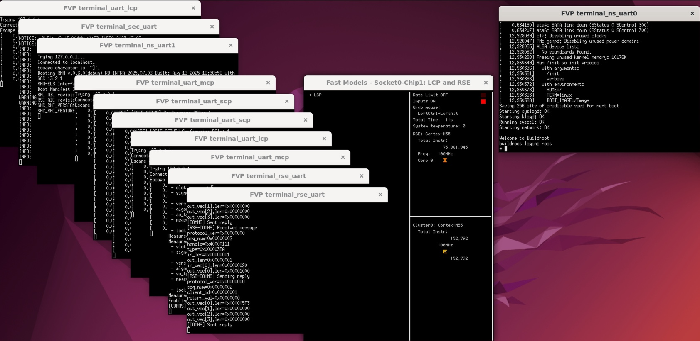

## Build and Run RDV3-R1 Dual Chip Platform

The RD‑V3‑R1 platform is a dual-chip simulation environment built to model multi-die Arm server SoCs. It expands on the single-die RD‑V3 design by introducing a second application processor and a Management Control Processor (MCP).

***Key Use Cases***

- Simulate chiplet-style boot flow with two APs
- Observe coordination between SCP and MCP across dies
- Test secure boot in a distributed firmware environment

***Differences from RD‑V3***
- Dual AP boot flow instead of single AP
- Adds MCP (Cortex‑M7) to support cross-die management
- More complex power/reset coordination

### Step 1: Clone the RD‑V3‑R1 Firmware Stack

Initialize and sync the codebase for RD‑V3‑R1:

```bash
cd ~
mkdir rdv3r1
cd rdv3r1
repo init -u https://git.gitlab.arm.com/infra-solutions/reference-design/infra-refdesign-manifests.git -m pinned-rdv3r1.xml -b refs/tags/RD-INFRA-2025.07.03 --depth=1
repo sync -c -j $(nproc) --fetch-submodules --force-sync --no-clone-bundle
```

### Step 2: Install RD-V3-R1 FVP

Refer to the [RD-V3-R1 Release Tags](https://neoverse-reference-design.docs.arm.com/en/latest/platforms/rdv3.html#release-tags) to determine which FVP model version matches your selected release tag.  
Then download and install the corresponding FVP binary.

```bash
mkdir -p ~/fvp
cd ~/fvp
wget https://developer.arm.com/-/cdn-downloads/permalink/FVPs-Neoverse-Infrastructure/RD-V3-r1/FVP_RD_V3_R1_11.29_35_Linux64_armv8l.tgz
tar -xvf FVP_RD_V3_R1_11.29_35_Linux64_armv8l.tgz
./FVP_RD_V3_R1.sh
```

### Step 3: Build the Firmware

Since you have already created the Docker image for firmware building in a previous section, there is no need to rebuild it for RD‑V3‑R1.

Run the full firmware build and packaging process:

```bash
cd ~/rdv3r1
docker run --rm \
  -v "$PWD:$PWD" \
  -w "$PWD" \
  --mount type=volume,dst="$HOME" \
  --env ARCADE_USER="$(id -un)" \
  --env ARCADE_UID="$(id -u)" \
  --env ARCADE_GID="$(id -g)" \
  -t -i rdinfra-builder \
  bash -c "./build-scripts/rdinfra/build-test-buildroot.sh -p rdv3r1 build && \
           ./build-scripts/rdinfra/build-test-buildroot.sh -p rdv3r1 package"
```

### Step 4: Launch the Simulation

Once connected via Remote Desktop, open a terminal and launch the RD‑V3‑R1 FVP simulation:

```bash
cd ~/rdv3r1/model-scripts/rdinfra
export MODEL=/home/ubuntu/FVP_RD_V3_R1/models/Linux64_armv8l_GCC-9.3/FVP_RD_V3_R1_R1
./boot-buildroot.sh -p rdv3r1 &
```

This command starts the dual-chip simulation.  
You’ll observe additional UART consoles for components like the MCP, and you can verify that both application processors (AP0 and AP1) are brought up in a coordinated manner.



Similar to the previous session, the terminal logs are stored in `~/rdv3r1/model-scripts/rdinfra/platforms/rdv3r1/rdv3r1`.


### Step 5: Customize Firmware and Confirm MCP Execution

To wrap up this learning path, let’s verify that your firmware changes can be compiled and simulated successfully within the RD‑V3‑R1 environment.

Edit the MCP source file `~/rdv3r1/host/scp/framework/src/fwk_module.c`

Locate the function `fwk_module_start()`. Add the following logging line just before `return FWK_SUCCESS;`:

```c
int fwk_module_start(void)
{
    ...
    FWK_LOG_CRIT("[FWK] Module initialization complete!");

    // Custom log message for validation
    FWK_LOG_CRIT("[FWK] Customer code here");
    return FWK_SUCCESS;
}
```

Rebuild and repackage the firmware:

```bash
cd ~/rdv3r1
docker run --rm \
  -v "$PWD:$PWD" \
  -w "$PWD" \
  --mount type=volume,dst="$HOME" \
  --env ARCADE_USER="$(id -un)" \
  --env ARCADE_UID="$(id -u)" \
  --env ARCADE_GID="$(id -g)" \
  -t -i rdinfra-builder \
  bash -c "./build-scripts/rdinfra/build-test-buildroot.sh -p rdv3r1 build && \
           ./build-scripts/rdinfra/build-test-buildroot.sh -p rdv3r1 package"
```

Launch the FVP simulation again and observe the UART output for MCP.


If the change was successful, your custom log line will appear in the MCP console—confirming that your code was integrated and executed as part of the firmware boot process.

You’ve now successfully simulated a dual-chip Arm server platform using RD‑V3‑R1 on FVP—from cloning firmware sources to modifying secure control logic.

This foundation sets the stage for deeper exploration, such as customizing platform firmware or integrating BMC workflows in future development cycles.
