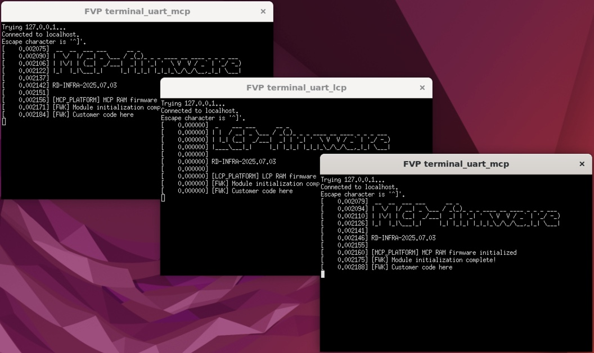

## The RD-V3-R1 dual-chip platform

The RD-V3-R1 platform is a dual-chip simulation environment built to model multi-die Arm server SoCs. It expands on the single-die RD-V3 design by introducing a second application processor and a Management Control Processor (MCP).

Key use cases of RD-V3-R1 are:

- Simulating a chiplet-style boot flow with two APs
- Observing coordination between SCP and MCP across dies
- Testing secure boot in a distributed firmware environment

Key differences from RD-V3 are:

- Dual AP boot flow instead of a single AP
- MCP (Cortex-M7) to support cross-die management
- More complex power/reset coordination

## Step 1: Clone the RD-V3-R1 firmware stack

Initialize and sync the codebase for RD-V3-R1:

```bash
cd ~
mkdir rdv3r1
cd rdv3r1
repo init -u https://git.gitlab.arm.com/infra-solutions/reference-design/infra-refdesign-manifests.git -m pinned-rdv3r1.xml -b refs/tags/RD-INFRA-2025.07.03 --depth=1
repo sync -c -j "$(nproc)" --fetch-submodules --force-sync --no-clone-bundle
```

## Step 2: Install the RD-V3-R1 FVP

Refer to the [RD-V3-R1 Release Tags](https://neoverse-reference-design.docs.arm.com/en/latest/platforms/rdv3.html#release-tags) to pick the FVP version that matches your tag, then download and install it: 

```bash
mkdir -p ~/fvp
cd ~/fvp
wget https://developer.arm.com/-/cdn-downloads/permalink/FVPs-Neoverse-Infrastructure/RD-V3-r1/FVP_RD_V3_R1_11.29_35_Linux64_armv8l.tgz
tar -xvf FVP_RD_V3_R1_11.29_35_Linux64_armv8l.tgz
./FVP_RD_V3_R1.sh
```

## Step 3: Build the firmware

If you built the Docker image earlier, you can reuse it for RD-V3-R1. 

Run the full build and package flow:

```bash
cd ~/rdv3r1
docker run --rm \
  -v "$PWD:$PWD" \
  -w "$PWD" \
  --mount type=volume,dst="$HOME" \
  --env ARCADE_USER="$(id -un)" \
  --env ARCADE_UID="$(id -u)" \
  --env ARCADE_GID="$(id -g)" \
  -t -i rdinfra-builder \
  bash -c "./build-scripts/rdinfra/build-test-buildroot.sh -p rdv3r1 build && \
           ./build-scripts/rdinfra/build-test-buildroot.sh -p rdv3r1 package"
```

## Step 4: Launch the simulation

From a desktop session on the build host, start the RD-V3-R1 FVP:

```bash
cd ~/rdv3r1/model-scripts/rdinfra
export MODEL="$HOME/FVP_RD_V3_R1/models/Linux64_armv8l_GCC-9.3/FVP_RD_V3_R1"  # adjust if your path/toolchain differs
./boot-buildroot.sh -p rdv3r1 &
```

This starts the dual-chip simulation. You’ll see additional UART consoles (for example, MCP) and can verify both application processors (AP0 and AP1) boot in a coordinated manner.


As before, the terminal logs are stored under `~/rdv3r1/model-scripts/rdinfra/platforms/rdv3r1/rdv3r1`.


## Step 5: Customize firmware and confirm MCP execution

To validate a firmware change in the RD-V3-R1 environment, edit the MCP source file `~/rdv3r1/host/scp/framework/src/fwk_module.c`

Locate the function `fwk_module_start()` and add the following logging line just before `return FWK_SUCCESS;`:

```c
int fwk_module_start(void)
{
    ...
    FWK_LOG_CRIT("[FWK] Module initialization complete!");

    // Custom log message for validation
    FWK_LOG_CRIT("[FWK] Customer code here");
    return FWK_SUCCESS;
}
```

Rebuild and repackage the firmware:

```bash
cd ~/rdv3r1
docker run --rm \
  -v "$PWD:$PWD" \
  -w "$PWD" \
  --mount type=volume,dst="$HOME" \
  --env ARCADE_USER="$(id -un)" \
  --env ARCADE_UID="$(id -u)" \
  --env ARCADE_GID="$(id -g)" \
  -t -i rdinfra-builder \
  bash -c "./build-scripts/rdinfra/build-test-buildroot.sh -p rdv3r1 build && \
           ./build-scripts/rdinfra/build-test-buildroot.sh -p rdv3r1 package"
```

Launch the FVP simulation again and check the MCP UART output for MCP.




If the change was successful, your custom log line will appear in the MCP console - confirming that your code was integrated and executed as part of the firmware boot process.
You’ve now successfully simulated a dual-chip Arm server platform using RD‑V3‑R1 on FVP and validated a firmware change end-to-end—setting you up for deeper customization (for example, BMC integration) in future development cycles.

