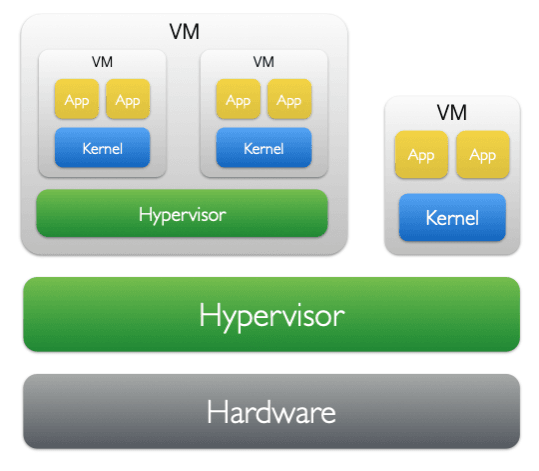

## Why use Nested Virtualization?

Virtualization allows organizations to mutualize large multi-core servers into smaller environments with a strong level of resource isolation. It is a foundational technology for cloud computing, and Cloud Service Providers typically provide compute resources to their customers using virtualization.

Nested virtualization enables guest virtual machines to serve as hypervisors, and run guest virtual machines inside a VM or cloud instance. There are a few use-cases where this facility is very useful:

* **Resource isolation:** When running container applications in cloud instances, containers share a common operating system. By running containers inside microVMs like Firecracker VM, the container workloads share nothing with the host operating system 
* **Mobile application development and testing:** It is very desirable to build and test Android applications on cloud infrastructure like Kubernetes. Cloud hosted Kubernetes compute nodes are typically virtual machine instances. Running Android environments in Kubernetes in this situation requires nested virtualization. 
* **Testing and development of Embedded applications:** Many embedded applications are running specialized real-time or embedded operating systems, rather than Linux. Developing and testing these environments requires virtualization, which means developing on bare metal or VMs with nested virtualization enabled.

## Terminology and server set-up

Throughout this Learning Path, we will refer to the bare metal server as L0, guest VMs running on the bare metal server as L1 VMs, and nested VMs as L2 VMs. We will be starting two VMs on the host, which we will call `fedora-l1-guest` and `fedora-l1-hyper`, and inside `fedora-l1-hyper` we will create another VM called `fedora-l2-guest`. Both "guest" VMs will be 8-core virtual machines, and the `fedora-l1-hyper` VM will be assigned 16 cores.

This will allow us to allocate similar amounts of resources, and pin those resources to specific cores, to minimize any potential resource conflicts across the bare metal host and the VMs when we are comparing the performance of a reference benchmark at the end.

Nested virtualization:



## Installing the virtualization software stack 

To run a nested VM on Arm64, you need both a recent Linux kernel (6.13 or later, preferably 7.2 or later) and a recent version of qemu-kvm (version 10.1.0 or later), and all of the other virtualization tooling that we will need to create and run virtual machines using virsh and NV2_stack

1. Connect to a host running Fedora 44 or later, and install prerequisite packages:
   ```
    sudo dnf -y install libvirt libvirt-daemon-qemu libvirt-client qemu-kvm virt-install dnsmasq genisoimage
   ```
2. Enable nested virtualization on the host by passing the kernel argument `kvm-arm.mode=nested` to the Linux kernel at boot time, then reboot the server:
   ```
    sudo grubby --args="kvm-arm.mode=nested" --update-kernel=ALL 
    sudo reboot
   ```
3. Verify after reboot that capability is available:
   ```
    sudo dmesg | grep -i "nested\|vhe\|nv" 
    # Expected: "CPU features: detected: Nested Virtualization Support" 
    # Expected: "kvm [1]: VHE+NV2 mode initialized successfully"
   ```

At the end of this step, you should have installed all of the virtualization tools that we will use to prepare and start virtual machines on the bare metal host, and confirmed that your host is now running with nested virtualization enabled.

Next, we will create and start an L1 guest VM running Fedora 44.

