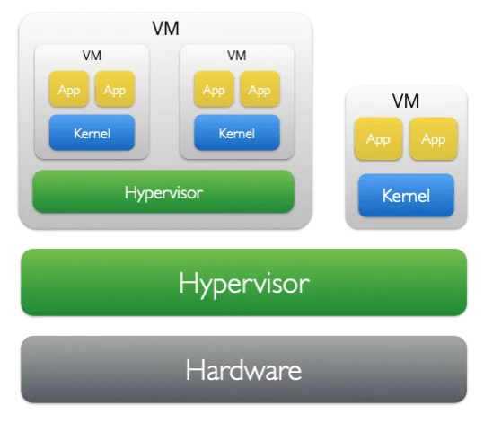

## Why use nested virtualization?

Virtualization allows organizations to partition large multi-core servers into smaller environments with a strong level of resource isolation. It is a foundational technology for cloud computing, and Cloud Service Providers typically provide compute resources to their customers using virtualization.

Nested virtualization enables guest virtual machines to serve as hypervisors, and run guest virtual machines inside a VM or cloud instance. There are a few use cases where this facility is useful.

### Resource isolation

When running container applications in cloud instances, containers share a common operating system. By running containers inside microVMs such as Firecracker VM, the container workloads share nothing with the host operating system.

### Mobile application development and testing

Developers often want to build and test Android applications on cloud infrastructure such as Kubernetes. Cloud hosted Kubernetes compute nodes are typically virtual machine instances. Running Android environments in Kubernetes in this situation requires nested virtualization.

### Testing and development of embedded applications

Many embedded applications run specialized real-time or embedded operating systems, rather than Linux. Developing and testing these environments requires virtualization, which means developing on bare metal or VMs with nested virtualization enabled.

## Terminology and server setup

The bare metal server is referred to as L0, guest VMs running on the bare metal server as L1 VMs, and nested VMs as L2 VMs. The examples assume an Arm64 bare metal host with 64 cores or more. You start two VMs on the host, called `fedora-l1-guest` and `fedora-l1-hyper`, and inside `fedora-l1-hyper` you create another VM called `fedora-l2-guest`. Both "guest" VMs are 8-core virtual machines, and the `fedora-l1-hyper` VM is assigned 16 cores.

This lets you allocate similar amounts of resources, and pin those resources to specific cores, to minimize any potential resource conflicts across the bare metal host and the VMs when you compare the performance of a reference benchmark at the end.

The following diagram shows the nested virtualization layout:



## Installing the virtualization software stack 

The host is an Arm64 server running Fedora 44, which includes a recent enough kernel and `qemu-kvm` to support nested virtualization. You install the remaining virtualization tools with the `dnf` package manager in the following steps.

{}
This must run on a bare metal Arm64 server, whether a cloud bare metal instance or a local physical machine. Nested virtualization needs direct access to the processor's EL2 virtualization support, which is not available inside a standard virtual machine. Running these steps inside an existing VM does not enable nested virtualization.

Nested virtualization on Arm64 also depends on a recent Linux kernel (6.13 or later, preferably 7.2 or later) and `qemu-kvm` version 10.1.0 or later. Fedora 44 meets these requirements. These version details are included for awareness if you want to adapt the steps to another distribution.
{}

### Install the virtualization packages

Install the prerequisite packages:

```bash
sudo dnf -y install libvirt libvirt-daemon-qemu libvirt-client qemu-kvm virt-install dnsmasq genisoimage
```

### Enable nested virtualization

Enable nested virtualization on the host by passing the kernel argument `kvm-arm.mode=nested` to the Linux kernel at boot time, then reboot the server:

```bash
sudo grubby --args="kvm-arm.mode=nested" --update-kernel=ALL
sudo reboot
```

### Verify nested virtualization is enabled

After the reboot, verify that the capability is available:

```bash
sudo dmesg | grep -iE "Nested Virtualization Support|VHE\+NV2"
```

The output is similar to:

```output
CPU features: detected: Nested Virtualization Support
kvm [1]: VHE+NV2 mode initialized successfully
```

The `VHE+NV2 mode initialized successfully` line is the key confirmation that nested virtualization is active. If you only see `VHE mode initialized successfully` without `+NV2`, nested virtualization is not enabled, which usually means the kernel argument was not applied or the hardware does not support FEAT_NV2.

At the end of this step, you should have installed all of the virtualization tools you use to prepare and start virtual machines on the bare metal host, and confirmed that your host is now running with nested virtualization enabled.

Next, you create and start an L1 guest VM running Fedora 44.

