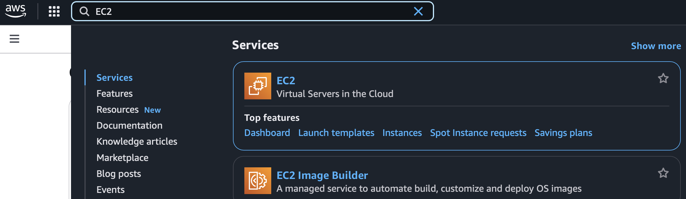
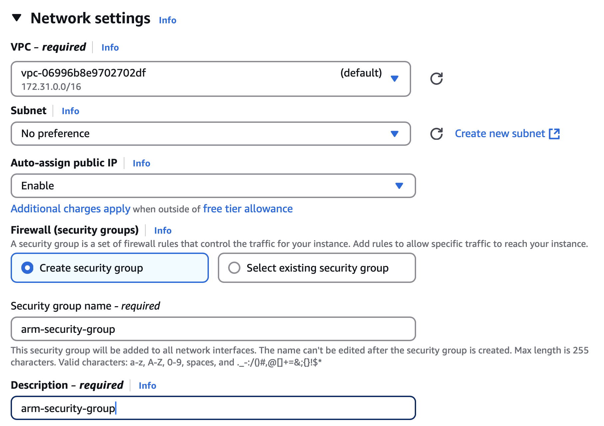

### Objective
In this section, you will learn how to deploy the .NET Aspire application you created on to an AWS Elastic Compute Cloud (EC2) virtual machine powered by Arm-based processors, such as AWS Graviton. This allows you to leverage the cost and performance benefits of Arm architecture while benefiting from the seamless deployment of cloud-native applications on modern infrastructure.

### Set up your AWS EC2 Instance
To set up an Arm-powered EC2 instance, follow these steps:
1. Log in to the [AWS Management Console](http://console.aws.amazon.com).

2. Navigate to the EC2 Service. 

   As Figure 5 shows, in the search box, type "EC2". 
   
   Then, click on **EC2** in the search results:



3. In the EC2 Dashboard, click **Launch Instance** and add the following information in these corresponding data fields to configure your setup:
* Name: enter **arm-server**.
* AMI: select **Arm-compatible Amazon Machine Image, Ubuntu 22.04 LTS for Arm64**.
* Architecture: select **64-bit (Arm)**.
* Instance Type: select **t4g.small**.

The configuration should look like the configuration fields that Figure 6 shows:


4. Scroll down to **Key pair** (login), and click **Create new key pair**. 
  This displays the **Create key pair** window. 
  Now configure the following fields:
* Key pair name: **arm-key-pair**.
* Key pair type: **RSA**.
* Private key format: **.pem**.
* Click the **Create key pair** button, and download the key pair to your computer.


5. Scroll down to **Network Settings**, and configure the settings:
* VPC: select the default.
* Subnet: select **No preference**.
* Auto-assign public IP: **Enable**.
* Firewall: Check **Create security group**.
* Security group name: **arm-security-group**.
* Description: **arm-security-group**.
* Inbound security groups. 



6. Configure **Inbound Security Group Rules** by selecting **Add Rule** and then setting the following details:
* Type: **Custom TCP**.
* Protocol: **TCP**.
* Port Range: **7133**.
* Source: Select **Anywhere (0.0.0.0/0)** for public access or restrict access to your specific IP for better security.

Repeat this step for all three ports that the application is using. This example demonstrates setup using ports 7133, 7511, and 17222. These must match the values that you have when you run the app locally.

The configuration should look like:


7. Launch an instance by clicking the **Launch instance** button. You should see the green box with the **Success** label. 

This box also contains a link to the EC2 instance. Click on it, and it takes you to the instance dashboard, as Figure 10 shows:


### Deploy the application
Once the EC2 instance is ready, you can connect to it, and deploy the application. Follow these steps to connect:

1. Locate the instance public IP (here this is 98.83.137.101).

2. Use an SSH client to connect:
* Open the terminal.
* Set the appropriate permissions for the key pair file, using your own IP address:
```console
chmod 400 arm-key-pair.pem                     
ssh -i arm-key-pair.pem ubuntu@98.83.137.101 
```


You can now install the required components, pull the application code from git, and launch the app:
In the EC2 terminal run: 
```console
sudo apt update && sudo apt upgrade -y
```

This updates the package list and upgrades the installed packages.

Install .NET SDK using the following commands:
```console
wget https://packages.microsoft.com/config/ubuntu/22.04/packages-microsoft-prod.deb -O packages-microsoft-prod.deb
sudo dpkg -i packages-microsoft-prod.deb
sudo apt update
sudo apt install -y dotnet-sdk-8.0
```

Verify the installation:
```console
dotnet --version
```
Install the Aspire workload using the dotnet CLI:
```console
dotnet workload install aspire
```
Clone the repository that contains the application that you created in the previous section:
```console
git clone https://github.com/dawidborycki/NetAspire.Arm.git
cd NetAspire.Arm/
```
Trust the development certificate:
```console
dotnet dev-certs https --trust
```
Build and run the project:
```console
dotnet restore
dotnet run --project NetAspire.Arm.AppHost
```

The application runs the same way as it does locally. You should see the following:


Finally, open the application in the web browser, using the EC2's public IP:


### Summary 
You have successfully deployed the Aspire app on to an Arm-powered AWS EC2 instance. This demonstrates the compatibility of .NET applications with Arm architecture and AWS Graviton instances, offering high performance and cost-efficiency.

