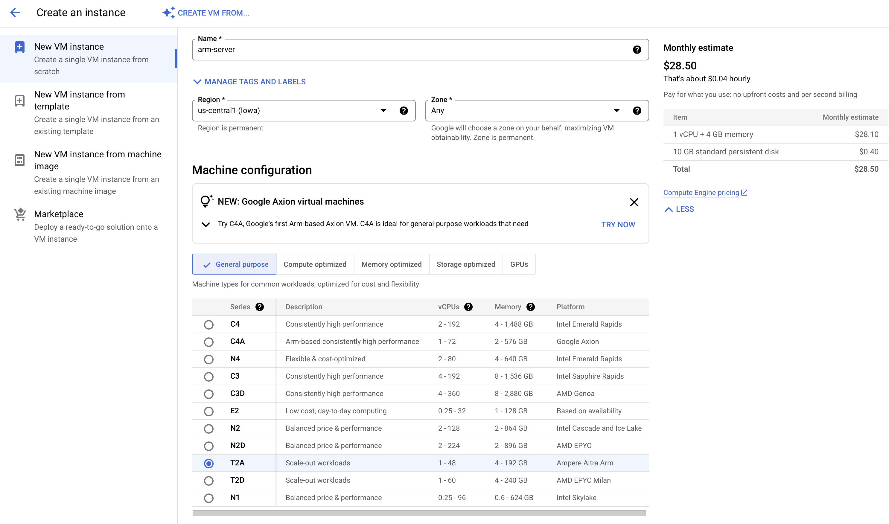
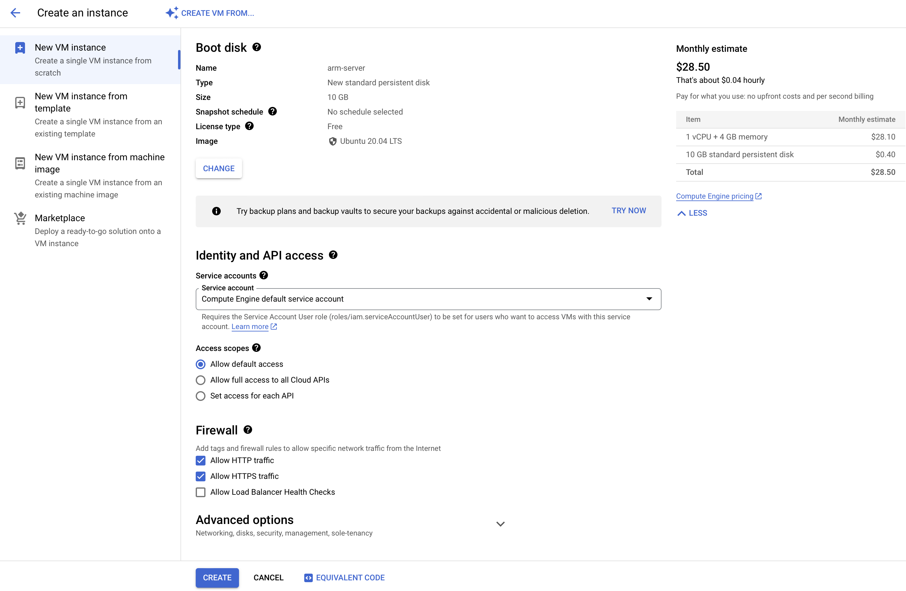
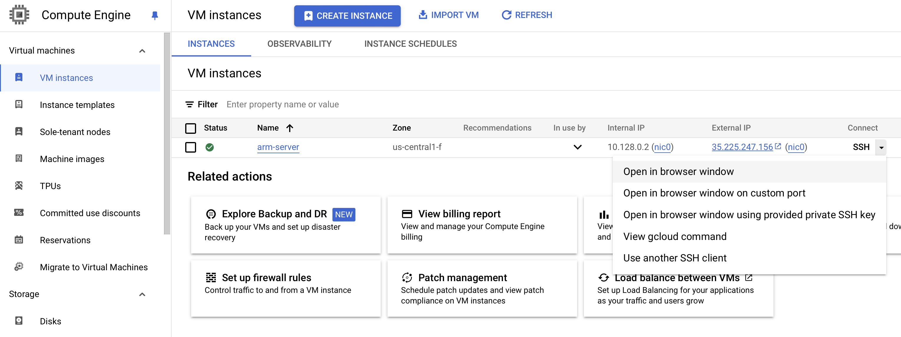
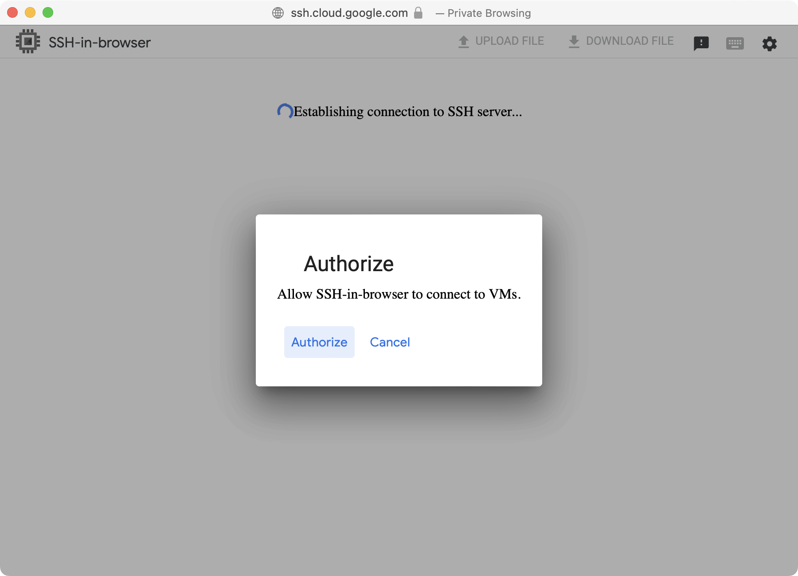
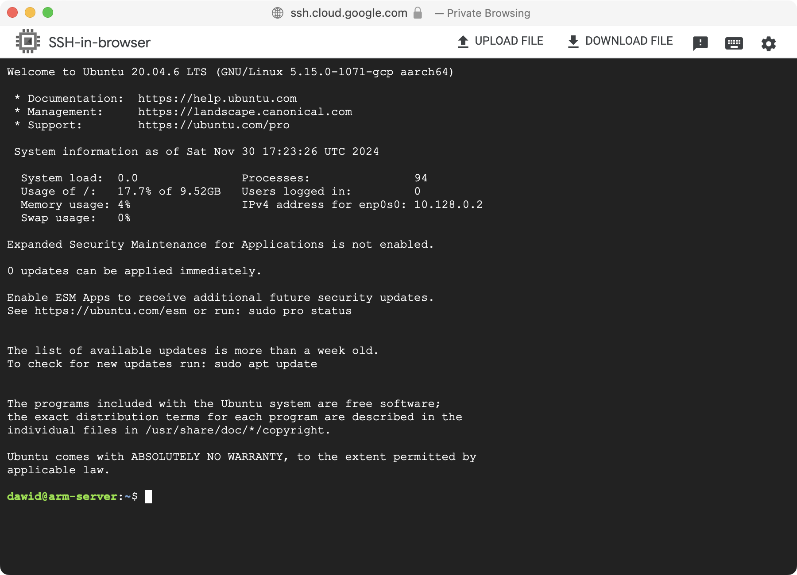
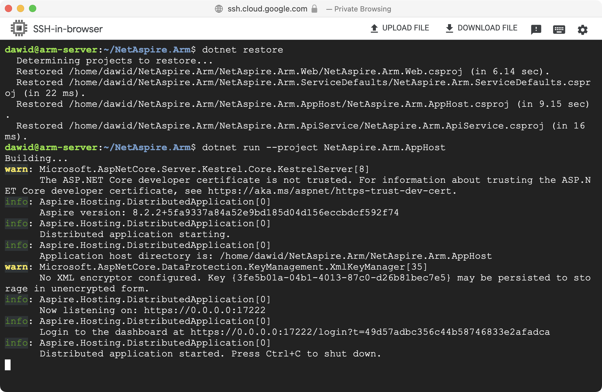

### Objective
In this section, you will learn how to deploy the .NET Aspire application you created onto an Arm-based instance running on Google Cloud Platform (GCP). You will start by creating an instance of an Arm64 virtual machine on GCP. You will then connect to it, install the required software, and run the application.

### Create an Arm64 virtual machine
To create an Arm64 VM, follow these steps:
1. Create a Google Cloud Account. If you don’t already have an account, sign up for Google Cloud.

2. Open the Google Cloud Console [here](https://console.cloud.google.com).

3. Navigate to Compute Engine. In the Google Cloud Console, open the Navigation menu, and go to **Compute Engine** > **VM Instances**. Enable any relevant APIs if prompted.

4. Click **Create Instance**.

5. Configure the VM Instance as follows:
    * Name: **arm-server**.
    * Region/Zone: choose a region and zone where Arm64 processors are available, for example, **us-central1**.
    * Machine Family: select **General-purpose**.
    * Series: **T2A**. 
    * Machine Type: select **t2a-standard-1**.

The configuration setup should resemble the following:



6. Configure the Remaining Settings:
    
    * Availability Policies: **Standard**.
    * Boot Disk: Click **Change**, then select **Ubuntu** as the operating system.
    * Identity and API Access: keep the default settings.
    * Firewall Settings: Check **Allow HTTP traffic** and **Allow HTTPS traffic**.



7. Click the **Create** Button and wait for the VM to be created.

### Connecting to VM
After creating the VM, connect to it as follows:
1. In **Compute Engine**, click the SSH drop-down menu next to your VM, and select **Open in browser window**:



2. This opens a browser window. First, click the **Authorize** button:



3. You will then see the terminal of your VM:



### Installing dependencies and deploying an app
Once the connection is established, you can install the required dependencies (.NET SDK, Aspire workload, and Git), fetch the application code, and deploy it.

Update the Package List:
```console
sudo apt update && sudo apt upgrade -y
```
Install .NET SDK 8.0 or later:
```console
wget https://dot.net/v1/dotnet-install.sh
bash dotnet-install.sh --channel 8.0
```
Add .NET to PATH:
```console
export DOTNET_ROOT=$HOME/.dotnet
export PATH=$PATH:$HOME/.dotnet:$HOME/.dotnet/tools
```
Verify the installation:
```console
dotnet --version
```
Install the .NET Aspire workload:
```console
dotnet workload install aspire
```
Install git:
```console
sudo apt install -y git
```
Clone the repository:
```console
git clone https://github.com/dawidborycki/NetAspire.Arm.git
cd NetAspire.Arm/
```
Trust the development certificate:
```console
dotnet dev-certs https --trust
```
Build and run the project:
```console
dotnet restore
dotnet run --project NetAspire.Arm.AppHost
```

You will see output similar to this:


### Making your application public

To make your application publicly-accessible, configure the firewall rules:
1. In the Google Cloud Console, navigate to **VPC Network** > **Firewall**.

2. Click **Create Firewall Rule** and configure the following:
    * Name: **allow-dotnet-ports**.
    * Target Tags: **dotnet-app**.
    * Source IP Ranges: **0.0.0.0/0** (for public access).
    * Protocols and Ports: **allow TCP on ports 7133, 7511, and 17222**.
    * Click the **Create** button.

3. Go back to your VM instance.

4. Click **Edit**, and under **Networking** find **Network Tags**, add the tag **dotnet-app**. 

5. Click the **Save** button.

### Summary
You have successfully deployed the Aspire app onto an Arm-powered GCP virtual machine. This deployment demonstrates the compatibility of .NET applications with Arm architecture and GCP, offering high performance and cost efficiency.
