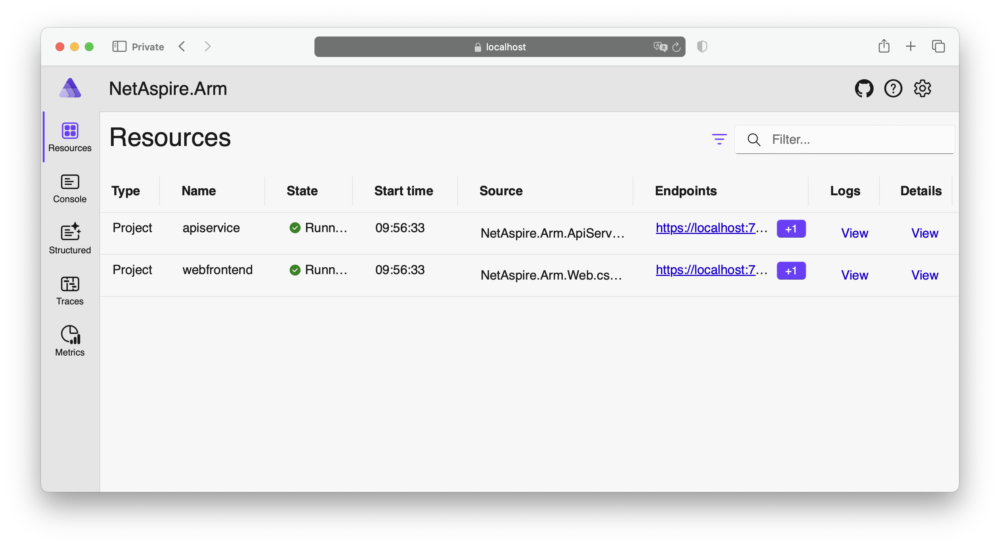

In this section, you will set up the project. This involves several steps, including installing the Aspire workload. Then, you will learn about the project structure and launch it locally. Finally, you will modify the project to add additional computations to mimic computationally intensive work.

## Create a Project
To create a .NET Aspire application, first ensure that you have .NET 8.0 or later installed on your system. Next, install the Aspire workload by opening your terminal and running:

```console
dotnet workload install aspire
```

Once the Aspire workload is installed, you can create a new application by executing:

```console
dotnet new aspire-starter -o NetAspire.Arm
```

This command generates a solution with the following structure:
* NetAspire.Arm.AppHost - the orchestrator, or coordinator, project serves as the backbone of your distributed application. Its primary responsibilities include defining how services connect to one another, configuring ports and endpoints to ensure seamless communication, managing service discovery to enable efficient interactions between components, and handling container orchestration to streamline the deployment and operation of services within your application.

* NetAspire.Arm.ApiService - the sample REST API service, built with ASP.NET Core, acts as a core component of your application by implementing business logic and managing data access. The default implementation comes preconfigured with essential features, including a WeatherForecast endpoint for demonstration purposes, built-in health checks to monitor the service’s status, and telemetry setup to track performance and usage metrics.

* NetAspire.Arm.Web - the web frontend application, implemented with Blazor, serves as the user-facing layer of your application. It communicates with the API service to provide an interactive experience. This application includes a user interface for presenting data, client-side logic for handling interactions, and preconfigured patterns for consuming services.

* NetAspire.Arm.ServiceDefaults - the shared library provides a centralized foundation for common service configurations across your application. It includes a default middleware setup, preconfigured telemetry settings for tracking performance, standard health check implementations, and logging configurations to ensure consistent and efficient monitoring and debugging.

The structure of this project is designed to enhance efficiency and simplify the development of cloud-native applications. At its core, it incorporates features to ensure seamless service interactions, robust monitoring, and an exceptional development experience.

One of the foundational elements is service discovery, which enables automatic service registration, dynamic endpoint resolution, and load balancing. These features ensure that services communicate effectively and handle traffic efficiently, even in complex, distributed environments.

For monitoring and telemetry, the architecture integrates tools like built-in health checks, OpenTelemetry for monitoring, and metrics collection with distributed tracing. These features provide developers with deep insights into application performance, helping to maintain reliability and optimize system operations.

Configuration management offers environment-based settings that make deploying applications across different stages straightforward. Secure secrets management safeguards sensitive information, while standardized service-to-service communication simplifies interactions between microservices.

The architecture is also tailored to improve the development experience. Developers can benefit from local debugging support and a powerful monitoring dashboard. This dashboard provides a detailed view of service health, logs, metrics, trace information, resource usage, and service dependencies. Additionally, hot reload capability allows real-time updates during development, and container support ensures consistency across local and production environments.

This thoughtfully crafted architecture embodies microservices best practices, promoting scalability, maintainability, and service isolation. It not only simplifies deployment and monitoring but also fosters developer productivity by streamlining workflows and providing intuitive tools for building modern, distributed applications.

## Running the Project
To run the project, type the following
```console
dotnet run --project NetAspire.Arm.AppHost 
```

The output will look like below:
```output
Building...
info: Aspire.Hosting.DistributedApplication[0]
      Aspire version: 8.2.2+5fa9337a84a52e9bd185d04d156eccbdcf592f74
info: Aspire.Hosting.DistributedApplication[0]
      Distributed application starting.
info: Aspire.Hosting.DistributedApplication[0]
      Application host directory is: /Users/db/Repos/NetAspire.Arm/NetAspire.Arm.AppHost
info: Aspire.Hosting.DistributedApplication[0]
      Now listening on: https://localhost:17222
info: Aspire.Hosting.DistributedApplication[0]
      Login to the dashboard at https://localhost:17222/login?t=81f99566c9ec462e66f5eab5aa9307b0
```

Click on the link provided: https://localhost:17222/login?t=81f99566c9ec462e66f5eab5aa9307b0. This will direct you to the application dashboard, as shown below:



Once on the dashboard, locate and click the endpoint link for NetAspire.Arm.Web. This will take you to the Blazor-based web application. In the Blazor app, navigate to the Weather section to access and display data retrieved from the WeatherForecast API:


Finally, return to the dashboard and select the Traces option. This section provides detailed telemetry tracing, allowing you to view the flow of requests, track service dependencies, and analyze performance metrics for your application:


By following these steps, you’ll explore the key components of the .NET Aspire application, including its dashboard, data interaction through APIs, and telemetry tracing capabilities.

## Modify the Project
You will now include the additional code that will mimic computation intense work. Go to NetAspire.Arm.ApiService project, and create a new file ComputationService.cs. Modify this file as follows:

```cs
static class ComputationService
{
    public static void PerformIntensiveCalculations(int matrixSize)
    {
        var matrix1 = GenerateMatrix(matrixSize);
        var matrix2 = GenerateMatrix(matrixSize);

        // Matrix multiplication 
        var matrixResult = Enumerable.Range(0, matrixSize)            
            .SelectMany(i => Enumerable.Range(0, matrixSize)
                .Select(j =>
                {
                    double sum = 0;
                    for (int k = 0; k < matrixSize; k++)
                    {
                        sum += matrix1[i * matrixSize + k] * matrix2[k * matrixSize + j];
                    }
                    return sum;
                }))
            .ToArray();        
    }

    private static double[] GenerateMatrix(int matrixSize) {
        return Enumerable.Range(1, matrixSize * matrixSize)
            .Select(x => Random.Shared.NextDouble())
            .ToArray();
    }   
}
```

This code defines a static class, ComputationService, designed to perform computationally intensive tasks, specifically matrix multiplication. It contains a public method, PerformIntensiveCalculations, which generates two matrices of a specified size, multiplies them, and stores the resulting matrix.

The private method GenerateMatrix creates a one-dimensional array representing a matrix of the given size (matrixSize x matrixSize). Each element in the matrix is initialized with a random double value generated using Random.Shared.NextDouble().

The public method PerformIntensiveCalculations multiplies two matrices (matrix1 and matrix2) element by element using nested loops and LINQ. It iterates through each row of the first matrix and each column of the second matrix, calculating the dot product for each element in the resulting matrix. The result of the multiplication is stored in a flattened one-dimensional array, matrixResult.

This code is provided for demonstrating heavy computational operations, such as large matrix manipulations, and can simulate workloads in scenarios that mimic intensive data processing or scientific calculations.

Then, open the Program.cs of the NetAspire.Arm.ApiService, and use the above code:

```cs
app.MapGet("/weatherforecast", () =>
{
    ComputationService.PerformIntensiveCalculations(matrixSize: 1000);

    var forecast = Enumerable.Range(1, 5).Select(index =>
        new WeatherForecast
        (
            DateOnly.FromDateTime(DateTime.Now.AddDays(index)),
            Random.Shared.Next(-20, 55),
            summaries[Random.Shared.Next(summaries.Length)]
        ))
        .ToArray();
    return forecast;
});
```

This will trigger matrix multiplications when you click Weather in the web frontend application.

To test the code, re-run the application using the following command:

```console
dotnet run --project NetAspire.Arm.AppHost 
```

Next, navigate to the web frontend, click Weather, and then return to the dashboard. Click Traces to observe that the operation now takes significantly longer to complete—approximately 4 seconds in the example below:


Now, when project is ready, and we can deploy it to the cloud.