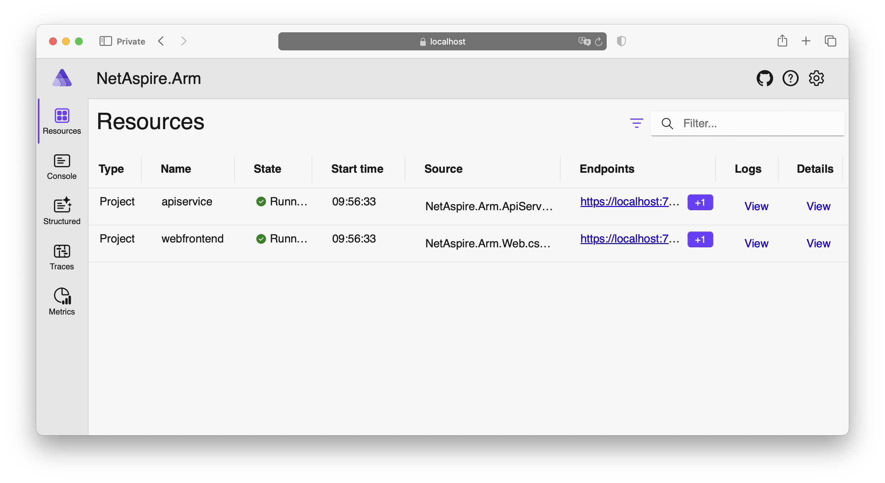
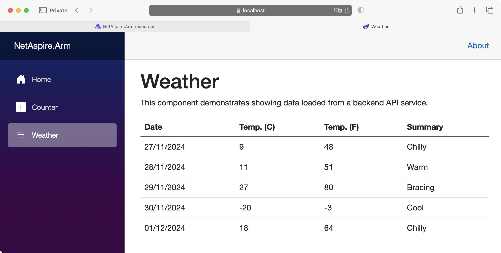
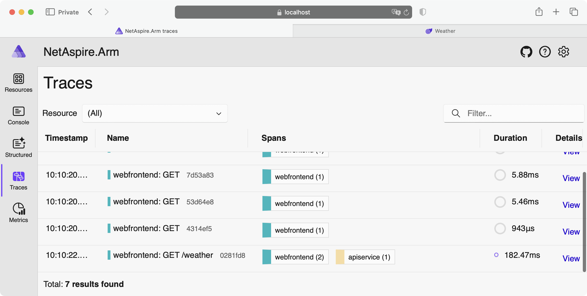

## Using the dashboard
The application will issue a certificate. Before you run the application, add support to trust the HTTPS development certificate by running:
 
```console
dotnet dev-certs https --trust
```

Now run the project:
```console
cd .\NetAspire.Arm\
dotnet run --project NetAspire.Arm.AppHost 
```

The output should look like the text below:
```output
Building...
info: Aspire.Hosting.DistributedApplication[0]
      Aspire version: 8.2.2+5fa9337a84a52e9bd185d04d156eccbdcf592f74
info: Aspire.Hosting.DistributedApplication[0]
      Distributed application starting.
info: Aspire.Hosting.DistributedApplication[0]
      Application host directory is: /Users/db/Repos/NetAspire.Arm/NetAspire.Arm.AppHost
info: Aspire.Hosting.DistributedApplication[0]
      Now listening on: https://localhost:17222
info: Aspire.Hosting.DistributedApplication[0]
      Login to the dashboard at https://localhost:17222/login?t=81f99566c9ec462e66f5eab5aa9307b0
```

Click on the link generated for the dashboard. 

In this case, it is: [https://localhost:17222/login?t=81f99566c9ec462e66f5eab5aa9307b0](https://localhost:17222/login?t=81f99566c9ec462e66f5eab5aa9307b0). 

This directs you to the application dashboard, as Figure 1 shows:



On the dashboard, locate and click the endpoint link for `NetAspire.Arm.Web`. 

This takes you to the Blazor-based web application. In the Blazor app, navigate to the Weather section to access and display data retrieved from the WeatherForecast API:



Now return to the dashboard, and select the **Traces** option. This section provides detailed telemetry tracing, allowing you to view the flow of requests, track service dependencies, and analyze performance metrics for your application:



By following these steps, you can explore the key components of the .NET Aspire application, including its dashboard, data interaction through APIs, and telemetry tracing capabilities.
