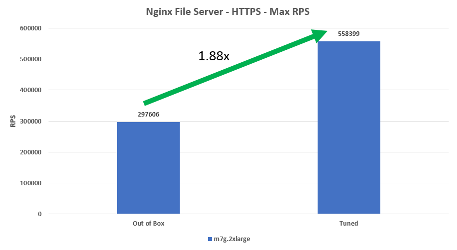
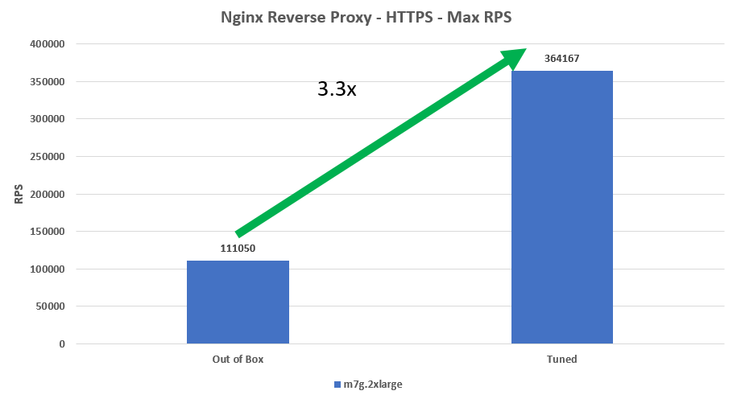
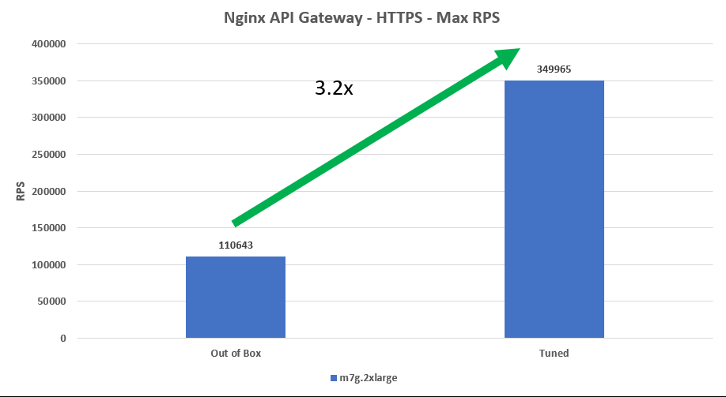

##  Importance of tuning

Application tuning allows you to gain performance without scaling your deployment up (bigger machines/nodes) or out (more machines/nodes). This gained performance can either be used, or traded for cost savings by reducing the amount of compute resources provisioned. The graphs below shows the performance gains of an Nginx file server, Reverse Proxy, and API Gateway when they are tuned.

Depending on the use case requirements. The m7g.2xlarge shown above could be down sized to a m7g.xlarge to gain cost savings.