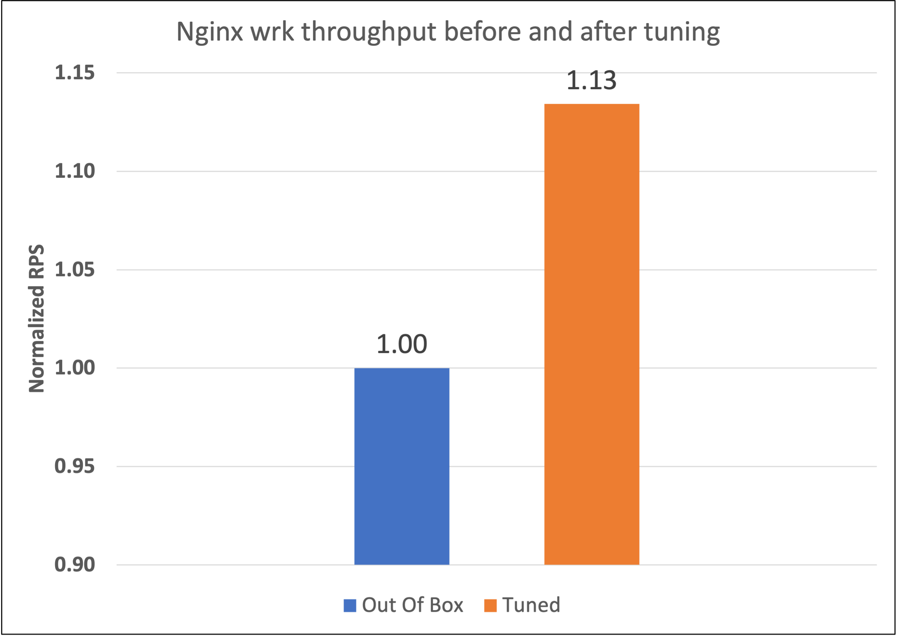

## About performance tuning

Performance tuning is most useful when you treat it as a measurement process, not a fixed checklist. You can tune by changing one parameter at a time, running a designed experiment, comparing profiles, or using automation and AI-assisted tools to explore a larger configuration space.

There isn't a universal set of tuning parameters that works best for every application. The right settings depend on the request profile, response size, TLS configuration, cache behavior, upstream service behavior, network path, software version, system architecture, operating system, and other application-specific factors.

Whatever method you use, keep the measurements repeatable. Record the system configuration, workload, software versions, and tuning parameters so you can identify which changes improved performance and which changes had little effect.

## Why tune NGINX

NGINX performance can be limited by connection handling, kernel network settings, TLS processing, file I/O, upstream connection reuse, cache behavior, logging, or regular expression processing. By tuning, you can use the available compute, memory, storage, and network resources more efficiently.

Improved performance can give you higher throughput, lower latency, or better cost efficiency. A tuned configuration can increase capacity on the same system, or help you meet the same performance target with fewer compute resources.

## Example performance result

The following example shows `wrk` throughput before and after tuning for an NGINX API gateway on an Arm Neoverse V3 system. The result is normalized to the out-of-box configuration, so `1.00` represents the baseline.

This result is an example, not a guaranteed improvement for every workload. Your results depend on the NGINX version, request rate, response size, TLS settings, client concurrency, upstream services, network configuration, and system resources.

## What you've learned and what's next

You've now learned why tuning NGINX is useful and reviewed an example benchmark demonstrating improvement in `wrk` throughput after tuning. 

Next, you'll learn about kernel, compiler, and library optimizations. 