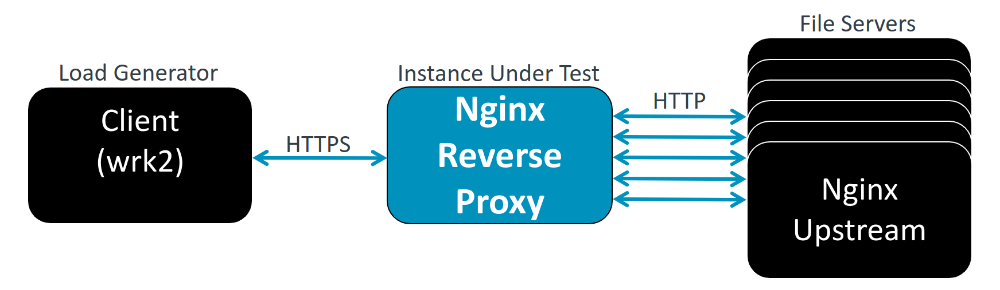

## Test NGINX optimizations

You can skip this section if you already have a performance test method for your NGINX deployment.

This section presents one method for testing NGINX with `wrk`. Use it as a starting point if you don't already have an established load test strategy. To understand the impact of tuning on your deployment, use a workload that reflects your request pattern, response size, TLS behavior, concurrency, and upstream service behavior.

## About wrk

[`wrk`](https://github.com/wg/wrk) is an HTTP load test tool that lets you configure the number of threads, open connections, and test duration. It reports throughput and latency statistics. Another option is [`h2load`](https://nghttp2.org/documentation/h2load-howto.html), which is useful when you want to test HTTP/2 behavior or prefer the `nghttp2` toolchain.

## Install wrk

You can install `wrk` by cloning the source and using `make`.

Install the required build dependencies:

```bash
sudo apt-get update
sudo apt-get install -y build-essential libssl-dev git zlib1g-dev
```

### Build wrk

Use the following commands to build `wrk`:

```bash
git clone https://github.com/wg/wrk
cd wrk
make
```

## Example load test setup

The following diagram shows a typical multi-node test setup. The load generator runs `wrk`. The instance under test runs the reverse proxy or API gateway. The file servers act as upstream servers for the reverse proxy or API gateway.

You can also run `wrk` directly against NGINX file servers, or run `wrk` on the same node as NGINX. Choose a setup that reflects your deployment and avoids making the load generator the bottleneck.



## Running a wrk test

The NGINX file servers need files to serve. If you are using the configuration files discussed in [Tune a static file server](/learning-paths/servers-and-cloud-computing/nginx_tune/tune_static_file_server/) or [Tune a reverse proxy or API gateway](/learning-paths/servers-and-cloud-computing/nginx_tune/tune_revprox_and_apigw/), run the following commands on each file server to create sample files. You do not need to create these files on reverse proxy or API gateway nodes because they do not serve files directly.

```bash
# Create 1 KB file in the reverse proxy use case directory
sudo dd if=/dev/urandom of=/usr/share/nginx/html/1kb bs=1024 count=1

# Create 5 KB file in the reverse proxy use case directory
sudo dd if=/dev/urandom of=/usr/share/nginx/html/5kb bs=1024 count=5

# Create 10 KB file in the reverse proxy use case directory
sudo dd if=/dev/urandom of=/usr/share/nginx/html/10kb bs=1024 count=10

# Copy files into the API gateway use case directory
sudo mkdir -p /usr/share/nginx/html/api_new
sudo cp /usr/share/nginx/html/1kb /usr/share/nginx/html/api_new
sudo cp /usr/share/nginx/html/5kb /usr/share/nginx/html/api_new
sudo cp /usr/share/nginx/html/10kb /usr/share/nginx/html/api_new
```

Run the sample commands from the `wrk` build directory, or use the full path to the `wrk` binary.

The following sample command tests a file server or reverse proxy. Select thread and connection values that load the NGINX server without causing connection, read, or write errors in `wrk` or NGINX. Because `wrk` does not use a fixed request-rate option, adjust `-t`, `-c`, and `-d` to scale load and keep the same values when comparing configurations.

```bash
./wrk -t64 -c200 -d60s --latency https://<nginx_ip_or_dns>/1kb
```

The following sample command tests an API gateway path:

```bash
./wrk -t64 -c200 -d60s --latency https://<nginx_ip_or_dns>/api_old/1kb
```

The API gateway shown in [Tune a reverse proxy or API gateway](/learning-paths/servers-and-cloud-computing/nginx_tune/tune_revprox_and_apigw/) rewrites `api_old` to `api_new`. This is why the sample files are copied into `/usr/share/nginx/html/api_new` as well as the document root on the file servers.
