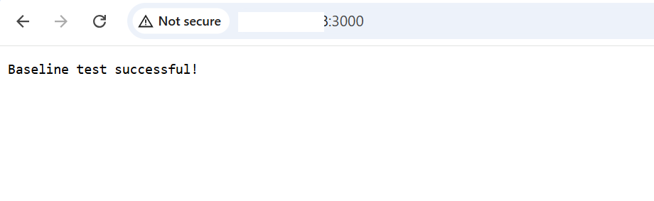

Since Node.js has been successfully installed on your GCP C4A Arm virtual machine, please follow these steps to make sure that it is running.

## Validate Node.js installation with a baseline test

### 1. Run a Simple REPL Test
The Node.js REPL (Read-Eval-Print Loop) allows you to run JavaScript commands interactively.

```console
node
```
Inside the REPL, type:

```console
console.log("Hello from Node.js");
```
You should see an output similar to:

```output
Hello from Node.js
undefined
```
This confirms that Node.js can execute JavaScript commands successfully.   Please now press "Ctrl-D" to exit node. 

### 2. Test a Basic HTTP Server
You can now create a small HTTP server to validate that Node.js can handle web requests.

Use a text editor to create a file named `app.js` with the code below: 

```javascript
const http = require('http');

const server = http.createServer((req, res) => {
  res.writeHead(200, { 'Content-Type': 'text/plain' });
  res.end('Baseline test successful!\n');
});

server.listen(80, '0.0.0.0', () => {
  console.log('Server running at http://0.0.0.0:80/');
});
```
 - This server listens on port 80.
 - Binding to 0.0.0.0 allows connections from any IP, not just localhost.

Next, we run the HTTP server in the background via sudo:

```console
export MY_NODE=`which node`
sudo ${MY_NODE} app.js &
```
You should see an output similar to:

```output
Server running at http://0.0.0.0:80/
```
#### Test Locally with Curl

```console
curl http://localhost:80
```

You should see an output similar to:

```output
Baseline test successful!
```

#### Test from a Browser
Also, you can access it from the browser with your VM's public IP. Run the following command to print your VM’s public URL, then open it in a browser:

```console
echo "http://$(curl -s ifconfig.me):80/"
```

You should see the following message in your browser, confirming that your Node.js HTTP server is running successfully:



This verifies the basic functionality of the Node.js installation before proceeding to the benchmarking.
