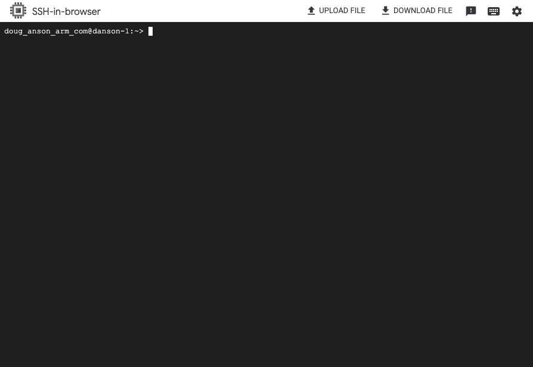

## Overview

In this section, you will learn how to provision a Google Axion C4A Arm virtual machine on Google Cloud Platform (GCP) using the `c4a-standard-4` (4 vCPUs, 16 GB memory) machine type in the Google Cloud Console.  

{}
For support on GCP setup, see the Learning Path [Getting started with Google Cloud Platform](https://learn.arm.com/learning-paths/servers-and-cloud-computing/csp/google/).
{}

## Provision a Google Axion C4A Arm VM in Google Cloud Console

To create a virtual machine using the C4A instance type in Google Cloud Platform:

- Open [Google Cloud Console](https://console.cloud.google.com/).
- In the left menu, select **Compute Engine**, then select **VM Instances**.
- Select **Create Instance**.
- In the **Machine configuration** section:
   - Enter a unique **Instance name**.
   - Choose your preferred **Region** and **Zone**.
   - Set **Series** to `C4A`.
   - Select `c4a-standard-4` for the machine type.

   

This configuration gives you four Arm vCPUs and 16 GB memory, optimized for Arm workloads.

## Select OS and finalize VM settings

After configuring the machine type, you'll need to select the operating system and finalize your VM settings. Follow the steps below to select an Arm64-based OS image, configure networking, and launch your instance. This ensures your VM is ready for Arm-native development and accessible for further setup.

- In the **OS and Storage** section, select **Change**:
   - Choose an Arm64-based OS image. For this Learning Path, select **SUSE Linux Enterprise Server**.
   - For **License type**, select **Pay as you go**.
   - Select **Select** to confirm your choices.

- In the **Networking** section, enable **Allow HTTP traffic**.

- Select **Review and create** to review your configuration.

- Select **Create** to launch your VM instance.

- After the VM is created, locate your instance in the **VM Instances** list.
   - Select the **SSH** button next to your instance to open a browser-based SSH shell.

{}
If you don't see the **SSH** option, refresh the page or check that your VM is running. The SSH shell opens in a new browser window, giving you direct access to your Arm-based VM.
{}

A window from your browser should come up and you should now see a shell into your VM instance:

## What you've accomplished

You've successfully provisioned a Google Axion C4A Arm virtual machine running SUSE Linux Enterprise Server. You're now ready to install Node.js and deploy your workloads on Arm.

