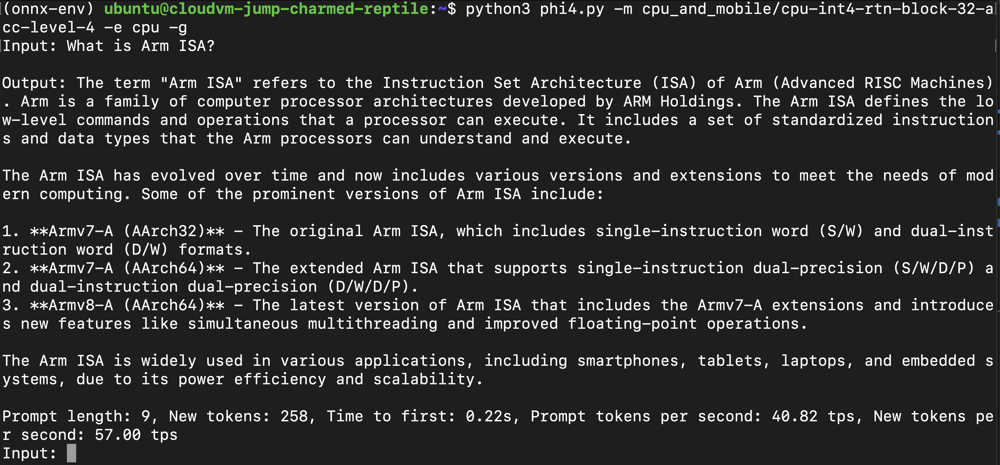
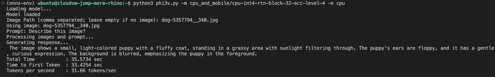

## Input a Prompt

To begin, skip the image prompt and input the text prompt as shown in the example below:


Next, download a sample image from the internet using the following `wget` command in the main directory:
```bash
wget https://cdn.pixabay.com/photo/2020/06/30/22/34/dog-5357794__340.jpg
```

After downloading the image, input the image prompt along with the image name, and enter the text prompt as demonstrated in the example below:


## Observe Performance Metrics

As shown in the example above, the LLM Chatbot performs inference at a speed of **44 tokens/second**, with the time to first token being approximately **1 second**. This highlights the efficiency and responsiveness of the LLM Chatbot in processing queries and generating outputs.

## Further Interaction and Custom Applications

You can continue interacting with the chatbot by asking follow-up prompts and observing the performance metrics displayed in the terminal.

This setup demonstrates how to build and configure applications using the Phi 3.5 model for text generation with both text and image inputs. It also showcases the optimized performance of running Phi models on Arm CPUs, emphasizing the significant performance gains achieved through this workflow.