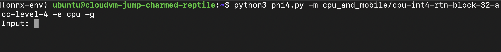

## Script for ONNX Runtime based LLM Server
Now create a `phi3v.py` script using the following content. This script runs the Phi3.5 vision model with ONNX Runtime.

```python
# Copyright (c) Microsoft Corporation. All rights reserved.
# Licensed under the MIT License
import argparse
import os
import glob
import time
from pathlib import Path
import onnxruntime_genai as og

def _find_dir_contains_sub_dir(current_dir: Path, target_dir_name):
    curr_path = Path(current_dir).absolute()
    target_dir = glob.glob(target_dir_name, root_dir=curr_path)
    if target_dir:
        return Path(curr_path / target_dir[0]).absolute()
    else:
        if curr_path.parent == curr_path:
            # Root dir
            return None
        return _find_dir_contains_sub_dir(curr_path / '..', target_dir_name)

def _complete(text, state):
    return (glob.glob(text + "*") + [None])[state]

def run(args: argparse.Namespace):
    print("Loading model...")
    config = og.Config(args.model_path)
    config.clear_providers()
    if args.execution_provider != "cpu":
        print(f"Setting model to {args.execution_provider}...")
        config.append_provider(args.execution_provider)
    model = og.Model(config)
    print("Model loaded")
    processor = model.create_multimodal_processor()
    tokenizer_stream = processor.create_stream()
    interactive = not args.non_interactive
    while True:
        if interactive:
            try:
                import readline
                readline.set_completer_delims(" \t\n;")
                readline.parse_and_bind("tab: complete")
                readline.set_completer(_complete)
            except ImportError:
                # Not available on some platforms. Ignore it.
                pass
            image_paths = [
                image_path.strip()
                for image_path in input(
                    "Image Path (comma separated; leave empty if no image): "
                ).split(",")
            ]
        else:
            if args.image_paths:
                image_paths = args.image_paths
            else:
                image_paths = [str(_find_dir_contains_sub_dir(Path(__file__).parent, "test") / "test_models" / "images" / "australia.jpg")]
        image_paths = [image_path for image_path in image_paths if image_path]
        images = None
        prompt = "<|user|>\n"
        if len(image_paths) == 0:
            print("No image provided")
        else:
            for i, image_path in enumerate(image_paths):
                if not os.path.exists(image_path):
                    raise FileNotFoundError(f"Image file not found: {image_path}")
                print(f"Using image: {image_path}")
                prompt += f"<|image_{i+1}|>\n"
            images = og.Images.open(*image_paths)
        if interactive:
            text = input("Prompt: ")
        else:
            if args.prompt:
                text = args.prompt
            else:
                text = "What is shown in this image?"
        prompt += f"{text}<|end|>\n<|assistant|>\n"
        print("Processing images and prompt...")
        inputs = processor(prompt, images=images)
        print("Generating response...")
        start_time = time.time()
        params = og.GeneratorParams(model)
        params.set_inputs(inputs)
        params.set_search_options(max_length=7680)
        generator = og.Generator(model, params)
        #start_time = time.time()
        first_token_duration = None
        token_count = 0
        while not generator.is_done():
            generator.generate_next_token()
            new_token = generator.get_next_tokens()[0]
            decoded_token = tokenizer_stream.decode(new_token)
            token_count += 1
            if token_count == 1:
                ft_end = time.time()
                first_token_duration = ft_end - start_time
            print(decoded_token, end="", flush=True)
        end_time = time.time()
        total_run_time = end_time - start_time
        tokens_per_sec = token_count / (end_time - ft_end)
        print()
        print(f"Total Time           : {total_run_time:.4f} sec")
        print(f"Time to First Token  : {first_token_duration:.4f} sec")
        print(f"Tokens per second    : {tokens_per_sec:.2f} tokens/sec")
        for _ in range(3):
            print()
        # Delete the generator to free the captured graph before creating another one
        del generator
        if not interactive:
            break

if __name__ == "__main__":
    parser = argparse.ArgumentParser()
    parser.add_argument(
        "-m", "--model_path", type=str, required=True, help="Path to the folder containing the model"
    )
    parser.add_argument(
        "-e", "--execution_provider", type=str, required=True, choices=["cpu", "cuda", "dml"], help="Execution provider to run model"
    )
    parser.add_argument(
        "--image_paths", nargs='*', type=str, required=False, help="Path to the images, mainly for CI usage"
    )
    parser.add_argument(
        '-pr', '--prompt', required=False, help='Input prompts to generate tokens from, mainly for CI usage'
    )
    parser.add_argument(
        '--non-interactive', action=argparse.BooleanOptionalAction, required=False, help='Non-interactive mode, mainly for CI usage'
    )
    args = parser.parse_args()
    run(args)
```

## Run the Server

You are now ready to run the server to enable chatbot.
Use the following command in a terminal to start the server:

```python
python3 phi3v.py -m cpu_and_mobile/cpu-int4-rtn-block-32-acc-level-4 -e cpu
```

You should see output similar to the image below when the server starts successfully:

