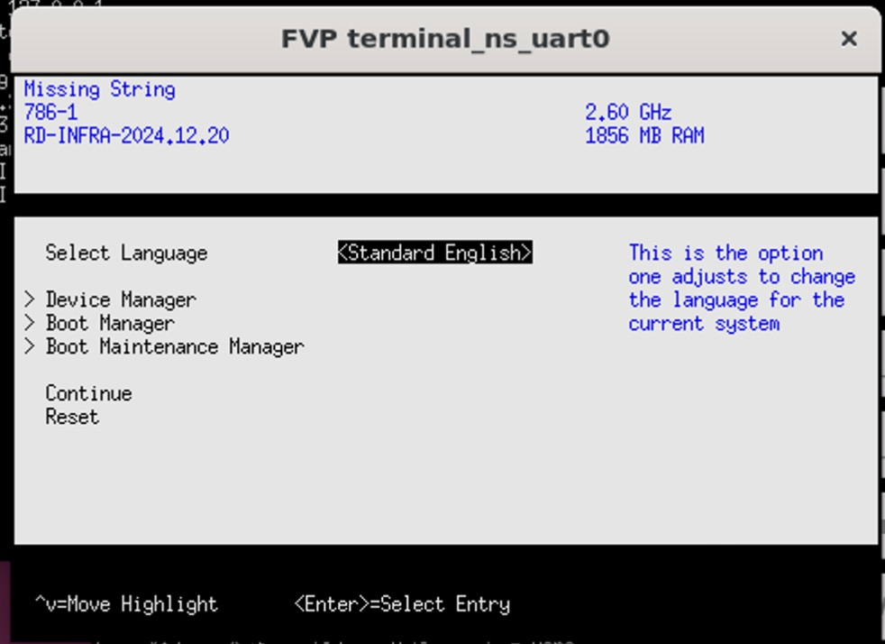
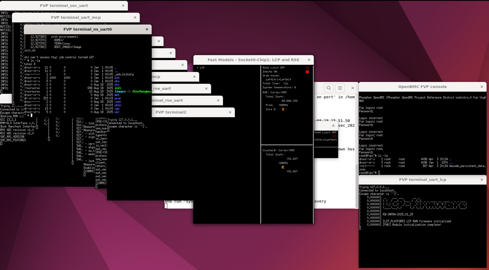

## Prepare Pre-Silicon OpenBMC Simulation

With your environment prepared, you can now simulate the full pre-silicon firmware boot flow using the Arm Neoverse RD-V3 reference design.
This includes building the OpenBMC image, launching the Fixed Virtual Platform (FVP), and validating the boot process of both the BMC and the host UEFI firmware.


This simulation launches multiple UART consoles—each mapped to a separate terminal window for different subsystems (e.g., Neoverse V3, Cortex‑M55, Cortex‑M7, and the Cortex-A BMC).

These graphical terminal windows require a desktop session. If you're accessing the simulation over SSH (e.g., on an AWS instance), they may not display properly.

To ensure proper display and interactivity, we recommend installing a Remote Desktop environment using XRDP.

In AWS Ubuntu 22.04 instance, you need install required packages:

```bash
sudo apt update
sudo apt install -y ubuntu-desktop xrdp xfce4 xfce4-goodies pv xterm sshpass socat retry
sudo systemctl enable --now xrdp
```

You may need to follow the Step 2 on RDv3 [learning path](https://learn.arm.com/learning-paths/servers-and-cloud-computing/neoverse-rdv3-swstack/4_rdv3_on_fvp/) to setup the networking and GDM configuration.

Once connected via Remote Desktop, open a terminal and launch the RD‑V3 FVP simulation:

## Execute Pre-Silicon OpenBMC Simulation

To make the simulation process smoother and more intuitive, you’ll need to modify a script from Arm’s GitLab repository.

```bash
wget https://gitlab.arm.com/server_management/PoCs/fvp-poc/-/raw/2a79ae93560969a3b802dfb3d7d89f9fd9dee5a6/run.sh
```

Open the `run.sh` file in a text editor and locate the line that defines FVP_KEYWORD. Modify it as follows:

```
- FVP_KEYWORD="Info: RD_V3_R1: terminal2: Listening for serial connection on port"
+ FVP_KEYWORD="terminal2: Listening for serial connection on port"
```

The `run.sh` script will:
* Launch the OpenBMC FVP and wait for the BMC to boot
* Automatically start the host FVP for RD-V3 (running UEFI)
* Connect the UART consoles between the BMC and the host via virtual pipes
* Connect MCTP and IPMI tunnels between the OpenBMC FVP and the RD-V3 host FVP
* Stop the OpenBMC FVP and RD-V3 host FVP when CTRL+C is pressed

Then, execute the script.

```bash
./run.sh -m ~/FVP_RD_V3_R1/models/Linux64_GCC-9.3/FVP_RD_V3_R1
```


wget https://gitlab.arm.com/server_management/PoCs/fvp-poc/-/raw/2a79ae93560969a3b802dfb3d7d89f9fd9dee5a6/run.sh

{}
Explain how/where can download the run.sh.
Explain the content of run.sh.
{}


The run.sh script will:
- Launch the OpenBMC FVP and wait for BMC boot
- Automatically start the host FVP for RD-V3 (running UEFI)
- Connect the UART consoles between the BMC and host via virtual pipes

Once simulation running, the `OpenBMC FVP console` console will stop in Linux login message:

```
[  OK  ] Started phosphor systemd target monitor.
[  OK  ] Started Sensor Monitor.
         Starting Hostname Service...
         Starting Phosphor Software Manager...
         Starting Phosphor BMC State Manager...
         Starting Phosphor Time Manager daemon...
[  OK  ] Finished SSH Key Generation.
[  OK  ] Finished Wait for /xyz/openbmc_project/state/chassis0.
[   27.454083] mctpserial0: invalid tx state 0
[FAILED] Failed to start OpenBMC ipKVM daemon.
Phosphor OpenBMC (Phosphor OpenBMC Project Reference Distro) nodistro.0 fvp ttyAMA0
         Starting Time & Date Service...
fvp login:
```

Type OpenBMC default username `root` and password is `0penBmc`.


{}
The first character of the password is the number ***0***, not a capital ***O***.
{}

Once login, you will see fully function Linux operation system in OpenBMC FVP console.

On the other side, the CSS-V3-R1 will launch and `FVP terminal_ns_uart0` console will show UEFI Firmware Setup Menu, selection `continue` then the Linux boot will runing.



The simulation will carry on the CSS-V3-R1 part, enter the GRUB menu. Press Enter to proceed.

A successful simulation will show login prompts on both BMC and host consoles. You can also confirm success by seeing the final system state in the Web UI or UART output.




The whole simulation procedure will be looks like:


After simulation completes, logs for both the BMC and host will be stored in `~/logs`. These are useful for verifying boot success or troubleshooting issues.

- `obmc_boot.log`: BMC boot output  
- `obmc_console.log`: BMC serial output  
- `fvp_boot.log`: Host UEFI boot output

By reviewing the contents of the logs folder, you can verify the expected system behavior or quickly diagnose
any anomalies that arise during boot or runtime.

In the next module, you’ll extend this simulation by interacting with the BMC over UART from the host side.
